> ## 1. 서론
> ## 2. 본론
> ## 3. 결론

## REFERENCES

글을 쓸때 서식 -> 초안 작성 -> 살 붙이기 -> 가독성 향상 등의 순서로 진행

글을 쓰는데 '글쓰기'에만 치중된 글을 지양하자.  
step by step에 해당하는 글일지라도 마지막에는 나의 생각이 녹아있어야 한다.  
마지막에 적어도 3번의 퇴고를 진행하자.

[데이터 과학자와 데이터 엔지니어를 위한 인터뷰 문답집](https://books.google.co.kr/books?id=7UgpEAAAQBAJ&pg=PA92&lpg=PA92&dq=PCA%EC%9D%98+%ED%95%B4%EB%8A%94+%EC%82%AC%EC%8B%A4+%EC%B5%9C%EC%A0%81%EC%9D%98+%ED%88%AC%EC%98%81%EB%B0%A9%ED%96%A5,+%EC%A6%89+%ED%95%98%EB%82%98%EC%9D%98+%EC%A7%81%EC%84%A0%EC%9D%84+%EC%B0%BE%EB%8A%94+%EA%B2%83%EC%9D%B8%EB%8D%B0,+%EC%9D%B4%EB%8A%94+%EC%84%A0%ED%98%95+%ED%9A%8C%EA%B7%80+%EB%AC%B8%EC%A0%9C%EC%9D%98+%EB%AA%A9%EC%A0%81%EA%B3%BC+%EC%9D%BC%EC%B9%98%ED%95%A9%EB%8B%88%EB%8B%A4.+%EA%B7%B8%EB%A0%87%EB%8B%A4%EB%A9%B4+%ED%9A%8C%EA%B7%80%EC%9D%98+%EC%8B%9C%EA%B0%81%EC%97%90%EC%84%9C+PCA%EC%9D%98+%EB%AA%A9%EC%A0%81%EC%9D%84+%EC%A0%95%EC%9D%98%ED%95%98%EA%B3%A0+%EB%AC%B8%EC%A0%9C%EC%9D%98+%ED%95%B4%EB%A5%BC+%EA%B5%AC%ED%95%98%EB%8A%94+%EB%B0%A9%EB%B2%95%EC%9D%B4+%EC%9E%88%EC%9D%84%EA%B9%8C%EC%9A%94?&source=bl&ots=M41PR7RIIz&sig=ACfU3U38Q9IdZ5h5siUTcQlsqONGwTOSkg&hl=ko&sa=X&ved=2ahUKEwjGkprstdH8AhUUB94KHaCTBGYQ6AF6BAgCEAM#v=onepage&q=PCA%EC%9D%98%20%ED%95%B4%EB%8A%94%20%EC%82%AC%EC%8B%A4%20%EC%B5%9C%EC%A0%81%EC%9D%98%20%ED%88%AC%EC%98%81%EB%B0%A9%ED%96%A5%2C%20%EC%A6%89%20%ED%95%98%EB%82%98%EC%9D%98%20%EC%A7%81%EC%84%A0%EC%9D%84%20%EC%B0%BE%EB%8A%94%20%EA%B2%83%EC%9D%B8%EB%8D%B0%2C%20%EC%9D%B4%EB%8A%94%20%EC%84%A0%ED%98%95%20%ED%9A%8C%EA%B7%80%20%EB%AC%B8%EC%A0%9C%EC%9D%98%20%EB%AA%A9%EC%A0%81%EA%B3%BC%20%EC%9D%BC%EC%B9%98%ED%95%A9%EB%8B%88%EB%8B%A4.%20%EA%B7%B8%EB%A0%87%EB%8B%A4%EB%A9%B4%20%ED%9A%8C%EA%B7%80%EC%9D%98%20%EC%8B%9C%EA%B0%81%EC%97%90%EC%84%9C%20PCA%EC%9D%98%20%EB%AA%A9%EC%A0%81%EC%9D%84%20%EC%A0%95%EC%9D%98%ED%95%98%EA%B3%A0%20%EB%AC%B8%EC%A0%9C%EC%9D%98%20%ED%95%B4%EB%A5%BC%20%EA%B5%AC%ED%95%98%EB%8A%94%20%EB%B0%A9%EB%B2%95%EC%9D%B4%20%EC%9E%88%EC%9D%84%EA%B9%8C%EC%9A%94%3F&f=false)

[[리뷰] 데이터 과학자와 데이터 엔지니어를 위한 인터뷰 문답집](https://theorydb.github.io/review/2020/09/19/review-book-data-science-interview/)

[데이터 과학자와 데이터 엔지니어를 위한 인터뷰 문답집](https://jpub.tistory.com/1057)

[Untitled](../assets/img/20230123/Untitled.pdf)

머리말

개인적으로 훌륭한 데이터 과학자가 되기 위해서는 관련 지식에 대한 체계적이고 완벽한 준비 뿐만 아니라, 알고리즘 모델에 대하여 마음 깊숙한 곳에서부터 나오는 열정과 연구 작업에 대한 장인 정신이 있어야 한다고 생각합니다. 여기서 말하는 장인 정신아란, 문제를 발견하는 눈빛, 문제를 해결하는 탐구정신, 그리고 집착에 가까운 끈기를 뜻합니다.

알고리즘 연구를 비즈니스에 적용하는 것과 순수한 학술 연구 사이에는 큰 차이점이 존재하는데, 바로 사용자의 시각에서 문제를 생각하는 것입니다. 많은 경우에 데이터 과학자들이 만든 상품이 데이터 지표를 향상시키더라도 이것이 진정으로 사용자가 원하는 것인지는 다시 생각해봐야합니다. 이런 기준으로 많은 모델 중에 가장 적합한 모델을 선택하고, 빠른 도입과 반복적인 테스트를 통해 상품화라는 결과를 얻어야 합니다. 이런 창조 정신과 도전정신을 통해’장인정신’이 표현되는 것이라 생각합니다. 물론 장인 정신도 중요하지만, 관련 지식도 성공하기 위한 필수 불가결한 기초입니다. 이것이 책을 쓰게 된 이유이고, 튼튼한 수학 기초, 알고리즘 시스템에 대한 완전한 이해, 모델에 대한 깊은 이해가 독자들에게 전달하고 싶은 정수입니다. 데이터 과학자로 향하는 길은 순탄치 않을 것입니다. 하지만 그 길에는 아름다움과 광활함이 함꼐할 것입니다. 여러분이 해야 할 일은 자신이 어떤 일을 하고 싶은지를 명확히 하고, 묵묵히 이 책의 내용을 최대한 습득한 후, 조용히 책을 덮고서 생활 속 사소한 곳에서 머신러닝의 매력을 느껴보는 것입니다. -Hulu 데이터 과학팀.

**CHAPTER 1 피처 엔지니어링 1**

> Garbage in Garbage out. 
본질적으로 데이터를 표현하는 과정이고, 실용적인 관점에서는 잡음과 잉여 성분을 제거하여 효율적인 피처를 얻음으로써 해결하려는 문제와 예측모델 간의 관계를 설명하는 것이다.
> 

① 피처 정규화 3

수치형 데이터에 대한 피처 정규화가 중요한 이유는 무엇인가?
선형함수 정규화(MinMax) - 선형편환을 해 [0,1] 범위안으로 투영
표준 정규화(Z-score) - 평균이 0이고 표준편차가 1인 분포로 투영
그렇다면 왜 해야하는가? 
경사하강법을 예로 들면 두 개의 수치형 데이터의 크기가 차이가 난다면 학습률이 동일하다는 가정하에서 정규화를 진행한 방법의 갱신 속도가 더 빠르다. 등치선도를 통하면 이해가 쉬움. 그러나 만능은 아니다. 경사하강법을 사용하는 곳에서는 써야하지만 결정 트리 계열에서는 정규화가 필요 없음.

② 범주형 피처 6

⭐ 데이터 정제 작업을 진행할 때 범주형 피처는 어떻게 처리해야 할까요?

- 순서형 인코딩
- 원-핫 인코딩 - 명목형 데이터에서 사용
희소벡터를 호라용하여 공간을 절약해야 함, 피처 선택을 통해 최대한 차원을 줄여야 함.
- 이진 코딩
- Helmert Contrast, Sum Contrast, Polynomial Contrast, Backward Difference Contrast 등

③ 고차원 결합 피처의 처리 방법 9

⭐ 결합 피처란 무엇일까요?고차원 결합 피처는 어떤 방식으로 피처 엔지니어링 해야할까요?

복잡한 관계를 보다 잘 적합하기 위해 피처 엔지니어링 단계에서 일차원의 불연속 특성을 쌍으로 조합시켜 고차원의 결합피처로 만드는 작업을 진행햐야 합니다.단, 특성 수가 늘어나기 때문에 특성 폭발 현상을 주의해야 함. 그리고 이러한 특성 폭발 현상은 k차원의 저차원 벡터로 표현하는 행렬 분해를 통해 줄일 수 있습니다.

④ 결합 피처 12

⭐ 효율적인 결합  피처는 어떻게 찾을 수 있을까요?

의사결정 트리를 활용하여 피처 조합을 찾는 방법으로 잎 노드로 가는 각각의 길을 일종의 피처 조합의 방법으로 볼 수 있습니다.

⑤ 텍스트 표현 모델 14

⭐ 텍스트 표현 모델에는 어떤 것들이 있나요? 각모델의 장단점은 무엇인가요?

- BOW와 N-gram모델
    
    Bag of Words는 가장 기초적인 텍스트 표현 모델입니다. 각 텍스트를 순서에 상관없이 단어 단위로 나눠 한 가방에 담는 방식.모든 문단의 텍스트를 단어 단위로 쪼갠 후 하나의 긴 벡터로 표현 하는데, 벡터 중의 각 차원은 하나의 닥ㄴ어를 대표하고, 해당 차원에 대응하는 가중치는 해당 단어가 문장에서 얼마나 중요한지를 나타냄(일반적으로 `TF-IDF` 를 가중치로 계산)합니다. 직관적으로 해석하면, 만약 하나의 단어가 많은 문장에 출현한다면 그 단어는 비교적 자주 사용하는 단어가 되고, 어떤 문장에서 특수한 의미를 구별하는 데 큰 공헌을 못할 가능성이 높습니다. 따라서 가중치에 패널티를 부여하는 것입니다.
    
    ㅁ문장을 단어 단위로 구별하는 것은 좋은 방법이 아닙니다. 일반적으로 이렇게 자주 함께 출현하는 n개의 단어를 한 그룹으로 구성하여 독립적인 피처로 생각하여 벡터로 표ㅗ현합니다 이것이 N-gram방법입니다.
    
- 토픽 모델
    
    문서 집합에서 대표성을 가진 주제를 찾기 위한 통계적 모델
    
- 워드 임베딩과 딥러닝 모델
    
    워드 임베딩이란, 단어를 정량화하는 모델들의 통칭입니다. 각 단어를 저차원상의 고밀도 벡터에 투영시키는 것입니다. k 차원 공간의 각 차원은 하나의 잠재적인 토픽으로 볼 수 있지만, 토픽 모델에서의 토픽처럼 직관적이지는 못합니다. 워드 임베딩은 각 단어를 k차원의 벡터로 매핑시키기 때문에 각 문장에 N개의 단어가 있다고 가정하면, N x K차원의 행렬을 사용하여 해당 문장을 표현할 수 있게 됩니다. 하지만 이러한표현은 단어가 가지고 있는 고차원적 의미를 잡아내긴 힘듭니다. 하지만 딥러닝 모델은 일종의 자동적인 피처 엔지니어링 프로세스를 포함해 각 은닉층은 서로 다른 단계의 추상 피처를 반영하므로 딥러닝이 여러 얕은 머신러닝 알고리즘보다 뛰어난 것은 자연스러운 현상입니다.
    

⑥ Word2Vec 17

구글에서 발표한 Word2Vec은 현재까지 가장 많이 사용되는 워드 임베딩 모델 중 하나입니다. 이는 은닉층이 한 개인 얕은 층을 가진 신경망 모델의 한 종류로 CBOW와 Skip-gram으로 구성

⭐ Word2Vec은 어떤 알고리즘이고, LDA와는 어떤 차이점과 관련이 있을까요?

CBOW(Continuous Bag of Words)의 목표는  상하 주변에 출현하는 단어들에 기반하여 현재 단어의 생성확률을 예측하는 것입니다. 반면, Skip-gram은 현재 단어에 기반해 상하 텍스트에 있는 각 단어의 생성확률을 예측합니다.

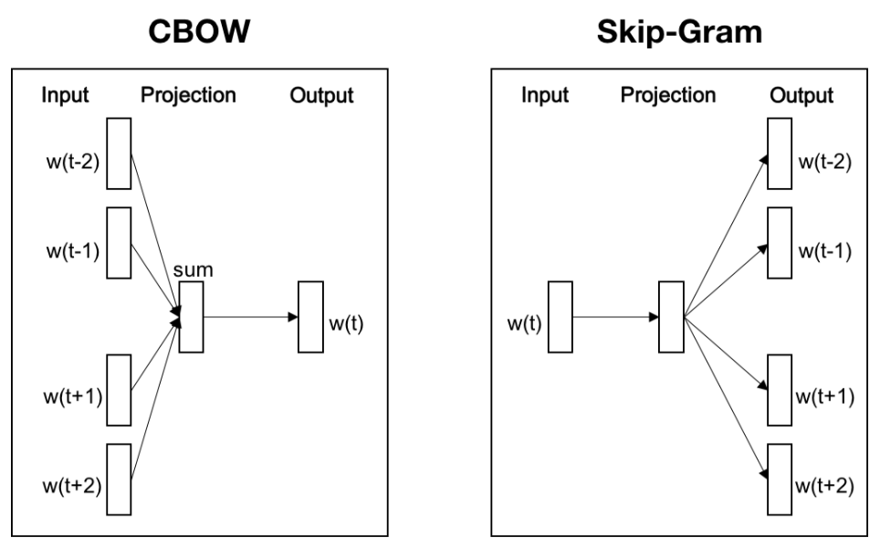

여기서 w(t)는 현재 알고자 하는 단어이고 그 외에는 전후 텍스트에 나오는 단어들입니다. 그리고 움직이는 슬라이딩 윈도우의 크기는 2입니다.출력층에서 각 단어는 원-핫 인코딩으로 표현되는데, 즉 모든 단어가 N차원의 벡터입니다. 여기서 N은 단어의 총 개수입니다. 벡터에서 각 단어와 대응하는 차원은 1로 설정되며, 그외의 차원은 모두 0으로 설정됩니다. 은닉층에서 K개의 히든 유닛의 값은 N차원 입력벡터와 입력은은 은닉 유닛 사이를 연결하는 N x K차원 가중치 행렬을 통해 계산됩니다. 마지막으로, 출력층 벡터에 대해 소프트맥스 활성화 함수를 사용하여 각 단어의 생성확률을 계산할 수 있습니다. $P(y = w_n | x) = \frac{e^{x_n}}{\sum e^{x_n}}$ 여기서 x는 N차원을 가진 초기 입력벡터를 뜻하고 , $x_n$은 초기 출력 벡터에서 단어 $w_n$에 대응하는 차원의 값을 뜻합니다.

생성확률을 최대화하는 신경망의 가중치를 훈련하는 것인데 오차역전파법을 통해 이뤄지나 매회 반복 시 속도가 느려지게 됩니다. 이러한 문제점을 개선하기 위해 계층적 소프트 맥스와 네거티브 샘플링이라는 개선된 방법들이 나오게 되었습니다. 

다음은 Word2Vec과 LDA의 차이점 및 연관성을 설명하겠습니다.

LDA는 텍스트 내 단어들의 공동 출현 관계를 이용해 단어를 주제별로 군집화합니다.

그러나 Word2Vec은 ‘상하 텍스트-단어’행렬을 학습하는 것입니다.

이는 LDA와 Word2Vec의 차이지 토픽 모델과 워드 임베딩 방법의 차이는 아닙니다. 두 방법의 가장 큰 차이점은 모델 자체에 있는데 토픽모델은 확률 그래프 모델에 기반을 둔 생성모델이며, 가능도 함수는 몇개의 조건확률의 연속된 곱셈형식으로 작성될 수 있습니다. 반면, 워드 임베딩 모델은 신경망 형식으로 표ㅗ현되며, 가능도 함수는 네트워크의 출력에 의해 정의됩니다.

⑦ 이미지 데이터가 부족할 때는 어떻게 처리해야 할까요? 20

⭐ 이미지 분류 문제에서 훈련데이터가 부족하다면 어떤 문제를 일으킬까요? 어떻게 데이터 부족이 야기하는 문제들을 완화할 수 있을까요?

모델이 제공받는 정보의 근원은 크게 두가지로 훈련 데이터 내에 포함된 정보이고, 두 번째는 모델 형성 과정에서 사람들이 제공한 선험적 정보입니다. 제공받은데이터가 적은 경우 선험적 정보들이 필요합니다. 이를 호라용하는 방법은 특정한 선험적 가설에 기반해 데이터를 조정하거나 변환하거나 확장합니다. 이런 과정을 거쳐 더 유의미하고 많은 정보를 모델 훈련과 학습에 사용할 수 있습니다.

훈련 데이터가 부족하면 과적합 문제가 발생하고 이는 모델의 간략화(비선형 모델을 선형으로, L1, L2같은 규제, 앙상블 학습, 드롭아웃 등)이 있고 데이터에 기반을 둔 방법으로 데이터 확장(CV를 예로 이미지 전환, 노이즈 추가, 색상 변환, 명암,해상도 변경 등)이 있습니다.

일반적으로 데이터 확장 혹ㅅ은 SMOTE(Synthetic Minority Over Sampling Technique)와 같은 업샘플링을 이용하는 방법도 있습니다. 이러한 휴리스틱한 변환 방법에서 벗어나고 싶다면  오늘날 가장 유행하는 생성적 적대 신경망(Generative Adversarial Networks, GANs)과 같은 생성모델을 호라용하여 새로운 샘플을 추가하는 방법도 있습니다.

이외에도 다른 모델이나 데이터를 빌려와 전이학습을 진행하는 방법도 딥러닝에서 자주 볼 수 있습니다. 즉, 대규모 데이터를 통해 훈련된 기존의 좋은 모델ㄷ들을 이용하여 소규모 데이터상에서 파인 튜닝만을 진행합니다. 이러한 미세한 조정도 일종의 간단한 전이학습이라 할 수 있습니다.

**CHAPTER 2 모델 평가 23**

‘평가할 수 없다면 과학이 아니다’ - 멘델레예프

모델 평가는 온라인 평가와 오프라인 평가의 두 단계로 나눌 수 있습니다. 또한 머신러닝 문제에 따라 평가 지표의 선택도 다를 수 밖에 없습니다. 각 평가 지표의 정확한 정의를 이해하는 것, 적절한 평가 지표를 선택하는 것, 평가 지표 피드백에 기반하여 모델을 조정하는 것, 이러한 것들이 모신러닝 모델 평가 단계에서 중요한 문제들이 됩니다.

① 평가 지표의 한계 25

⭐ 정확도의 한계성

정확도는 가장 간단하고 직관적인 평가 지표이지만 명백한 단점이 있습니다. 샘플 비율이 불균형한 경우, 정확도는 불균형 데이터의 영향을 많이 받게 됩니다.그러나 이런 문제는 개방형 질문으로 당면한 문제에 대해 차근차근 원인을 찾아가면 됩니다. 지표를 맞게 선택했다 하더라도 과적합이나 과소적합이 존재할 수도 있고, 테스트 세트를 제대로 분류하지 않았기 떄문에 발생하는 문제 일 수도 있습니다.

⭐ 정밀도와 재현율의 균형

- 정밀도 - precision, 양성으로 분류한 것중 실제 양성의 비율
- 재현율 - recall, 실제 양성 중 양성으로 분류한 것의 비율

일반적인 랭킹문제에서는 정해진 임계값이 없고 대신 Top N으로 반환된 결과의 정밀도와 재현율 값으로 랭킹모델의 성능을 평가합니다. 종합적으로 랭킹 모델을 평가하기 위해서는 서로 다른 Top N하에서 Precision@N, Recall@N을 구해야 하는데, 가장 좋은 방법은 P-R곡선(precision-recall)을 그려보는 방법입니다. P-R곡선은 임계값을 높은 곳에서 낮은 곳으로 이동시키며 만들어집니다.

⭐ 평균제곱근오차의 예외

RMSE는 회귀모델을 평가할때 자주 사용되는 지표입니다.일반적인 상황에서 RMSE는 회귀모델의 예측값이 실제 값에서 벗어난 정도를 잘 반영합니다. 핮미ㅏㄴ 벗어난 정도가 매우 큰 특이점이 존재할 경우에는 영향을 많이 받습니다.그렇다면 이러한 경우 해결방은은 무엇ㅇ이 있을까요? 세가지 각도로 접근이 가능한데, 단순 노이즈라면 전처리 과정에서 필터링하는 방법이 있습니다. 두번쨰로 단순 노이즈가 아니라고 판단된다면 모델의 예측 성능을 향상시켜 특이점 데이터들이 만들어 낸 매커니즘을 모델에 포함시켜야 합니다. 마지막으로, 더 적절한 평가 짚를 사용하는 방법이 있습니다. RMSE보다 더 robust한 지표가 있는데 예를 들면 평균절대비오차(MAPE)가 있습니다. 평가 지표마다 고유의 가치가 존재합니다. 하지만 단일 평가지표만을 사용하여 모델을 평가할 경우, 단편적인 결론을 내릴 뿐만 아니라 심지어 잘못된 결론을 내릴 수도 있습니다. 따라서 서로 보완성이 존재하는 지표들을 종합적으로 고려하여 모델을 평가해야 더 쉽고 정확하게 모델에 존재하는 문제들을 찾아낼 수 있습니다. 

② ROC 곡선 31

이진 분류기는 광범위하게 응용되는 분류기입니다. 이를 평가하는 지표는 정밀도, 재현율, F1-Score, P-R곡선 등이 있습니다. 이들은 일부 성능만 반영한다는 한계점도 느끼셨을 겁니다. 이에 비해 ROC곡선은 많은 장점을 가지고 있습니다.

⭐ ROC곡선이란 무엇일까요

Receiver Operating Characteristic Curve의 약자입니다. 가로측은 FPR(False Positive Rate), 세로축은 TPR(True Positive Rate)을 나타냅니다.

⭐ ROC곡선은 어떻게 그릴까요?

분류기의 ‘절단점’을 계속해서 이동하며 곡선상의 중요지점을 생성합니다. ‘절단점’이란 바로 양성과 음성 예측 결과를 구별하는 임계값을 뜻합니다. 

⭐ AUC는 어떻게 계산할까요?

Area Under Curve는 ROC 곡선 아래의 면적을 뜻합니다. 이 지표는 ROC곡선에 기반해 모델 성능을 정량화하여 나타낼 수 있습니다.

⭐ ROC곡선과 P-R곡선을 비교해 보세요

양성, 음성 샘플의 분포에 변화가 생겼을 때 ROC곡선의 형태는 기본적으로 변하지 않고 유지되지만, P-R곡선의 형태는 일반적으로 급격한 변화를 보입니다.이러한 특징은 ROC곡선이 다양한 테스트 세트를 만날 때마다 견고한 결과를 보여줄 수 있게 만들어 더 객관적으로 모델 자체의 성능을 평가할 수 있게 해줍니다. 많은 현실 문제에서 양성, 음성 샘플의 수는 불균형합니다. 따라서 ROC곡선은 랭킹, 추천, 고아고 등 분야에서 더 자주 사용됩니다, 하지만 주의해야할점은  어느 곡선을 선택하느냐에 대한 문제는 해결하고자 하는 문제에 따라 달라진다는 것입니다. 만약 모델이 특정 데이터 세트상에서 어떤 성능을 내는지 알고 싶다면, P-R곡선을 선택하는 것이 더 좋을 수도 있습니다.

③ 코사인 거리의 응용 38

모델 훈련 과정에서 우리는 샘플 사이의 거리에 대해 비교하는 경우가 많습니다. 특성은 벡터의 형태로 표현되는 경우가 많습니다 따라서 두 특성 벡터 사이의 유사도를 분석할 때 코사인 유사도를 자주 사용합니다.

⭐ 어떤 상황에서 유클리드 거리 대신 코사인 유사도를 사용하는지를 학습과 연구 경험을 토대로 설명해 보세요.

코사인 유사도는 그들 사이의 각도에 따라 범위가 일정한 값을 나타내지만 유클리드 거리의 수치는 차원의 영향을 받아 값의 범위가 불안정하고 함의 역시 비교적 모호해집니다. 다시 정리하면, 유클린드 거리는 수치상의 절대 차이를 나타내고, 코사인 거리는 방향과 크기의 상대적 차이를 반영합니다.특정 측정 밥법을 어떤 문제에서 사용해야 하는가에 대한 부분은 평소 연구와 공부를 하면서 계속해서 정리하고 생각해야할 문젱비니다. 그래야만 문제가 주어졌을 때 논리정연하게 답할 수 있으며, 새로운 문제를 만났을 때 문제해결 능력을 갖추게 됩니다.

⭐ 코사인 거리는 엄격한 의미에서의 거리가 맞습니까?

먼저 거리에 대한 정의를 알아보면 구분 불가능한 점의 동일성, 대칭성, 삼각부등식이 성립한다면 해당 실수는 이원소 사이의 거리라고 정의할 수 있습니다. 코사인 거리는 동일성과 대칭성은 만족하지만 삼각부등식을 만족하지는 않습니다. 따라서 엄격한 정의에서의 거리라고 할 수 없습니다. 이러한 기초 증명 문제를 만나면 쉽게 당활 할 수 있지만 면접관과 최대한 많이 소통하면서 논의를 시작하는 방식으로 ‘제 느낌에는…’ 식의 커뮤니케이션 방식보다 적극적으로 분석하과 명확한 논리로 설명해야 합니다. 설령 틀리더라도 증명하는 과정 자체에 대한 정답보다는 논리적으로 증명하는 자세가 중요하기 떄문에 좋은 점수를 받을 ㄱ가능성이 높습니다.

머신러닝 영역에서 흔히’거리’라고 불리는 것 중에 거리 공식을 마족시키지 못하는 것은 KL(Kullback-Lebler divergence)도 만족시키지 못하고 상대 엔트로피 라고도 불립니다. 이 개념은 두 분포 사이의 차이를 계산하는데 사용 되는데 대칭성과 삼각부등식 모두를 만족하지 못합니다.

④ A/B 테스트의 함정 43

A/B 테스트는 새로운 모델의 성능음 검증하거나 피드백을 얻을때 테스트하는 방법입니다. 머신러닝 영역에서의 A/B테스트는 모델의 최종 효과를 검증하는 최종 수단입니다. 실험군, 대조군

⭐ 모델에 대해 충분한 오프라인 평가를 진행하더라도 왜 온라인에서 다시 한번 A/B테스트를 진행해야 하는 것일까요?

AB테스트를 진행하는 이유로는

- 오프라인 평가로는 모델의 과적합 위험을 모두 제거할 수 없어 온라인 평가 결과를 완전히 대체 불가능하다.
- 오프라인 평가 환경은 온라인 평가 환경과 같지 않아 여러 상황을 반영하지 못합니다.
- 온라인 시스템의 어떤 비즈니스 지표는 오프라인에서 평가하기 어렵습니다. 오프라인 평가는 일반적으로 모델 자체에 대한 평가를 진행할 뿐 모델에 관련 있는 기타지표, 특히 비즈니스 지표들을 직접적으로 얻진 못합니다.

⭐ A/B테스트는 어떻게 진행해야 하나요

사용자에 대한 분할-실행(버킷 테스트)방법을 사용하는 것입니다. 즉, 사용자를 실험군과 대조군으로 분류하고 실험군의 사용자에게 새로운 모델을, 대조군의 사용자에게는 기존 모델을 사용합니다. 버킷의 형성 과정에서 샘플의 독립성과 샘플 방식의 무편향성에 각별한 주의를 기울이고, 동일한 사용자가 하나의 버킷만으 갈 수 있도록 합니다. 그리고 사용자는 랜덤으로 정해야 샘플의 무편향성을 유지할 수 있습니다.

⭐ 실험군과 대조군은 어떻게 분류할까요?

‘미국 사용자’에 대한 새로운 콘텐츠 추천 모델을 적용시켜 보고자할때, 모든 미국 사용자를 랜덤으로 실험군과 대조군으로 나누고 모델 A와 기존 모델을 적용해야 효과를 검증할 수 있습니다.

⑤ 모델 평가 방법 46

⭐ 모델 평가 과정에서 사용할 수 이쓴ㄴ 검증방법에는 어떤 것들이 있고, 각 방법의 장단점에 관해 설명해주세요.

- 홀드아웃 방법
초기 데이터를 임의로 훈련 데이터와 테스트 데이터로 나눕니다. 단점은 명확합니다. 테스트 세트에서의 결과는 초기 데이터를 어떻게 분류하느냐에 따라 큰영향을 받습니다.
- 교차검증
    - K-FOLD
        
        샘플을 k개의 크기가 같은 하위 샘플로 나누고 k개의 샘플 세트를 돌아가면서 검정 세트가 된다.
        
    - LOOCV(Leave-One-Out Cross-validation)
        
        매번 하나의 샘플을 남겨 검정 세트로 사용하고 나머지는 훈련에 사용. LpOCV(leave-p-Out cross validation의 한 예, n개의 원소중 p개의 원소를 선택하는 방법으로 계산량이 커져 실무에서 선호되지는 않는다.)
        
- 부트스트래핑
    
    훈련 세트 규모를 유지하면서 검증하는 방법으로 n개인 샘플 집합에서 n번의 복원 추출법을 사용하여 n개의 훈련세트를 얻습니다. 이 과정에서 중복되어 추출되지만 추출되지 않는 것이 있을텐데 이것이 바로 OOB(Out-of-Bag)검증 세트입니다.
    

⭐ 부트스트래핑 과정중에서 n이 무한대로 커진다면 한번도 추출되지 않는 데이터의 수는 얼마나 될까요?

$\lim_{n→ \infinite} (1 - \frac{1}{n})^n$이 되는데 $\lim_{n→ \infinite} (1 + \frac{1}{n})^n = e$가 되기떄문에 = 1/e 로 샘플수가 매우 클 경우에 약 36.%의 샘플이 한 번도 추출되지 않게 됩니다.

⑥ 하이퍼파라미터 튜닝 49

⭐ 하이퍼파라미터 최적화 방법에 대해 설명해 주세요.

하이퍼파라미터 탐색 알고리즘이 일반적으로 포함하고 있는 몇 가지 요소에 관해 설명하고자 합니다. 첫번째는 목적함수로 함숫값을 최대화 또는 최소화하여 최적해를 도출하는 문제를 의미합니다. 두번째는 생성 가능한 신경망의 조합 수 결정을 위해 탐색 영역을 설계하는 탐색 범위 설정입니다. 세번째는 성능을 측정하기 위해 일정 간격으로 선택하는 탐색 스텝과 같은 기타 값입니다.

- 그리드 탐색 - 탐색 범위의 모든 샘플을 대상으로 최적값을 찾는 방법입니다. 범위를 비교 적 크게 설정하고 탐색 스텝을 작게 설정했다면 전역 최적해를 찾을 확률이 매우 높아집니다. 그러나 이러한 탐색 방법은 시간과 자원을 많이 사용해야 하고 효율이 떨어지는 단점이 있습니다.
- 랜덤 탐색 - 그리드 탐색과 비슷하지만 정해진 범위 내에서 랜ㅓㅁ으로 샘플 포인트를 선택합니다.
- 베이지안 최적화 - 하나의 샘플 포인트를 테스트할때 이전의 정보들을 충분히 호라용합니다. 미지의 모적함수의 형태를 학습하는 방법을 통해 목적함수를 전역 최적해로 만드는 파라미터를 찾습니다. 목적함수의 형태를 학습하는 방법은, 먼저 사전분포에 기반하여 하나의 탐색 함수를 가정합니다. 그리고 매번 새로운 샘플링르 사용해 목적함수를 테스트 할 때 해당 정보를 사용하여 새로운 목적함수의 사전분포를 업데이트 합니다, 마지막으로, 알고리즘은 사후분포를 통해 얻은 전역 최적해가 나타날 가능성이 가장 높은 위치에서 알고리즘을 테스트합니다. 그러나 이에 주의해야할 점으로는 국소 최적해에 빠질 가능성이 있어 이러한 단점을 보완하기 위해 탐색(아직 샘플링하지 않은 영역에 대해 샘플링)과 이용(사후 분포에 기반해 전역 최적해가 나타날 가능성이 높은 영역에서 샘플링) 사이에 하나의 균형점을 찾아야 합니다.

구글은 하이퍼파라미터 최적화 알고리즘으로 더 맛있는 쿠키를 굽는다.

쿠키를 굽는 과정도 숙성 시간, 오븐의 온도 등을 조정하는데 어떤 요소가 더 맛있는 쿠키를 만들어 냈는지 알 수 없는 블랙박스 모델입니다 따라서 이러한 작업은 하이퍼파라미터 튜닝과 비슷하다고 말할 수 있습니다. 예전에는 ‘대학원생 하강법(대학원생이 수동으로 조율)’을 사용했지만 구글에서 이러한 문제를 해결하기 위해 하이퍼파라미터 튜닝 시스템(Google Vizier)를 만들었습니다.

⑦ 과적합과 과소적합 52

⭐ 모델 평가 과정에서 과적합과 과소적합이란 어떤 현상을 뜻하는 것일까요?

과적합은 훈련 데이터에 과하게 맞춰진 상태로 모델이 지나치게 복잡하여 노이즈 데이터의 특징까지 학습해 모델의 일반화 성능을 저화시킨 상태로 실제 응용단계에서 잘못된 예측 결과를 내놓을 가능성이 높습니다. 과소 적합은 그와 반대로 훈련이나 예측에서 좋은 성은을 보이지 못하는 현상을 뜻합니다.

⭐ 과적합과 과소적합의 위험을 낮출 수 있는 몇가지 방법에 대해 설명해주세요

- 과적합 위험을 낮추는 방법
    - 더 많은 데이터틀 확보하는 것 - 더 많은 샘플은 유효한 특성을 학습할 수 있도록 하는 동시에 노이즈의 영향을 줄여주기 때문.
    - 모델의 복잡도를 낮춰 줍니다 - 모델의 복잡도를 적당히 낮춰 준다면 노이즈 데이터에 과도하게 적합되는 것을 방지
    - 정규화를 사용 - 모델의 파라미터에 정규화 항을 추가합니다. 예를 들어, 가중치의 크기를 손실함수에 추가합니다. L2정규화를 예로들면 목적함수를 최적화하는 동시에 가중치가 너무 커지는 것을 제어할 수 있습니다.
    - 앙상블 학습 방법을 사용 0 단일 모델의 과적합 위험을 낮춰줄 수 있습니다.
- 과소적합 위험을 낮추는 방법
    - 새로운 특성을 추가합니다 - 특성이 부족하거나 특성과 샘플 레이블의 상관성이 약할 경우 과소적합을 일으킬 가능성이 큽니다.
    - 모델의 복잡도를 증가시킵니다 - 간단한 모델은 학습 능력이 비교적 떨어져 복잡도를 올려 강한 적합 능력을 더해 줄 수 있습니다. 예를 들어 선형모델에서 고차원의 항을 더하거나 신경망 모델에서 네트워크 층 수나 뉴련 개수를 늘리는 방법.
    - 정규화 계수를 줄입니다 - 과소적합 현상을 보인다면 목적성 있게 정규화 계수를 줄여줘야합니다.

**CHAPTER 3 클래식 알고리즘 55**

‘초심을 잃지 않아야 성공할 수 있다’라는 말이 있습니다. 초심은 딥러닝과 인공지능이 범람하는 시대에 데이터와 통계적 방법론에 관한 이전 세대 데이터 과학자들의 지혜에 집중하는 것입니다. 가장 좋은 분류기란 존재하지 않습니다. 단지 가장 적합한 분류기만이 존재할 뿐이죠. 신경망 모델의 눈부신 발전 떄문에 전통적인 머신러닝 알고리즘은 딥러닝의 빛에 가려 어둠 속으로 사리지는 듯합니다. 그러나 딥러닝은 데이터 덕분에 발전했습니다. 만약 데이터가 없다면 아무리 정교한 딥러닝 구조라 하더라도 그림의 떡일 뿐입니다. 실무를 하다 보면 라벨링이 명확한 대용량의 데이터가 드물다는 것을알수 있습니다. 이때 딥러닝보다는 전통적인 머신러닝 방법들이 유연하게 적용될 수 있습니다. 머신러닝의 기본 모델들을 잘 익혀 두면, 딥러닝을 쉽게 학습할 수 있을 뿐만 아니라 훌륭한 데이터 과학자가 되는 기초를 쌓을 수 있습니다. 특히, 더 많은 수학 모델과 통계이론학의 응용을 배우며 인공지능 시대에 꼭 필요한 원칙과 기본을 파악할 수 있을겁니다.

① 서포트 벡터 머신 57

SVM(Support Vector Machine)은 지도학습 방법중에서ㅏ도 가장 뛰어난 알고리즘 입니다.

데이터들을 구분하는 분류면의 마진을 최대로 하는 분류면의 위치 차즌ㄴ 과정이 ‘최적화’입니다. 선형으로 분류가 안되는 데이터들을 고차원으로 투영시키는 커널맵(kernel map)에 초평면(hyperplane)으로 분류를 진행하는 벙식이 있습니다.

⭐ 공간상에서 선형분리 가능한 두점이 각각 SVM이 분리한 초평면상으로 투영된다면, 이점들의 초평면상의 투영도 선형분리가 가능한가요?

!!!!!!!!!!!!!!!!!!!!!!!!!!!!!!!!!!!!!!!!!!!!!!!!!!!!!!!!!!!!!!!!!!!!!!!!!!!!!!!!!!!!!!!!!!!!!!!!

!!!!!!!!!!!!!!!!!!!!!!!!!!!!!!!!!!!!!!!!!!!!!!!!!!!!!!!!!!!!!!!!!!!!!!!!!!!!!!!!!!!!!!!!!!!!!!!!

!!!!!!!!!!!!!!!!!!!!!!!!!!!!!!!!!!!!!!!!!!!!!!!!!!!!!!!!!!!!!!!!!!!!!!!!!!!!!!!!!!!!!!!!!!!!!!!!

⭐ SMV 훈련오차를 0이 되도록 만드는 파라미터 세트가 존재할까요?

!!!!!!!!!!!!!!!!!!!!!!!!!!!!!!!!!!!!!!!!!!!!!!!!!!!!!!!!!!!!!!!!!!!!!!!!!!!!!!!!!!!!!!!!!!!!!!!!

!!!!!!!!!!!!!!!!!!!!!!!!!!!!!!!!!!!!!!!!!!!!!!!!!!!!!!!!!!!!!!!!!!!!!!!!!!!!!!!!!!!!!!!!!!!!!!!!

!!!!!!!!!!!!!!!!!!!!!!!!!!!!!!!!!!!!!!!!!!!!!!!!!!!!!!!!!!!!!!!!!!!!!!!!!!!!!!!!!!!!!!!!!!!!!!!!

⭐ 훈련 오차가 0인 SVM 분류기는 반드시 존재할까요?

실제 훈련에서 여유 변수(slack variable)를 추가하지 않은 SVM모델일 떄 얻은 SMV 분류기가 훈련 오차를 0으로 만들 수 있는지 보장할 수 있을까요?

!!!!!!!!!!!!!!!!!!!!!!!!!!!!!!!!!!!!!!!!!!!!!!!!!!!!!!!!!!!!!!!!!!!!!!!!!!!!!!!!!!!!!!!!!!!!!!!!

!!!!!!!!!!!!!!!!!!!!!!!!!!!!!!!!!!!!!!!!!!!!!!!!!!!!!!!!!!!!!!!!!!!!!!!!!!!!!!!!!!!!!!!!!!!!!!!!

!!!!!!!!!!!!!!!!!!!!!!!!!!!!!!!!!!!!!!!!!!!!!!!!!!!!!!!!!!!!!!!!!!!!!!!!!!!!!!!!!!!!!!!!!!!!!!!!

⭐ 여유 변수를 추가한 SVM의 훈련오차는 0이 될 수 있나요?

실무에서 만약 SMO알고리즘을 사용하여 여유 변수를 추가한 선형 SMV 모델을 훈련시키고 패널티 요소 C를 임의의 미지 상수라고 한다면, 훈련오차가 0인 모델을 얻을 수 있을까요?

SMO 알고리즘을 사용하여 훈련한 선형분류기가 반드시 훈련오차가 0인 모델을 얻는 것은 아닙니다. 이는 우리의 최적화 목표가 변하여 더 이상 훈련오차를 최소화하는 것이 목표가 아니기 때문입니다.여유 변수를 가진 SVM모델의 최적화 목적함수는 두 가지 항을 가지고 있는데 파라미터 C가 비교적 작은 값일 경우 정규화 항이 최적화의 대부분의 비중을 차지하게 됩니다. 이렇게 된다면 훈련오차는 있지만 파라미터가 비교적 작은 것이 더 최적화된 결과가 됩니다. 

② 로지스틱 회귀 67

머신러닝 영역에서 가장 기초적이고 가장 자주 사용하는 모델입니다. 

⭐ 선형회귀와 비교했을때 로지스틱 회귀의 다른점은 무엇이 있을까요

로지스틱 회귀는 주로 분류 문제에 사용됩니다.로지스틱 회귀에서 종속변수가 취하는 값은 이원분포를 따르고 모델은 학습하여 $E[y|x;\theta]$를 얻습니다. 즉, 독립변수와 하이퍼라미터가 주어졌을 떄 종속변수의 기댓값을 얻고, 해당 기댓값에 기반하여 분류 문제를 예측합니다. 분류와 회귀는 머신러닝의 전혀 다른 두가지 문제입니다. 로지스틱회귀 공식을 정리해보면 $log\frac{p}{1-p} = \theta^Tx$를 얻을 수 있는데 여기서 $p = P(y = 1 |x)$는 입력 x가 주여졌을 때 양성 클래스로 예측할 확률을 나타냅니다.  만약 한 사건의 오즈를 해당 사건이 발생할 확률과 해당 사건이 발생하지 않을 확률의 비율이라고 한다면, 로지스틱 회귀는 ‘y=1|x’에 대한 이사건의 로그오즈의 선형회귀입니다.  즉, 로지스틱 회귀에서 종속변수는 이산형이고, 선형회귀에서의 종속변수는 연속형입니다. 로지스틱 회귀와 선형회귀 사이에 같은 점이 없진 않습니다. 먼저 두 알고리즘 모두 최대우도 추정을 사용하여 훈련세트에 대해 모델링 합니다. 선형회귀는 최소제곱법을 사용하는데, x와$\theta$가 주어졌을 때 종속변수 t가 정규분포를 따른다는 가정하에 최대우도 추정을 사용하여 수식을 간단히 합니다. 로지스틱 회귀는 우도함수를 학습하여 최적으 파라미터를 얻습니다.

⭐ 로지스틱회귀를 사용하여 다중분류 문제를 해결할때 자주 사용되는방법은 어떤것이 있을까요? 각각은 어떤상황에서 쓰이고, 어떤관계를맺고있을까요?

어떤 방법을 사용하여 다중분류 ㅜㄴ제를 해결할 것인지는 구체적인 정의에 따라야 합니다. 만약 하나의 샘플이 하나의 레이블에 대응한다면, 우리는 각 샘플이 서로 다른 레이블에 속할 확률이 기하분포를 따른다고 가정할 수 있고, 소프트맥스 회귀를 사용하여 분류를 진행할 수 있습니다.  일반적으로, 소프트 맥스 회귀는 장애모수(nuisance parameter)가 있다는 특징이 있는데, 즉 동시에 $\theta_1, \theta_2, …, \theta_k$하나의 벡터를 더하고 빼더라도 예측결과가 변하지 않습니다. 장애모수의 특성을 이용하여 우리는 모든 파라미터에서 $\theta_1$를 뺄 수 있고 이는 로지스틱 회귀와 일치합니다. 따라서 소프트맥스 회귀는 사실상 이진분류ㅜ 로지스틱 회귀의 다중분류에서의 확장이라고 할 수 있습니다.

존재하는 샘플이 여러개의 레이블에 속하는 상황에서, 우리는 k개의 이진분류 로지스틱 회귀 분류기를 훈련할 수 있습니다. i번째 분류기는 각 샘플이 i번째 클래스에 속할 것인지를 구별하는데 사용됩니다. 이러한 방법을 통해 각 샘플이 여러 개의 레이블을 가지는 상황까지 해결할 수 있습니다.

③ 의사결정 트리 71

가장 기초적이고 자주 보이는 지도학습 모델로서 분류 문제와 회귀 문제에서 두루 사용됩니다.

일반적으로 의사결정 트리의 생성 과정은 특징 선택, 트리 구조, 가지치기 등의 세 가지 과정을 포함합니다.

⭐  의사결정 트리에서 사용하는 휴리스틱 함수에는 어떤 것들이 있나요?

여러 개의 의사결정 트리 중에서 최적의 트리를 찾는 것은 NP하드 문제입니다. 실무에서 우리는 휴리스틱 학습 방법을 이요해 조건을 만족하는 의사결정 트리를 찾습니다.

- ID3 - 최대 정보이득, 샘플 집합 D에 대해 클래스 수가 K인 데이터 세트 D의 경험 엔트로피를 경험조건 엔트로피 H(D|A)를 활용하여 정보 이득g(D,A)가 높은 특징에 기반하여 분할합니다. 하지만 실무에서 하나의 특징만을 가지고 구조를 완성하는 경우는 잘 없고ㅡ, 경험 엔트로피가 0이 아닌 클래스에서 ㄱ속해서 생성해 나가야 합니다.
- C4.5 - 최대 정보 이득비, $g_R(D,A)=\frac{g(D,A)}{H_A(D)}$ 여기서 $H_A(D)$는 데이터 세트 D의 A에 관한 엔트로피 값입니다.
- CART - 최대 지니 계수, 지니는 데이터의 순도를 나타냅니다. 매 회 반복마다 지니 계수가 가장 작은 특징과 그에 대응하는 최적의 분리점을 ㅓㄴ택하여 분류를 진행합니다 위의 두 방법과 다른 점은 CART는 한 그루의 이진 트리 라는 사실입니다. CART는 이진 분할 방법을 사용하고, 단계마다 데이터를 특징 A의 값에 따라 둘로 나누어 각각을 좌우 하위 트리로 보냅니다.

ID#는 정보 이득을 평가 기준으로 채택했는데, 취할 수 있는 값이 많은 특성을 선택하는 경향이 있습니다, 왜냐하면 정보 이득이 반영하는 것은 일정한 조건이 정해진 후 불확실성이 감소하는 정도이기 때문입니다. 특성에 값이 다양하다는 것은 불확실성이 높다는 뜻이고, 조건 엔트로피가 작을 수록 정보이득이 커진다는 것을 뜻합니다. 이러한 분류는 일반화 능력이 매우 약해 C4.5는 이러한 ID3에 대해 최적화를 진행한 것인데, 정보 이득비를 사용함으로써 어느 정도는 값이 많은 특성에 대해 패널티를 부여하여 과대적합된 특성이 나타나는 것을 방지하고 의사결정 트리의 일반화 성능을 향상시킵니다. 두번째로, 샘플 유형의 관점에서 봤을 때 ID3는 이산형 변수밖에 처리 하지 못하지만, C4.5와 CART는 연속형 변수까지 처리할 수 있습니다. 마지막으로, 응용적 관점에서 봤을때 ID3와 C4.5는 분류문제에만 사용할 수 있지만, CART(Classification and Regression Tree)알고리즘은 회귀문제에서도 사용이 가능합니다. 그외에도 디테일한 구현 부분, 최적화 과정 등의 고나점에서 바라보면, ID3는 샘플 특성의 손실값에 민감하지만 나머지는 서로 다른 방식으로 손실값에 대한 처리가 가능하고 ID3와 C4.5는 각 노드에서 다수의 가지를 생성해 특성의 층 사이에서 중복되어 활용될수 없는 반면 CART는 중복 사용이 가능합니다. ID3와 C4.5는 가지치기를 통해 정확성과 일반화의 밸런스를 조정할 수 있지만 CART는 모든 데이터를 사용하여 가능한 트리 구조를 모두 만들어 비교를 진행합니다. 이들의 차이와 연관성을 종합해 보면 매우 간단한 것 같지만, 실제 응용단계에서는 많은 경험을 바탕으로 유연성 있게 활용하는 방법에 대해 배워야 할 것입니다.

⭐ 의사결정 트리에 대한 가지치기는 어떻게 진행되나요?

- 사전 가지치기 - 노드가 확장되기 전에 미리 현재 분할이 모델의 일반화 성능을 향상 시킬 수 있는지를계산하여, 성능 향상이 안된다면 트리를 키우지 않는 것으로 일정 깊이, 샘플 수 제한, 정확도 향상에 미치는 영향을 계산 하는 방법. 이러한 방법들은 간단하고 효율적이라 대규모 데이터를 가진 문제에 적용하기 적합. 그러나 이러한 부분은 경험적 판단이 있어야 한다는 점과 과소적합 위험이 존재한다는 단점등이 존재합니다.
- 사후 가지치기 - 오나전히 자란 의사결정 트리의 가장 하단부터 시작하여 상향식으로 기지치기 여부를 결정하는 것.자주 사용하는 가지치기 방법에는 REP,PEP,CCP,MEP,CVP,OPP 등이 있습니다.

가지치기 과정와 관련한 많은 연구에서 가지치기가 트리의 생성 과정보다 더 관건이라고 밝혀냈습니다. 서로 다른 분할 기준으로 생성된 과적합 의사결정 트리가 가지치기 이후 가장 중요한 분할 속성을 보존하여 최종적인 성능에서 큰 차이가 없게 됩니다.

> 오컴의 면도날 - 같은 현상을 설명하는 두 개의 주장이 있다면 간단한 쪽을 선택하라 또는 사고 절약의 원리. 엄격히 말하면, 오컴의 면도날 법칙은 법칙 혹은 정리라기 보다는 일종의 문제를 사고하는 방식입니다. 실무에서 만약 간단한 방법과 복잡한 방법이 동일한 효과를 낸다면, 우리는 당연히 간단한 방법을 선택해야 할 것입니다. 왜냐하면 간단한 방법이 우연히 일치할 가능성이 더 작아 사물의 본질적인 규칙을 더 잘 반영할 것이기 때문입니다.
> 

**CHAPTER 4 차원축소 85**

우주는 시간과 공간의 총합입니다. 끈 이론에 따르면 9차원이라고 하고, 호킹이 인정한 M이론은 10차원이라고 주장합니다. 데이터의 차원수와 현실 세계의 공간 차원수의 본질은 같습니다. 차원 벡터에 대해 처리를 하거나 분석을 할 때 극도로 높은 시스템 자원을 사용하며 심지어 차원의 저주에 걸리기도 합니다. 따라서 저차원의 벡터로 기존의 고차원 특징을 표현하는 것이 중요합니다. 자주 사용되는 차원축소 방법으로 주성분분석, 선형판별분석, ISOMAP, Locally Linear Embedding(LLE), Laplacian Eigenmaps, Locality Preserving Projection(LPP)등이 있습니다.

① PCA 최대분산 이론 87

⭐ 주성분은 어떻게 정의할까요? 이정의에서 출발하여 주성분을 추출하는 목적을 달성하기 위해 어떻게 목적함수를 설계해야 할까요? 해당 목적함수로 어떻게 PCA 문제의 해를 구할 수 있을까요?

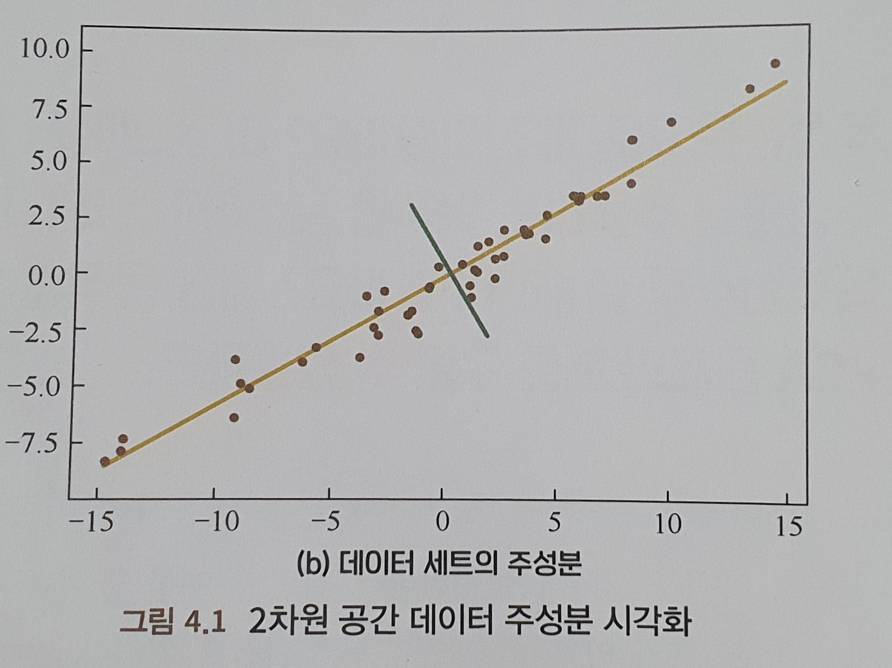

해당 그림에서 노란색 선이 위치한 축에 데이터 분포가 더 분산되어 읶ㅆ는 것을 확인할 수 있는데, 이는 데이터가 이방향에서 분산이 더 크다는 것을 의미합니다. 신호처리 영역에서 우리는 신호과 비교ㅗ적 큰 분산을 가지고 있고, 노이즈는 비교적 작은 분산을 가지고 있다고 여깁니다. 신호와 노이즈의 비율을 S/N비라 부릅니다. S/N비가 클수록 데이터의 질이 좋다는 뜻이고 따라서 우리는 PCA의 목표를 쉽게 생각해낼 수가 있습니다. 즉, 투영 분산의 최대화인데, 축에 투영된 데이터의 분산을 최대화하는 것이라고 생각하면 됩니다.우리가 찾는 분산은 사실 공분산행렬의 최대 고윳값을 찾는 것과 같고, 최대 투영 방향은 최대 고윳ㄱ밧에 대응하는 고유벡터와 같습니다. 두번째 주성분 방향은 최대 주성분 투영방향ㄱ과 직각으로 교차하는 곳에 위치하고 있습니다. 이는 두번째 큰 고윳값에 대응하는 고유벡터입니다.

② PCA 최소제곱오차 이론 92

⭐ PCA의 해는 사실 최적의 투영방향, 즉 하나의 직선을 찾는 것인데, 이는 선형 회귀 문제의 목적과 일치합니다. 그렇다면 회귀의 시각에서 PCA의 목적을 정의하고 문제의 해를 구하는 방법이 있을까요?

고차원 공간에서 우리가 찾으려 하는 것은 샘플과의 거리 제곱합이 가장 작은 d차원의 표평면이 됩니다. d=1인 경우엔 초평면은 직선이 됩니다. 즉, 샘플을 최적 직선에 투영했을 때, 최소화하는 것은 모든 샘플에서 직선까지 거리의 제곱의 합이 됩니다.

③ 선형판별분석 96

⭐ 레이블이 있는 데이터의 차원축소 과정에서 레이블 정보를 잃지 않게 하려면 어떤 목적함수를 설정해야 할까요? 그리고 해당 목표를 달성하기 위해 어떻게 해를 구해야 할까요?

LDA는 분류를 위한 알고리즘이기 때문에 투영 방향만 찾아낸다면 투영 후의 샘플이 최대한 기존 클래스에 맞게 분류되도록 만듭니다. ‘클래스 사이의 ㅓ리를 최대화하는 동시에 클래스 내의 거리를 최소화’하는 것이 LDA의 핵심 아이디어입니다. LDA 차원 축소는 행렬 고윳값 벡터를 구하는 문제로 귀결되는데,우리는 샘플의 평균값과 클래스 내의 분산만 구하면 최적의 투영방향을 구할 수 있다는 뜻입니다. LDA는 PCA와 비교했을 때 클래스 정보를 포함하고 있는 데이터에 대한 차원축소 처리가 뛰어납니다. 그러나 피셔 LDA는 데이터 분포에 대한 아주 강한 가정을 하고 있습니다. 현실에서 이러한 조건을 완전히 만족시키는 경우는 흔히 볼 수 없지만, 차원 축소 방법에 있어 유효성은 이미 증명이 되었습니다. 주요한 이유는 선형모델이 노이즈에 대해 비교적 좋은 강건성을 보이기 때문입니다. 그러나 모델이 지나치게 간단하여 표현능력에 한계가 있다는 단점이 있습니다. 이러한 단점을 보완하기 위해서는 커널 LDA와 같은 비교적 복잡한 분포를 가진 데이터를 처리해야 합니다.

④ 선형판별분석과 주성분분석 101

PCA는 비지도 차원축소 알고리즘인 반면, LDA는 지도 차원 축소 알고리즘입니다.

⭐ LDA와 PCA는 전통적인 차원축소 알고리즘입니다. 응용적 관점에서 이들 원리의 같고 다름을 분석해 보세요. 수학적 관점과 목적함수에 대해 두 차원 축소 알고리즘은 어떤 차이점과 연관성이 있는지 설명해 보세요.

LDA를 다중 클래스를 가진 고차원으로 확장해보면 최종적으로 특성 차원을d차원으로 축소시키는 것이 목표입니다. 따라서 우리는 d차원의 투영초평면을 찾아 투영후 샘플이 LDA의 목표를 달성하도록 해야합니다.

PCA와 LDA 사이에는 유사성이 많이 보입니다. 하지만 대응하는 원리 자체는 다소 차이가 있습니다.

먼저 목적부터 살펴보면, PCA가 선택하는 것은 투영 후 데이터 분산을 가장 크게 만드는 방향으로 PCA는 비지도학습법이기에 분산이 클수록 정보량이 많다고 가정하고, 주성분으로 원래 데이터에서 별 필요가 없는 잉여 차원들을 제거하여 차원축소 목적을 달성합니다., 반면, LDA는 투영 후 클래스 내의 분산이 작으면서 클래스 사이의 분산은 큰 방향을 선택합니다. LDA는 클래스 레이블 정보를 사용하게 되는데, 데이터 ㅜㅇ에서 판별성을 가진 차원을 찾기 위해 원래 데이터를 해당 방향으로 투영한 후 서로 다른 클래스를 최대한 구별하려고 합니다.

안면인식분야에서 PCA와 LDA는 모두 빈번하게 사용되는데 PCA에 기반한 안면인식 방법을 Eigenface 방법이라고도 부릅니다. 이 방법은 사람의 어굴 이미지를 행을 기준으로 전개하여 고차원의 벡터를 만듭니다. 그리고 다수의 얼굴 고윳ㄱ밧의 공분산행렬에 대해 고윳ㄱ밧 분해를 합니다. 여기서 비교적 큰 고윳값에 대ㅎ응하는 사람의 얼굴과 비슷한 형태를 보이고 있기 떄문에 고유 얼굴이라고 칭합니다. 그러나 PCA를 이용해 차원축소를 했ㅇ를 경우 일반적으로 남게 되는 것은 최적의 묘사특징(주성분)이지 분류특징은 아닙니다. 만약 우리가 안면인식의 효과를 더 높이려면 LDA 방법을 사용하여 데이터에 대해 차원축소를 진행한 후, 서로 다른 얼굴의 투영 후 특성에 차별성을 갖도록 해야합니다.

응용관점에서 본다면 우리는 하나의 기본원칙을 세울 수 있습니다. 바로 비지도 문제에 대해서는 PCA를 사용하여 차원축소를 학소, 지도 문제에 대해서는 LDA를 사용하는 것입니다.

> 그저 따라 작성하는 것이 아닌 진정한 의미의 공부, 리뷰로 모르는 내용을 억지로 적을 필요는 없다는 생각이 들었음.
> 

**CHAPTER 5 비지도학습 107**

비지도 학습은 주로 두 종류의 학습 방법이 있는데, 바로 데이터 클러스터링과 특성 변수 관계 탐색입니다. 여기서 클러스터링 알고리즘은 여러 번의 반복을 통해 데이터의 최적 분할을 진행하는 방법이고, 특성 변수 관계 탐색은 각종 연관성 분석 방법을통해 변수 사이의 관계를 찾는 겁니다.

① k평균 클러스터링 109

⭐ K평균 알고리즘이 작동하는 방법에 대해 구체적으로 설명해 주세요

랜덤으로 k개의 군집 중심을 잡고 군집의 중심이 거의 이동하지 않을때까지 반복.

⭐ K평균 알고리즙의 장단점은 무엇인가요? 알고리즘을 튜닝하는 방법에는 어떤 것들이 있나요?

K평균 알고리즘은 초깃값과 특이점의 영향을 받아 결과가 불안정해지고 전역 최적해가 아닌 국소 최적해에 수렴하게 되는 경우가 많이 발생하는 등 군집 분포 차이가 비교적 큰상황에 적합하지 않는 단점들이 존재합니다. 그러나 이러한 단점들도 대규모 데이터 세트에서 상대적으로 유연하고 효과적인 장점을 가릴 수 없습니다. 알고리즙 튜닝에서는 다음의 세가지 방법을 사용.

- 데이터 정규화 및 특이점 처리
- 합리적인 K값 도출 - 오차제곱합으로 정의되는 손실함수 그래프에 엘보우 기법 적용, 이는 경험적인 방법으로 Gap Statistic 방법으로 최대의 Gap Statistic에 대응하는 K값을 찾는 방법을 고안함.
- 커널함수 사용 - non-convex 데이터 분포 모양일 때 커널 함수를 통해 최적화를 해야할 필요가 있습니다. 커널 K군집 알고리즘이라 부르는데, 비선형 투영을 통해 입력 공간의 데이터 포인트를 고차원의 특성공간으로 투영시키고, 새로운 특성공간에서 클러스터링 하는 것입니다.

⭐ K평균 알고리즙의 단점을 개선한 모델은 어떤 것들이 있을까요?

- K값을 지정해야함.
- 국소 최적해에만 수렴하고, 효ㅗ과는 초깃값에 영향을 많이 받습니다.
- 특이점 영향을 많이 받습니다.
- 샘플 포인트는 하나의 군집에만 분류될 수 있습니다.

1. K-means++알고리즘 - n개의 초기 군집 중심을 선택했다면 n+1번째 군집 중심을 선택할 때 n개 군집 중심에서 거리가 먼 샘플이 선택될 확률을 높게 만듭니다.
2. ISODATA 알고리즘 - K값의 크기가 불명확할때 Iterative Self-Organizing Data Analtsis Technique Algorithm을 사용합니다. 모 클래스에 속하는 샘플 수가 작아지면 해당 클래스를 삭제하고, 모 클래스에 속하는 샘플 수가 많아지거나 분산 정도가 비교적 크다면 해당 클래스를 두개의 하위 클래스로 나누는 것이 핵심 아이디어입니다. 아래는 각 입력 파라미터입니다.
    - 예상되는 군집 중심 개수 k
    - 최소 샘플 개수 N
    - 최대분산 시그마
    - 두 군집 중심 사이에 가지는 최소 거리
    
    만약 샘플을 단일한 클래스에 분류하는 것이 목적이 아니라면, 퍼지 군집 알고리즘을 사용하거나 가우스 혼합 모델을 사용합니다.
    

⭐ K평균 알고리즙의 수렴성에 대해 증명하세요

K평균 클러스터링의 재귀적 계산법은 사실 일종의 EM(기댓값 최대화) 알고리즘이라는 것을 알아야 합니다. EM 알고리즙은 확률 모형에 관측할 수 없는 은닌ㄱ변수가 있는 경우의 파라미터 예측 문제를 해결합니다.

② 가우스 혼합 모델 121

Gaussian Mixture Model, GMM은 각 군집의 데이터가 가우스 분포에 부합하고, 데이터에 나타나는 분포가 각 군집의 가우스 분포를 겹친 결과라고 가정합니다.

⭐ 가우스 혼합 모델의 핵심 아이디어는 무엇인가요? 알고리즙은 어떻게 반복적으로 계산되나요?

가우스 혼합 모델은 일종의 생성 모델입니다. 그러나 일반적으로 우리는 가우스 혼합 모델의 파라미터를 직접적으로 얻을 수 없습니다. 이러한 상황에서 EM 알고리즘 구조를 사용하여 최적화 문제를 풀 수 있습니다. 다시말해, 우리는 최적의 K개 가우스 분포가 가지고 있는 3개의 파라미터를 알지 못하고, 각 데이터 포인트가 어떤 가우스 분포에 의해 생성된 것인지도 알지 못합니다. 따라서 매번 반복할 때 가우스 분포를 고정하고 각 데이터 포인트가 각 가우스 분포에 의해 생성될 확률을 얻습니다. 그리고서 해당 생성확률을 고정시키고 데이터 포인트와 생성확률을 기반으로 새로운 가우스 분포를 얻습니다. 이런 과정을 순환하며 더 이상 변화하지 않거나 변화가 매우 작을 경우 비교적 합리적인 가우스 분포를 얻게 됩니다. 가우스 혼합 모델의 장점은 샘플이 어떤 클래스에 속할 확률이 얼마인지 알 수 있다는 것입니다. 따라서 클러스터링 문제뿐만 아니라 확률 밀도의 계산에도 활용되며, 새로운 샘플 포인트를 생성할 때도 사용됩니다.

③ 자기 조직화 지도 125

Self-Organizing MAP, SOM은 중요한 비지도 학습 방법이며, 클러스터링, 고차원 시각화, 데이터 압축, 특성 추출 등 다양한 용도로 사용됩니다.

⭐ SOM알고리즙에 대해 설명해보세요. SOM과 K평균 알고리즙은 어떤 차이점이 있나요?

SOM은 입력층과 출력층(경쟁층), 두 개의 층으로 구성된 신경망 입니다. 훈련할 때는 ‘경쟁학습’방식을 선택하여 각 입력 샘플에서의 모든 가중치와 유클리드 거리를 계산하여 최소가 되는 가장 적합한 노드를 찾습니다. 출력층의 군집의 개수는 일반적으로 군집의 ㄱ수와 같습니다. SOM의 출력층 노드는 위상 관계를 갖습니다.SOM은 투영의 순서를유지하는 특징이 있는데, 임의 차원의 입력형식을출력층에서 1차원 혹은 2차원 도형으로 투영해 위상 구조를 유지할 수 잇습니다. 이러한 위상 투영은 ‘출력층 뉴련의 공간 위치를 입력 공간의 특정 영역 특징에 대응’하도록 만듭니다. 

SOM은 K평균 알고리즘과 다르게 군집 개수를 설정할 필요가 없고, 노이즈 데이터의 영향을 비교ㅗ적 덜 받지만 정확성은 낮을 수 있습니다. 그리고 시각화하기 좋고 비교적 우아한 위상 관계 그래프를 얻을 수 있습니다.

⭐ SOM은 어떻게 설계해야 할까요? 그리고 네트워크 훈련 파라미터는 어떻게 설정해야 할까요?

- 출력층 뉴련 수를 설정 - 출력층 뉴런 수와 훈련 세트 샘플의 클래스 수는 고나련이 있습니다. 클래스 수가 명확하지 않으면 최대한 많은 노드 수를 설정하는 것이 좋습니다. 그래야만 샘플의 위상 구조를 비교적 잘 투영할 수 있기 때문입니다.
- 출력층 노드의 배열을 설정 - 배열 형식은 최대한 실제 문제의 물리적 의미를 직관적으로 반영할 수 있도록 만들어야 합니다.
- 가중치 초기화 - 최대한 가중치의 초기 위치를 입력 샘플의 대략적인 분포 규역과 충분히 중첩될 수 있도록 만들어 대량으로 초기 ‘죽은 노드’가 생기는 것을 방지.
- 위상 영역 설계 - 영역을 계속해서 축소하는 것인데, 이렇게 해야 출력 평면상에 인접한 뉴런에 댕으하는 가중치 벡터 사이에 차이가 생기는 동시에 유사성도 생기기 때문.
- 학습률 설정 - 학습률은 하나의 단조감소 함수이며, 입력벡터의 대략적인 구조를 파악할 수 있도록 합니다.

④ 클러스터링 알고리즘 평가 131

⭐ 외부 라벨 데이터가 없다고 가정한다면 어떻게 두 클러스터링 알고리즘을 비교할 수 있을까요?

서로 다른 클러스터링 알고리즘의 성능을 비교하기 위해서 우리는 먼저 자주 보이는 데이터군집의 특징을 알아야 합니다.

- 중심에 의해 정의되는 데이터 군집
- 밀도에 의해 정의되는 데이터 군집
- 연결에 의해 정의되는 데이터 군집
- 개념에 의해 정의되는 데이터 군집

많은 상황에서 클러스터링 알고리즘 결과의 좋고 나쁨은 주관적 해석에 의존합니다. 그렇다 하더라도 클러스터링 알고리즘의 평가는 필요하고 클러스터링 분석에서 매우 중요한 부분 중 하나입니다.클러스터링 평가의 주요 임무는 데이터 세트에서 클러스터링에 대한 타당성을 고려하는 것과 클러스터링 결과의 질에 대한 계산읋 하는 것입니다. 이러한 틀에서 세가지 임무로 볼수있음.

1. 클러스터링 경향성 측정 - 데이터 분포 중에 비-임의성 군집 구조가 존재하는지를 테스트, 홉킨스 통계를 사용하여 공간상 데이터의 랜덤성을 판단할 수 있음.
2. 데이터 군집 수 판단 - 데이터 분포와 가장 유사한 군집 수를 찾고 이에 기반하여 클러스터링 결과의 질을 판단해야 합니다.
3. 클러스터링 품질 측정 - 비지도 상황에서 우리는 군집이 분리된 상황과 군집이 모여 있는 상황을 통해 클러스터링 효과를 평가할 수 있습니다.
    - 실루엣 계수 - 우리는 모든 포인트에 대응하는 실루엣 계수의 평균값으로 클러스터링 결과의 품질을 측정할 수 있습니다.
    - 평균제곱근 표준편차 - 클러스터링 결과의 동질성, 즉 밀집 정도를 평가하는데 사용되며, 정규화가 반영된 표준편차라고 볼 수 있습니다.
    - R-Square - 군집 사이의 차이 정도를 측정할 수 있으며, 클러스터링 이후의 결과와 클러스터링 이전의 결과 사이의 비교이며, 대응하는 오차 제곱합 지표의 개선 정도를 나타냅니다.
    - 개선된 Hubert $\gamma$ 통계량 - 데이터 쌍의 불일치성을 이용하여 군집의 차이를 평가할 수 있습니다.
    
    이 외에도 합리적으로 서로 다른 클러스터링 알고리즘의 성능을 평가하기 위해 인위적으로 서로 다른 유형의 데이터 세트를 만드는 방법도 필요합니다.
    
    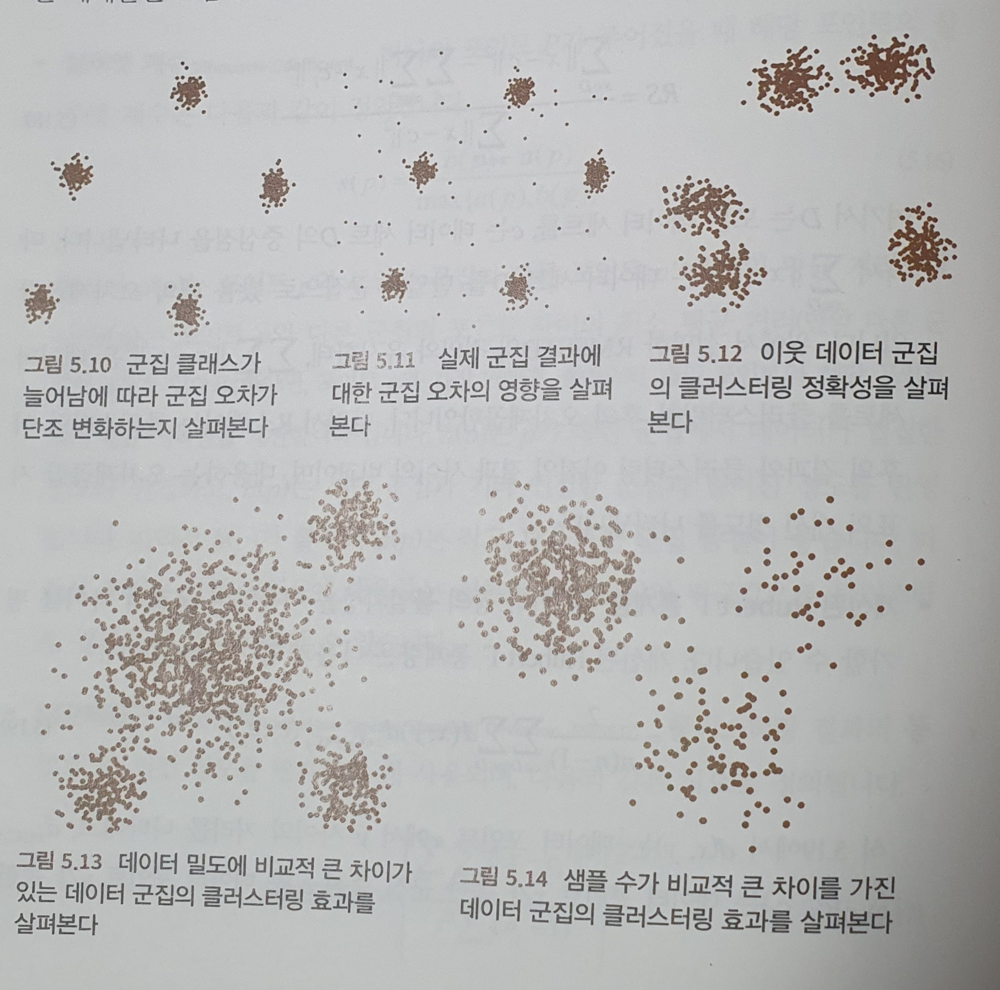
    

**CHAPTER 6 확률 그래프 모델 137**

확률 그래프 모델은 관측 노드로 관측한 데이터를 표현하고, 은닉 노드로 잠재적인 지식을 표현합니다. 그리고 에지를통해 지식과 데이터 사이의 상호관계를 나타내며, 이러한 관계도에 기반해 확률 분포를 얻어 매우 ‘우아하게’문제를 해결합니다.

확률 그래프에서 노드는 은닉 노드와 관측 노드로 나눌 수 있고, 에지는 방향이 있는 예지와 방향이 없는 에지로 나눌 수있습니다. 확률론의 고나점에서 노드는 랜덤변수에 대응하고, 에지는 랜덤변수의 상관계수에 대응합니다. 여기서 방향이 있는 에지는 단방향 의존을, 방향이 없는 에지는 상호의존 관계를 나타냅니다. 확률 그래프 모델에는 베이지안 네트워크와 마르코프 네트워크 두가지 큰 종류가 있습니다. 베이지안 네트워크는 유방향 그래프 구조로 표현되고, 마르코프 네트워크는 무방향 그래프 네트워크 구조로 표현됩니다. 더 세분화하면, 확률 그래프 모대ㅔㄹ에는 나이브 베이즈 모대ㅔㄹ, 최대 엔트로피 모델, 은닉 마르코프 모델, 랜덤 필드, 토픽 모델 등이 있습니다.

① 확률 그래프 모델의 결합확률분포 139

그래프 형식으로 확률 생성 관계를 표현할 수 있는 점이 가장 멋집니다. 이는 중요한 기능일 뿐만 아니라 이해하기 위한 척도과 됩니다.

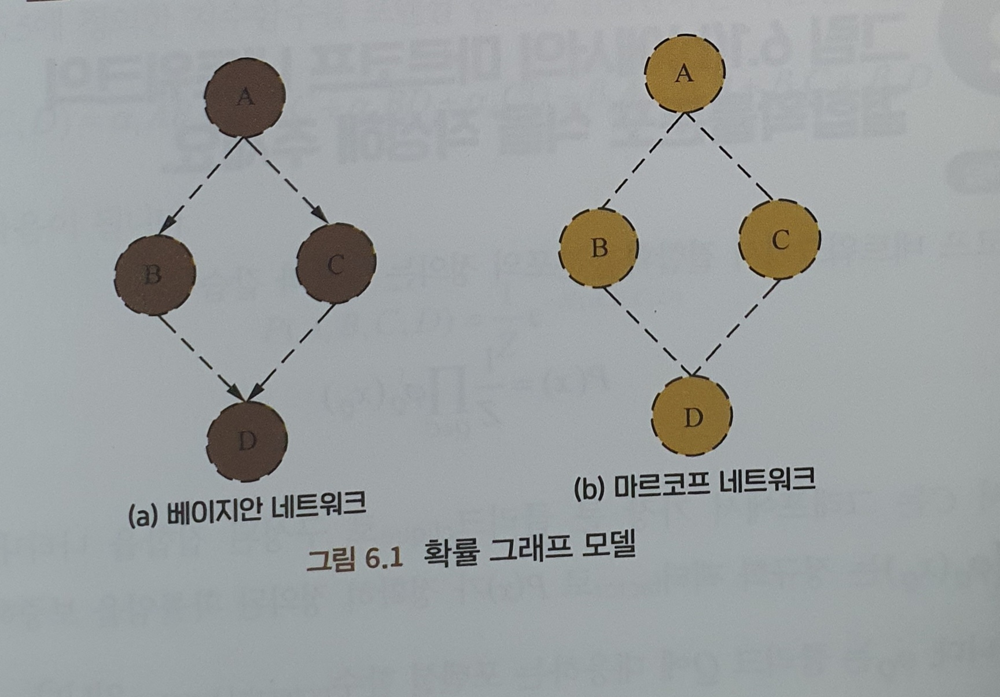

⭐ 위 그림에서 베이지안 네트워크의 결합확률분포 식을 작성해 주세요

$P(C|A,B)$(단, A 조긴이 주어졌을때 B,C는 독립), $P(D|A,B,C)$(단, A 조긴이 주어졌을때 B,C는 독립) 두 식을 통해 $P(A,B,C,D) = P(A)P(B|A)P(C|A)P(D|B,C)$를 얻을 수 있습니다.

② 확률 그래프 표현 142

⭐ 나이브 베이즈 모델의 원리에 관해 설명하고 확률 그래프 모델로 표현해 보세요

나이브 베이즈 모델은 지정된 샘플이 특정한 클래스에 속할 확률을 예측하여 해당 샘플이 속할 클래스를 예측합니다. $P=(y_i|x) \propto P(x|y_i)P(y)$로 $P(y_i)$는 훈련 샘플 통계를 통해 얻을 수 있습니다.

⭐ 최대 엔트,로피 모델의 원리에 고나해 설명하고 확률 그래프 모델로 표현해 보세요.

정보는 사람들이 사물을 이해하는 것에 대한 불확실성 감소 혹은 해소를 뜻하며, 엔트로피는 불확실성의 척도입니다. 엔트로피가 클수록 불확실성이 커집니다. 최대 엔트로피 원리는 확률 모델 학습의 원칙 중 하나이며, 핵심 아이디어는 제약 조건을 만족하는 모델 집합에서 엔트로피가 가장 큰 모델을 선택하는 것인데, 즉 불확실성이 최대인 모델을 뜻합니다. 최대 엔트로피 모델은 적합한 분포 $P(x|y)$를 학습하여 조건 엔트로피 $H(P)$의 값을 최대로 만듭니다. 아무것도 알지 못하는 상황에서는 $P(x|y)$가 균등분포를 따른다고 가정합니다.그렇다면 훈련 데이터 세트가 있는 상황에서는 어떠한 규율을 찾아 불확실성을 제거하고 싶엏 ㅏㅂ니다. 바로 이때 우리는 특성함수 $f(x,y)$를 사용합니다. 학습된 모델 $P(x|y)$이 훈련 데이터 중의 규울을 정확하게 포착하게 만들기 위해, 하나의 제약을 추가하여 경험 분로 $f(x,y)$에 관한 특징 함수의 기댓값과 모델$P(x|y)$와 경험분포의 기댓값에 관한 값이 같아지도록 만듭니다. 확률 그래프 모델의 고나점에서 이해하면, 우리는 $P_w(x|y)$의 표현 형식이 포텐셜 함수가 지수 함수인 마르코프 네트워크와 매우 유사하는 것을 알 수 있습니다.

③ 생성모델과 판별모델 146

생성모델과 판별모델의 차이는 머신러닝 영역에서 가장 중요한 기초 지식이지만 정확히 이 둘을 구별하는 것은 결코 쉽지 않습니다.

⭐ 자주 보이는 확률 그래프 모델 중에는 어떤 생성 모델과 판별모델이 있나요?

관측 가능한 변수 집합 X오ㅓㅏ 예측해야 하는 변수 집합 Y, 그리고 기타 변수 집합 Z가 있다고 가정하면,

- 생성모델 - 결합확률분포 $P(X,Y,Z)$에 대한 모델링하고, $P(Y|X)$ 계산을 통해 변수 집합 Y를 추측합니다.
- 판별모델 - 직접적으로 $P(Y, Z|X)$를 모델링하고 변수 Z를 제거해 변수 집합 Y를 예측합니다.

자주 사용하는 확률 그래프 모델에는 나이브 베이즈, 최대엔트로피 모델, 베이지안 네트워크, 은닉 마르코프 모델, 조건 랜덤 필드, pLSA, LDA 등이 있습니다. 앞의 해설에 따라 최대 엔트로피 모델, 조건 랜덤 필드 모델은 판별모델, 나머지는 생성모델에 속한다는 것을알 수 있습니다.

④ 마르코프 모델 148

마르코프 과정은 과거에 의존하지 않는 랜덤 과정입니다.하나의 랜덤 과정을 가정하고, 시간과 ㅅ강태의 값이 모두 이산값인 마르코프 과정을 마르코프 체인이라고 부릅니다. 은닉 마르코프 모델은 미지의 파라미터(은닉상태)를 포함하는 마르코프 체인을 모델링하여 생성된 모델이며, 간단한 마르코프 모델에서 모든 상태는 관측자에게 관측 가능합니다. 따라서 마르코프 모델에서는 상태 사이의 전이확률만을 포함하고 있습니다. 그러나 은닉 마르코프 모델에서는 관측자가 확인할 수 없기 때문에 관측자가 관측할 수 있는 것은 각 은닉 상태에 대응하는 출력 뿐입니다. 

⭐ 단어 분할 문제에서 은닉 마르코프 모델을 사용하여 모델링하고 훈련하는 방법에 대해 설명해 주세요.

은닉 마르코프 모델은 아래와 같이 구성됩니다.

- 확률 계산 문제 - 모델의 모든 파라미터를 알고있을때, 관측 수열 T의 출현 빈도를 계산
- 예측 문제 - 모델의 모든 파라미터와 관측 수열 Y를 알고 있을 때 최대 가능성을 가진 은닉 상태 수열 X를 계싼
- 학습 문제 - 관측 수열 Y를 알고 있을때 해당 관측 수열 확률을 최대로 하는 모델 파라미터를 구함

은닉 마르코프 모델은 일반적으로 수열 레이블링 문제를 해결하기 위해 사용되는데, 따라서 단어 분할 문제를 수열 레이블링 문제로 전환해 모델링 할 수 있습니다. 모델링 후, 언어 자료를 사용한 지도 훈련과 비지도 훈련으로 나눌 수 있는데 경험에 기반해 언어 자료의 모든 은닉 상태 정보를 얻어 간단한 계산법으로 확류 분포에 대해 최대우도를 계산한 것과 같습니다, 비지도 훈련은 바움-웰치 알고리즘을 사용할 수 있는데, 은닉 상태 수열과 모델에 대응하는 확률 분포를 동시에 최적화합니다.

⭐ 최대 엔트로피 마르코프 모델에서 레이블 편향 문제가 생기는 이유는 무엇일까요? 이 문제에 대한 해결 방안은 무엇인가요?

시퀀스 레이블 문제를 해결하는 모델은 종종 레이블에 대해 독립성 가설을 세웁니다. 은닉 마르코프 모델을 통해 레이블 편향문제에 대해 소개합니다.

시퀀스 레이블 문제에서 은닉 상태는 단일 관측 상태와 관련 있을 뿐만 아니라 관측 수열의 길이나 상하 문장의 정보와도 연관이 있습니다.따라서 최대 엔트로피 마르코프 모델이 고안되었습니다. 이 모델을 모델링할 때 은닉 마르코프 모델에서 관측 상태가 서로 독립적이라는 가설을 제외했습니다. 그리고 전체 관측 시퀀스를 고려하여 더 강력한 표현 능력을 얻을 수 있게 되었습니다. 또한 은닉 마르코프 모델은 일종의 은닉상태 시퀀스와 관측상태 시퀀스에 대한 결합확률에 대해 모델링하는 생성모델인 데 반해, 최대엔트로피 마르코프 모델은 직접적으로 레이블의 사후 확률을 모델링하는 판별모델입니다. 최대 엔트로프 마르코프 모델에는 레이블 편향 문제가 존재합니다. 국소적 정규화 영향으로 인해 은닉 상태가 후속 가능 상태가 더욱 적은 상태로 전이하는 경향을 보이는데, 이는 전체 사후확률을 향상시키기 위함입니다. 이것이 바로 레이블 편향 문제입니다. 노건 랜덤 필드(CRF)는 최대 엔트로피 마르코프 모델에 기반하여 전역 정규화를 진행한 알고리즘입니다.

> 베이지안 이론이 처음 나왔을 때 그 목적이 ‘신의 존재’를 증명하기 위함이었다고 합니다. 베이즈가 관ㄴ심이 있었던 원래 문제는 인간이 세상의 경험과 현실 ㅅ게계의 저ㅡㅇ거를 가지고 신의 존재를 증명할 수 있을까에 대한 것이었습니다. 길은 달라도 이르는 곳은 같다고, 이유야 어쩃든 베이즈와 뉴턴과 같은 수학자들은 모두 최종적으로 자신의 분야에서 걸출한 공헌을 했고 이로 인해 ‘신’에 대한 인류의 인식 방법도 점점 이성적으로 변했습니다.
> 

⑤ 토픽 모델 156

BOW, N-gram 모델에 기반한 텍스트 표ㅗ현 모델은 두 개의 서로 다른 단어 혹은 단어 그룹이 같은 토픽을 갖고 있을 경우 분펼이 힘들다는 단점이 있습니다. 따라서 같은 토픽을 가진 단어나 단어 그룹을 동일 차원으로 투영할 수 있는 기술이 필요한데, 이러한 필요에 의해 토픽 모델이 생겨났습니다. 이는 일종의 특수한 확률 그래프 모델입니다. 같은 토픽을 가진 두 단어를 구별하는지 생각해보면 높은 확률로 동시에 한 문장에서 출현할 것입니다. 다른 말로, 하나의 토픽이 주어졌을 때 두단어의 생성확률은 모두 비교적 높을 것이고, 다른 관련성이 비교적 낮은 단어들의 생성확률은 낮을 것입니다. 토픽 모델로 해결하고자 하는 일은 텍스트 라이브러리에서 대표성이 있는 토픽을 찾아내고(각 토픽에서 단어의 분포를 얻을 수 있음), 각 문장이 어떤 토픽에 대응하는 지 계산하는 것입니다.

⭐ 자주 사용하는 토픽 모델에는 어떤 것들이 있나요? 토픽 모델과 그 원리에 대해 설명해 주세요.

- PLSA(Probabilistic Latent Semantic Analysis)는 생성모델을 사용해 텍스트 생성 과정을 모델링합니다.K개의 토픽과 M편의 문장이 있다고 가정할때, 말뭉치에서임의의 문장 d에 대해 N개의 단어가 있다고 가정한다면, 각 단어에 대해 우리는 하나의 주제 z를 선택하고 현재 토픽에 기반하여 단어 w를 생성합니다. 토픽 z와 단어 w를 생성하는 과정은 하나의 정해진 확률 분포를 따릅니다. 문장 d에서 토픽 z를 생성할 확률을 $p(z|d)$라고 설정하면, 토픽이 정해진 조건하에서 단어 w를 생성할 확률은 $p)w|d)가 됩니다.이는 모든 말뭉치 중에서 텍스트 생성확률은 우도함수로 표현할 수 있고 최적의 파라미터를 찾아 모든 말뭉치의 로그우도함수를 최대화햐야하지만 최대우도추정을 사용할 수 없기에 EM알고리즘을 사용하여 해를 구합니다.
- LDA(Latent Dirchlet Allocation)는 PLSA의 베이지안 버전이라고 볼 수 있습니다. 차이점은 토픽 분포와 단어 분포에 각각 둑 개의 디리클레 사전분포를 더헀다는 점입니다.오ㅓㅐ 디리클레 사전분포를 추가해야 할까요? 이에 대한 논의는 빈도주의 학파와 베이지안 학파의 차이에서 시작합니다.LDA는 베이지안 학파의 아이디어를 사용해, 계산해야할 파라미터를 고정된 상수로 보지 않고 일정한 분포를 따르는 랜덤변수라 생각합니다. 이 분포는 일정한 사전확률 분포(즉, 디리클레 분포)를 따르고, 샘플 정보가 들어오면 사전분포를 수정하여 사후분포를 얻을 수 있다고 주장합니다. 디리클레 분포를 선택한 이유는 다항식 분포의 켤레 사전분포이며, 사후 확률도 디리클레 분포를 따르는 계산의 편의성 떄문입니다.

⭐ LDA 모델의 토픽 개수는 어떻게 정해야 할까요?

LDA에서 토픽의 개수는 사전에 지정해 줘야합니다.우리는 훈련 시에 다양한 조합의 하이퍼 라라미터 값을 실험하고 검증 세트에 적용하여 결괏값이 가장 좋은 하이퍼 파라미터를 선택합니다. 검증 세트와 테스트 세트에서 LDA 모델의 효과를 측정하기 위해서 우리는 적합한 평가 지표로 Perplexity를 일반적으로 주로 사용합니다. 시작할 때 토픽 개수가 많아지면서 훈련 세트와 검증 세트에서의 모델의 퍼플렉시티(혼잡도)는 낮아지게 됩니다. 그러나 토픽 개수가 충분히 많을 때는 과적합이 발생하여 훈련 세트의 퍼플렉서ㅏ티 지표는 계속해서 감소하지만, 검증 세트에서는 증가하게 됩니다. 이때 극솟값에 대응하는 토픽 개수를 지정하면 됩니다. 그외 다른 방법으로는 LDA를 기반으로 계측 디리클레 과정을 더해 일종의 비모수 토픽 모델인 HDP-LDA를 사용합니다. 비모수 토픽 모델의 장점은 사전에 토픽 개수를 지정할 필요가 없고, 문서 수가 변화함에 따라 모델이 자동으로 토픽 개수를 조정한다는 점입니다. 그러나 이는 모델이 복잡해져 실제 응용단계에서 많이 선호하지 않는다는 단점이 있습니다.

⭐ 어떻게 토픽 모델을 사용하여 추천 시스템의 콜드 스타트 문제를 풀 수 있나요?

콜드 스타트 문제는 일반적으로 사용자, 상품, 시스템 콜드 스타트의 세 가지로 나눌 수 있습니다. 사용자 콜드 스타트는 예전에 어떠한 행위도 없거나 행위가 매우 적은 신규 사용자에게 추천을 해야 하는 문제를 뜻하고, 상품 콜드 스타트는 새롭게 런칭한 상품 혹은 영화에 대해 ㅈㅁ재적 흥미를 느낀 사용자를 찾아주는 문제를 뜻합니다. 시스템 콜드 스타트는 새롭게 개발한 웹사이트나 플랫폼 디자인에 관한 개인화 추천 문제입니다.

이를 해결하기 위해서는 일반적으로 콘텐츠 기반의 추천을 많이 사용합니다. Hulu에서는 사용자의 등록 정보, ㅘㄴ련 검색어 혹은 다른 플랫폼에서 얻은 정보를 활용하여 사용자가 관심을 가질만한 토픽을 추측합니다. 그런 다음 토픽 벡터를 기반으로 유ㅜ사한 영화를 찾고, 새로운 영화를 이전에 해당 토픽의 영화를 좋아했던 사용자에게 추천합니다. 그렇다면 콜드 스타트 문제는 어떻게 해결해야 할까요? 먼저, 각 사용자와 영화에 대응하는 토픽 벡터를 얻고, 사용자 토픽과 영화 토픽 사이의 선호도를 알아야 합니다. 즉, 어떤 토픽의 사용자가 어떤 토픽의 영화를 좋아할지에 대해 알아야 합니다. 시스템에 어떠한 데이터도 없다면 우리는 사전 지식을 통해 토픽을 지정합니다. 일반적으로 토픽의 개수는 그리 많지 않기 때문에 시스템이 업데이트 되면 데이터를 얻을 수 있게 되어 토픽 사이의 선호도에 대해 비교적 정확한 예측을 할 수 있게 됩니다.

**CHAPTER 7 최적화 알고리즘 163**

c최적화는 응용수학의 한 분야. 머신러닝 = 모델표현 + 모델 평가 + 최적화 알고리즘 으로 봐도 무방합니다. 최적화 알고리즘은 모델 표현 공간에서 모델 평가 지표를 최적으로 하는 모델을 선택하는 것입니다.빅데이터와 딥러닝의 발전으로 인해 실제 응용 환경에서 직면한 문제는 대부분 대규모, 고차원의 넌 컨벡스 최적화 문제들인데, 이는 데이터와 컨벡스 최적화 이론에 기반한 전통적인 방법에 큰 도전입니다. 머신러닝 도구 대부분은 자주 사용하는 최적화 알고리즘을 내재하고 있어 응용 단계에서는 코드 몇줄이면 자유롭게 사용가능하지만 이는 머신러닝에서 중요한 역할을 담담하고 있기 때문에 원리를 이해하는 데이터 과학자의 필수 시킬입니다.

① 지도학습에서의 손실함수 165

머신러닝의 관건은 모델 평가인데, 손실함수는 모델의 평가 지표를 정의합니다.

⭐ 지도학습법에서 사용하는 손실함수는 어떤 것들이 있나요? 예제와 함께 설명하고 각 손실함수의 특징도 함께 말해 주세요.

손실함수는 모델과 훈련 샘플의 적합 정도를 보여줍니다. 파라미터가 $\theta$인 모델은 함수 $f(\dot, \theta):X \rarr Y$로 표현될 수 있습니다. 

이진분류 문제에서는 0-1 손실함수가 가장 자연스럽지만, non-convex한 특성으로 Hinge 손실함수를 대체해 사용합니다.  또 다른 대체 손실함수로는 로지스틱 손실함수도 있습니다.

회귀문제에 대해서는 제곱 손실함수를 사용하지만 거리가 멀수록 패널티가 커져 특이점에 비교적 민감합니다. 따라서 절댓값 손실함수를 사용합니다. 이는 중간값 회귀를 하는 것과 마찬가지로 특이점에 비교적 견고합니다. 그러나 $f=y$에서 미분할 수 없어 종합적으로 고려했을 때 Huber 손실함수를 사용할 수 도 있습니다.

② 머신러닝에서의 최적화 문제 169

대부분 머신러닝 모델의 파라미터 계산 문제는최적화 문제로 귀결되고, 최적화 문제의 형식과 특징에 대한 이해는 우리가 더 효과적으로 문제를 풀고 모델파라미터를 얻어 원하는 학습 목표에 도달할 수 있도록 도와 줄 것입니다.

⭐ 머신러닝에서의 최적화 문제에서 어떤 컨벡스 최적화 문제와 넌컨벡스 최적화 문제가 존재할까요? 예를 들어 설명해 보세요

- 컨벡스 함수 - 직관적인 해석은 컨벡스 함수 곡면상의 임의의 두 점을 연결한 직선상의 임의의 한 점이 해당 함수 곡면 아래에 위치할 수 없음을 뜻합니다.

자주 사용하는 로지스틱 회귀모델에 대응하는 최적화 문제가 바로 컨벡스  최적화 문제입니다. 컨벡스 최적화 문제에 대해 모든 국소 최솟ㄱ밧은 전역 최솟값이고, 따라서 이러한 문제는 일반적으로 비교적 쉽게 풀 수 있습니다. 다른 한편으로는, PCA에서의 최적화 문제는 넌컨벡스 최적화 문제입니다. 일반적으로 이러한 문제는 풀기 어려운 문제로 간주되지만 SVD(특이값 분해, 고윳값 분해 처럼 행렬을 대각화하는 한 방법)를 사용하여 주선분 분석의 전역 최솟값을 구할 수 있기 때문에 주성분분석은 예외입니다.

③ 전통적인 최적화 알고리즘 172

다양한 알고리즘 중에서도 전통적인 최적화 알고리즘에 대해서는 잘 이해해야 합니다. 이들의 응용 상활까지 이해한다면 새로운 최적화 문제를 만났을 때 해결할 수 있는 사고력을 더해 줄 겁니다.

⭐ 제약 조건이 없는 최적화 문제에서의 최적화 방법에는 어떤 것들이 있을까요?

전통적인 최적화 알고리즘은 

- 직접법(direct method) - 직접적으로 최적화 문제의 최적해를 구할 수 이쓴 방법. 두가지 조건을 만족시켜야 하기 때문에 응용범위에 제한이 있음.
- 반복법(iterative method) - 반복적으로 최적해에 대한 계산 값을 수정하는 것을 뜻함. 일차 방법과 이차 방법으로 나눌 수 있는데, 
일차 방법은 일차 테일러 전개를 하여 근사식을 얻는 경사하강법이라고도 부릅니다. 
이차 방법이란, 함수에 대해 이차 테일러 전개를하여 근사식을 얻고 근사 최적화 문제 식의 해를구하면 이차 방법의 반복 공식을 얻을 수 있습니다. 이는 뉴턴법이라고도 부릅니다. 헤시안 행렬은 바로 목적함수의 이차 정보입니다. 수렴속도는 일차 방법보다 빠르지만, 고차원일 경우 계산복잡도가 커져 목적함수가 넌 컨벡스인 경우 안정점에 수렴할 가능성이 높습니다.

④ 경사하강법 검증 방법 177

경사하강법을 사용해 최적화문제를 풀 때 가장 중요한 작업은 바로 목적함수의 기울기 계산입니다. 딥러닝과 같ㄷ은 비교ㅗ적 복잡한 머신러닝 학습 모델에서는 매우 복잡하고 틀리기 쉽습니다. 따라서 실제 응용에서 기울기를 계산하는 코드를 작성한 후 코드를 검증하는 작업이 필요합니다.

⭐ 목적함수 기울기의 계산에 대한 검증은 어떻게 진행할까요?

최적화 문제와 목적함수의 값과 경사를 구하는 기능을 구현했다고 가정했을때, 테일러 전개를 이용해 근사오차를 계산하고 라그랑주 나머지 공식에 의해  근사식의 오차는 다음과 같습니다.

$|\frac{L(\theta + he_i) - L(\theta - he_i)}{2h} - \frac{\partial L(\theta}{\partial \theta_i}| \approx Mh^2$

따라서 우리는 h가 비교적 작을 때 h를 원래 크기에서 $10^{-1}$배 할때마다 근사오차 또한 원래 크기의 $10^{-2}$배가 됨을 알 수 있습니다. 즉, 근사오차는 h의 고위의 무한소 입니다.만약 어떠한 첨자 i에 대해 대해 부등식이 성립하지 않을 때에는 

1. 해당 첨자에 대응하는 M이 너무 크기때문에
2. 해당 기울기 컴포넌트 계산이 부정확하기 때문에

$\theta$를 고정하고 h를 줄여 근사오차를 계산하고, 근사오차가 위의 내용과 같이 줄어든다면 첫 번째 원인일 가능성이 높기 떄문에 더 작은 h를 선택하여 검증을 한 번더 합니다. 그렇지 않다면 두 번째 우너인일 가능성이 높기 때문에 코드에 문제가 없는지 한 번 더 검증합니다.

⑤ 확률적 경사하강법 180

⭐ 훈련 데이터 크기가 매우 큰상황에서 전통적인 경사하강법을 사용한다면 어떤 문제가 생길가요? 이에 대한 개선 방안은 무엇인가요?

전통적인 경사하강법은 모든 훈련 데이터 세트의 평균 손실을 사용하여 목적함수에 근사하게 되는데, 매번 모델 파라미터를 업데이트 할 때마다 모든 훈련 데이터를 사용해야 합니다. M이 너무 많다면 계산량도 그만큼 많아져서 계산 시간이 길어지므로 실제 응용 환경에서 적용하기 힘든 경우가 있습니다. 이런 문제를 해결하기 위해 확률적경사하강법(SGD)가 나온 것입니다.

이 방법은 단일훈련 데이터의손실을 사용해 평균손실에 근사합니다. 따라서 단일 훈련 데이터를 사용하여 모델 파라미터에 대해 한차례 업데이트를 하기 때문에 수렴속도가 높아집니다. 이 방법은 데이터가 끊임없이 추가되는 온라인 플랫폼 환경에 잘 맞습니다. 확률적 경사의 분산을 줄여 반복 계산을 더 안정적으로 수행하기 위해, 그리고 고도로 최적화된 행렬 연산을 충분히 활용하기 위해서는 실제 응용중에서 여러개의 데이터를 동시에 처리하게 되는데, 이런 방법을 미니배치-경사하강법이라고 부릅니다. 

미니배치-경사하강법을 사용할때는 

- ‘파라미터 m을 어떻게 선택할것인가?’ - 튜닝을통해 선택해야함.
- ’ 어떻게 m개의 훈련 데이터를 선택할 것인가?’ - 데이터의 특정 순서가 영향을 주는 것을 피하기 위해 사용하기 전에 랜덤으로 배열하는 작업을 진행
- ’학습률은 어떻게 선택할 것인가?’ - 처음 시작할때는 큰 학습률을 사용하다 오차 곡선이 정체기에 들어서면 학습률을 감소시켜 더 정밀한 튜닝을 함.

> 기울기 연산자 \nabla - ‘나블라’로 외형이 역삼각형처럼 생긴히브리어의 하프를 뜻함.
> 

⑥ 확률적 경사하강법의 가속 184

확률적 경사하강법은 만능 열쇠가 아닙니다. 가끔은 독이 되는 경우도 존재합니다. 이 방법만 사용하여 딥러닝 네트워크를 설계할때 비교적 좋은 결과를 얻지 못했을때 쉽게 포기하고 말것입니다. 그러나 모델의 문제가 아닌 최적화 과정이 제대로 작동하지 않았기 때문일 수 있습니다.

⭐ 확률적 경사하강법이 효과를 상실하게 되는 원인 - 돌을 더듬어 가며 산을 내려오다.

시력이 좋지 못한 사람이 산을 내려가는 비유는 경사하강법을 설명하기 위해 자주 사용하는 비유인데, 이는 자기 위치에서 발 밑의 경사만을 의지해서 기울기가 아래로 향하는 쪽으로만 걸어가야 하기 때문입니다. 돌이 많아 경사를 잘 파악할 수 없다면 정확성이 떨어질 것이고, 내리막이라고 생각했던 곳이 사실은 내리막이 아닌 경우도 자주 만나게 됩니다.

이와 유사하게, 배치 경사하강법은 시력이 좋지 못한 상태에서 비교적 정상적인 산을 내려가는 것과 같고, 확률적 경사하강법은 맹인이 돌이 많은 산을 내려가는 것과 같습니다.

배치 경사하강법은 모든 데이터 세트에서 정확한 경사를 계산합니다.

확률적 경사하강법은 단일 샘플을 사용하여 현재 위치한 경사를 계산합니다.

정확한 기울기를 얻기 위해서 배치경사하강법은 각 스텝마다 모든 훈련 데이터를 계산에 사용하기 때문에 계산 시간과 메모리 소모가 매우 큽니다. 따라서 대규모 데이터를 사용하는 환경에 적합하지 않습니다. 이와 반대로, 확률적 경사하강법은 기울기 정확성을 조금 포기하고 각 스텝마다 하나의 샘플만을 기울기 계산에 사용하기 때문에 계산 속도가 빠르고 메모리 소모가 적다는 장점이 있습니다. 하지만 각 스텝마다 얻을 수 있는 정보가 제한적이기 때문에 SGD의 기울기 계산에 편차가 생겨 곡선 수렴을 불안정하게 만들고 비교적 큰 기복을 수반합니다.

딥러닝 최적화 문제는 원래 매우 어렵고 너무 많은 국소 최적해의 함정에 빠질 위험이 있다고 말합니다. 그러나 SGD에서 가장 경계해야 할 것은 국소 최적해가 아닌 골짜기와 안장점 두 종류의 지형입니다. 골짜기에서는 약간의 기울기만 있어도 산 절벽을 만나기 쉽습니다. 따라서 양 산 절벽사이에서 계속해서 왔다 갔다만 하게 만들며, 아래 방향으로 신속하게 내려갈 수 없게 만들어 수렴이 불안정하고 속도를 느리게 만듭니다(진동 현상이라고도 부름). 안장점에서는 SGD는 평지를 지나게 됩니다.(이러한 지형을 고원,plateau라고 부름)

⭐ 해결방법 - 관성 보존과 환경 감지

- 모멘텀 방법 - $v_t = \gamma v_{t-1} + \mug_t(\theta_{t+1} = \theta_t - v_t)$, 관성의 문리량은 모멘텀입니다. 모멘텀 누적의 결과는 서로의 힘을 상쇄하여 자연스럽게 포환의 흔들림이 약해집니다.
- Adagrad - 관성은 기존 정보에 의해 얻어집니다.  그렇다면 기존의 스텝에서 앞으로 나아갈 힘을 얻는 방법 외에 다른 방법은 존재할까요? 우리는 주변 환경에 대한 감각과 지각을 통해 무언가를 얻을 수 있기를 기대합니다. 환경에 대해 감지한다는 것은, 파라미터 공간에서 서로 다른 파라미터의 경험성 판단에 근거하여 자기적응적으로 파라미터의 학습률을 결정한다는 것과 서로 다른 파라미터의 보폭 업데이터는 다르다는 것을 뜻합니다.AdaGrad의 방법은 ‘ 기존 기울기의 제곱합’을 사용하여 서로 다른 파라미터의 경사의 희소성을 평가하는데, 값이 작을수록 더 희소하다는 것을 뜻합니다.
    
    $\theta_{t+1,i} = \theta_{t, i} - \frac{\mu}{\root{\sum^{t}_{k=0}g^2_{k,i}+\epsilon}}g_{t,i}$
    
- Adam - 관성유지와 환경 감지의 두가지 장점을 합친 방법입니다. 일차모멘트와 이차 모멘트는 슬라이딩 윈도우 내에서 평균을 구하는 아이디어를 이용해 융합됩니다. 즉, 현재 기울기와 최근 시간 내의 기울긱의 평균값, 긴 시간대에서의 기울기가 현재 평균값에 공헌한 정도는 지수적 감쇠형태를 띠게 됩니다. 일차 모멘트와 이차 모멘트는 지수 감쇠 평균기술을 사용하는데
    
    $m_t = \beta_1m_{t-1} + (1-\beta_1)g_t$
    
    $v_t = \beta_2v_{t-1} + (1-\beta_2)g_t^2$로 $beta_1, \beta_2$는 감쇠 계수이고, $m_t$는 일차 모멘트, $v_t$는 이차 모멘트입니다.
    
    업데이트 공식은 다음과 같습니다.
    
    $\theta_{t+1} = \theta_t - \frac{\mu \cdot \hat{m_t}}{\root{\hat{v_t} + \epsilon}},(\hat{m_t} = \frac{m_t}{1-\beta_1^t}, \hat{v_t} = \frac{v_t}{1-\beta_2^t})$입니다.
    

이외에도 Nesterov Accelerated Gradient(관성 방향에 따라 미래 위치에 대한 기울기 계산으로 알고리즘은 전방 환경에 대한 예측 판단 능력을 갖게 됩니다.), AdaDelta와 RMSProp(AdaGrad 개선 방법), AdaMax, Nadam 등 있습니다.

⑦ L1 정규화와 희소성 192

왜 모델 파라미터가 희소성을 가지길 바랄까요? 희소성이란, 쉽게 말해 모델의 많은 파라미터가 0이 되는 상황입니다. 이는 모델에 대해 특징 선택을 하여 비교적 중요한 특징만을 남겨둔 것과 같습니다. 이렇게 함으로써 모델의 일반화 성능이 높아지고 과적합 위험을 낮출 수 있습니다. 만약 분별력 없이 모든 차원을 사용한다면 온라인 시스템을 맡고 있는 동료들이 당신을 찾아올지도 모릅니다. 온라인 환경에서는 시간이 중요하기 때문에 아무리 좋은 분산형 컴퓨텅 시스템을 갖추고 있더라도 특징을 줄이는 것이 좋은 방안일 것입니다.

⭐ L1 정규화를 사용해 모델 파라미터에 희소성을 갖게 할 수 있는 원리는 무엇인가요?

- 관점 1: 해공간 형태 - 노란색 부분은 L1과 L2 정규화 제약조건을 더한 해 공간을 뜻하고, 초록색 등고선은 컨벡스 최적화 문제에서 목적함수의 등고선을 나타냅니다.
    
    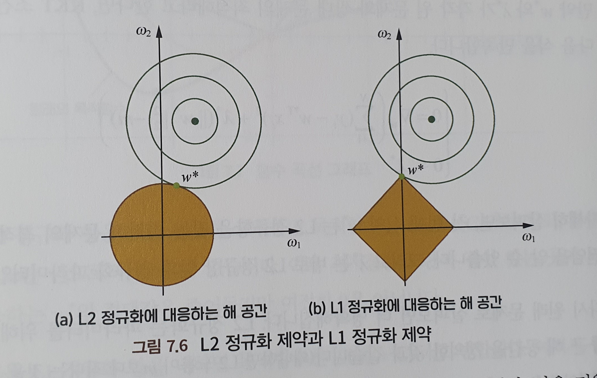
    
    위 설명은 의심의 여지 없이 정확하지만, 충분히 구체적이지는 못합니다. 이 질문은 KKT 조건을 통해 설명할 수 있습니다. 사실 ‘정규항을 가진’과 ‘제약 조건을 가진’은 같은 의미입니다.제약 조건을 가진 컨벡스 최적화 문제의 해를 구하기 위해서 라그랑주 함수를 사용합니다. L2 정규화는 파라미터를 위해 하나의 둥근해 공간을 정의한 것과 같습니다. 왜냐하면 L2 노름이 m보다 작다는 것을 보장하기 떄문. 그리고 L1 정규화는 파라미터를 위해 하나의 마름모 모양의 해 공간을 정의한 것과 같습니다. 만약 원 문제의 목적함수의 최적해가 해 공간 내에 있지 않다면, 제약조건에서의 최적해는 해 공간의 경계상에 있을 것이고, L1처럼 확실한 마름모 형태의 해공간에서는 더 쉽게 목적함수 등고선이 모서리에 부딪혀 희소해를 만들어 낼 것입니다.
    
- 관점 2: 함수 중첩 -
    
    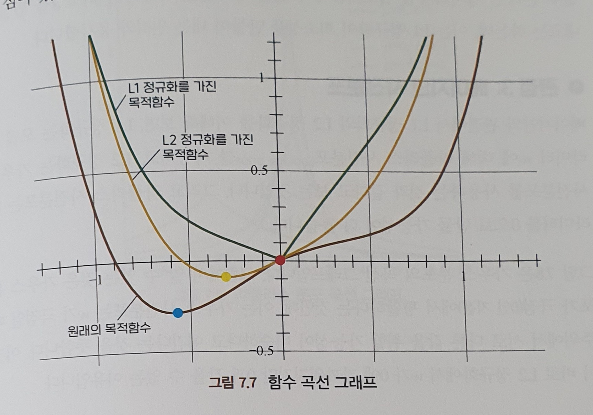
    
    더 직관적인 그래프를 통해 L1이 희소성을 만들어 내는 현상을 설명합니다. 위 현ㅅ강이 나타나는 원인은 매우 직관적인데, L1 정규항을 추가한 후에 정규항을 가진 목적함수를 미분하면 원래의 목적함수의 도함수의 절댓값이 C보다 작으면 정규항을 가진 목적함수는 원점 좌측 부분에서 계속해서 감소하게 됩니다. 그리고 원점 우측 부분은 시종일관 증가헤게 됩니다. 이와 반대로, L2정규항의 원점에서의 도함수는 0입니다. 원래 목적함수의 원점에서의 도함수가 0이 아니라면 최솟값지점은 원점에 있을 수 없고, 따라서 L2는 w 절댓값을 줄이는 작용만 하지 해공간의 희소성에는 아무런 영향을 주지 못합니다.
    
- 관점 3 : 베이지안 사전분포 - 베이지안의 관점에서 이해해 보면 L1 정규화는 모델 파라미터 w에 대해 라플라스 사전분포를 사용하고 ,L2 정규화는 가우스 사전분포를 사용하는 것과 같다고 보는 것입니다. 그리고 라플라스 사전분포는 파라미터를 0으로 만들 가능성이 더 높습니다.가우스 사전분포는 w가 극점일때 주위에서 서로 다른 값을 취할 ㅏ능성이 비슷하다고 여긴다는 것을 뜻하는데 이것이 바로 L2 정규화에서 w가 0에 가까워지지만 0과 같을 수 없는 이유입니다.

**CHAPTER 8 샘플링 199**

샘플링은 머신러닝에서 매우 중요하게 사용되고 있는데, 복잡한 분포를 간단한 이산 샘플 포인트로 나타낼 수 있고, 리샘플링을 사용하여 샘플 집합을 조정해 후기 모델 학습에 더 적절하게 만들 수 있기도 하고, 확률적 시뮬레이션을 통해 복잡한 모델의 근사해를 구하거나 추론을 진행할 수 있습니다.  간단한 분포라 하더라도 샘플링 과정이 명백한 것은 아니므로 잘 설계해야 합니다. 비교적 복잡한 분포들은 샘플링 함수가 없는 경우가 많기 때문에 다른 더 복잡한 샘플링 방법을 사용해야 합니다.

① 샘플링의 역할 201

⭐ 머신러닝에서 샘플링이 어떻게 활용되는지 설명해 보세요

샘플링은 본질적으로 임의 현상에 대한 모의실험인데, 주어진 확률 분포에 기반해 대응하는 랜덤 사건을 만들어 내는 것입니다. 다른 한편으로는 샘플링으로 얻은 샘플 집합은 일종의 비모수 모델이락 ㅏㄴ주할 수 있습니다. ㅡㄱ, 비교적 적은 양의 샘플포인트를 사용하여 전체 분포에 근사하고, 전체 분포에서의 불확실성을 묘사합니다. 이런 관점에서 설명하면 사실 일종의 정보에 대한 차원축소라고 볼 수있는데, 문제를 간단하게 만들어 주는 역할을 합니다.현재 데이터 세트에 대해 리샘플링을 진행하면 이미 보유한 데이터 세트를 충분히 이용하고 더 많은 정보를 얻을 수 있습니다. 예를 들어 부트스트래핑과 잭나이프 방법을 사용하여 통계량의 편차, 분산등을 계산할 수 있습니다. 이 외에도 리샘플링 테크닉을 사용하여 특정한 정보를 보존하는 동시에 계획적으로 샘플의 분포를 수정하여 추후 모델의 훈련과 학습에 적합하게 만들 수 있습니다. 한 예로, 리샘플링을 사용하여 분류 모델의 훈련 데이터 불균형 문제를 해결할 수 있습니다. 그 외에도 많은 모델이 복잡한 구조와 은닉변수 포함 여부등의 원인 때문에 해를 구하는 공식이 비교적 복잡하고 명확한 해석 해가 없어서 정확한 해를 구하거나 추론할 수 없습니다. 이러한 상황에서는 샘플링 방법을 이용하여 랜덤 시뮬레이션을 진행해 복잡한 모델에 대한 근사해를 구하거나 추론을 할 수 있습니다. 이 경우 일반적으로 특정한 분포에서 적분이나 기댓값, 또는 사후분포 등을 구하는 문제로 전환됩니다. 예를 들어 LDA나 딥 볼츠만 머신의 해를 구하는 과정에는 은닉변수를 포함하고 있ㄷ기 때문에 직접적으로 계산하기가 비교적 어렵습니다. 이때 깁스 샘플링을 사용하여 은닉 변수의 분포에 대해 샘플링을 할 수 있습니다. 

주의해야할점은, 결정론적인 근사해를 구하는 방법과는 달리 샘플링에 기반한 랜덤 시뮬레이션은 수치형 근사해를 구하는 방법이라는 점입니다.

② 균등분포의 난수 204

균등분포에서의 샘플링, 즉 균등분포 난수를 생성하는 것은 거의 모든 샘플링 알고리즘에서 사용하는 기본적업입니다. 그러나 간단한 분포임에도 샘플링 과정은 쉽지 않을 수 있기 때문에 세심한 전략이 필요합니다.

⭐ 어떻게 프로그래밍을 통해 균등분포 난수 생성기를 만들 수 있을까요?

컴퓨터 프로그래밍은 모두 결정론적이기 때문에 진정한 의미에서의 완전 균등분포 난수를 생성할 수 없고 오직 의사난수(결정론적인 프로그래밍에 의해 생성되었지만 근사적인 랜덤성 테스트를 통과할 수 있다는 것을 뜻함)만 생성할 수 있습니다. 일반적으로 선형 합동 생성기를 통해 이산 균등본포 의사난수를 생성하는데 계산공식은 $x_{t+1} \equiv = a \cdot x_t + c(modem)$입니다.선형 합동 생성기를 통해 얻은 난수는 다음번의 난수는 현재 난수에 근거해 생성되므로 서로 독립적이지 않습니다.  진정한 난수는 자연계의 물리현상에만 존재합니다. 예를 들면, 방사성 물질의 붕괴, 기류의 랜덤 ㅜㅁ직임 등.

③ 자주 사용하는 샘플링 방법 207

하나의 랜덤변수에 대해 일반적으로 확률밀도함수를 사용해 해당 변수의 확률 분포 특성을 나타냅니다,  반대로 호가률밀도함수에 기반해 제공되는 호가률분포 정보를 통해 하나의 랜덤 벼ㅑㄴ숫ㄱ값을 생성할 수 있는데, 이것이 바로 샘플링입니다. 따라서 어떤 의미에서는 샘플링이란 확률밀도함수를 역으로 응용한 것입니다.

⭐ 특정한 분포에 대해 설계된 샘플링 방법외에 알고있는 샘플링 방법이나 샘플링 전략에는 어떤 것들이 있는지, 그리고 그들의 주요 아이디어와 구체적인 진행 과정을 설명해 주세요.

거의 모든 샘플링 방법이 균등분포 난수를 기본 프로세스로 설정합니다. 어떠한 간단한 분포에 대해 균등 샘플링을 확장한 방법을 사용해 직접 샘플을 생성할 수 있는데, 이때 함수 변환법을 고려할 수 있습니다. 일반적으로 랜덤변수 x와 u에 변환 관계가 존재한다면,  $p(u)|\phi’(x)| = p(x)$와 같은 관계를 가집니다. 따라서 목표분포 p(x)에서 x를 샘플링하기 어렵다면, 변환 수식읆 ㅏㄴ들고 변환후의 분포에서 u를 샘플링하면 쉬워집니다.특히, 함수 변환법에서 만약 변환 관계가 x의 누적분포함수라면, 소위 역변환 샘플리을 얻을 수 있습니다. 만약 샘플링하려는 목표 분포의 누적분포함수의 역함수를 구할 수 없거나 계산이 쉽지 않다면, 역변환 샘플링 방법은 적합하지 않습니다. 이때 쉽게 샘플링할 수 있는 참고 분포를 만들어, 참고분포에 대해 샘플링을 진행하여 얻은 샘플에 대해 후처리 과정을 거쳐 최종 샘플이 목표 분포를 따르도록 만듭니다. 자주 보이는 방법으로는 기각 샘플링(채택/기각 샘플링), 중요도 샘플링이 있습니다. 실제 으용 환경이 만약 고차원 공간의 랜덤벡터라면, 기각 샘플링과 중요도 샘플링은 적합한 참고분포를 쉽게 찾을 수 없기 때문에 샘플링 효율이 떨어집니다. 이런 상황에서는 마르코프 체인 몬테카를로 샘플링 방법을 이요하면되는데,ㅡ 메트로폴리스-헤이스팅스 샘플링과 깁스 샘플링이 있습니다.

④ 가우스 분포 샘플링 212

⭐ 가우스 분포에서의 샘플링에 대해 설명해주요

역변환법을 사용한다면 균등분포 난수를 활용해 표준정규분포의 누적분포함수를 간단하게 평행 이동해서 늘린 변한된 형태를 사용하게 됩니다. 역변환법은 역함수를 구해야 하는데, 이것은 기본함수가 아니며 양적해가 없기 때문에 계산하기 비교적 번거롭습니다. 따라서 이러한 비-기본함수의 역함수를 구하는 것을 피하기 위해 박스-뮬러 알고리즘이 해결방안을 제시하고 있습니다.박스-뮬러 알고리즘은 삼각함수를 계싼해야 하기 때문에 상대적으로 많은 시간이 소모됩니다. 그러나 마르살리아 극좌표법은 삼각함수 계산을 피할 수 있게 해주기 때문에 속도가 더 빨라질 수 있습니다. 역변환 방법 이외에 기각 샘플링 방법을 이용하면, 계산하기 좋은 누적 분포 역함수의 참고분포를 선택해 현재 정규분포를 덮습니다. 그리하여 참고분포에 대한 샘플링이나 샘플포인트에 대한 채택/기각으로 전환합니다.  기각 샘플링 방법의 효율은 기각확률의 크기에 따라 달라집니다. 참고분포와 목표분포가 가까울수록 샘플링 효과가 높아집니다. 효율이 더 좋은 샘플링 알고리즘으로는 지구라트 알고리즘이 더 높은 효율을 가진 샘플링 방법이 될 수 도 있습니다.

> 정규분포를 왜 가우스 분포라고 할까?정규분포가 발견되고 사용되는 역사 과정에서 라플라스는 중심극한정리의 관점에서 이를 해석했고, 가우스는 오차분석에 사용했습니다. 정규분포가 유용하다는 사실이 밝혀지자 각국의 사람들은 ㅁ여명권을 차지하기위해 논쟁을 벌였고 라플라스 분포, 가우스 분포, 라플라스-가우스 분포라고도 불렸고 중립적인 이름으로 정규분포로 부르게 되었습니다.
> 

⑤ 마르코프 체인 몬테카를로 219

고차원 공간에서 기각 샘플링과 중요도 샘플링은 적합한 참고분포를 찾기 힘들고 샘플링 효율이 낮습니다. 이럴 때는 MCMC(Markov Chain Monte Carlo)샘플링 방법을 고려하는데, 많은 복잡한 분포와 고차원 공간세어 사용할 수 있습니다.

⭐ MCMC 샘플링 방법의 주요 아이디어에 대해 설명해보세요

몬테카를로 방법은 샘플링에 기반한 수치형 근사해를 구하는 벙빕이고, 마르코프 체인은 샘플링을 진행하는데 사용됩니다. 샘플링하려는 목표분포에 대해 하나의 마르코프 체인을 만들고, 해당 마르코프 체인의 정상분포를 목표분포가 되게 합니다. 그리고 임의의 초기 상태에서 출발해 마르코프 체인을 따라 상태 전이를 진행하고, 최정적으로 얻은 상태 전이 수열이 목표분포에 수렴하게 되는데, 이런 식으로 목표분포의 일련의 샘플을 얻을 수있습니다. 실제 응용단계에서 핵심은 적합한 마르코프 체인을 만드는 것, 즉 마르코프체인의 상태 전이확률을 정하는 것입니다. 이에 관해서는 세부균형, 시간동형, 정상분포,에르고딕 성질 등 더 심도 있게 공부해 보기를 추천합니다.

⭐ 자주 사용하는 MCMC샘플링 방법 몇가지를 소개해주세요

- 메트로폴리스-헤이스팅스 샘플링 - 참고조건분포를 선택하여 초기 샘플에 기반하여 하나의 샘플을 추출하고 균등분포에 기반해 난수를 생성하는 작업을 반복하면 최종적으로 목적함수 p(x)에 수렴할 것임을 증명할 수 있습니다.
- 깁스 샘플링 - 위 알고리즘의 특수한 케이스로 핵심 아이디어는 매번 샘플의 하나의 차원에 대해서만 샘플링하고 업데이틀르 하는 것.

MCMC샘플링은 반복 과정중에 점차적으로 정상분포에 수렴합니다. 따라서 실제 응용중에서 얻은 샘플 수열에 대해 ‘burn in’ 처리를 해주는데, 수열 가장 앞부분의 샘플을 삭제하고 후면의 샘플만 남기는 것을 뜻합니다.

⭐ MCMC 샘플링은 어떻게 상호 독립적인 샘플을 얻을 수 있을까요?

일반적인 몬테카를로 알고리즘과 다르게, MCMC샘플링으로 얻은 샘플의 수열에서 이웃하는 샘플은 독립적이지 않습니다. 왜냐하면 특정한 전이확률에 기반해 얻은 것이기 때문입니다. 또한, 일정한확률로 이전 샘플과 일치할 수도있습니다. 만약 샘플링에 대해서만 논한다면 상호 독립적일 필요는 없습니다. 만약 꼭 독립항등분포를 생성해야 하는 상황이라면 동시에 다수의 마르코프 체인을 사용할 수 있는데, 이때 서로 다른 체인에서의 샘플은 독립적이게 됩니다. 혹은 동일한 마르코프 체인에서 간격을 두고 선택한다면 추출된 샘플 역시 근사적으로 독립적이게 ㅚㅂ니다.

MCMC 샘플링의 응용범위는 매우 넓습니다.

분포의 최빈수를 구하거나 MCMC샘플링이 최대우도 추정 혹은 베이지안 추론 중에 어떻게 사용되는지에 대한 고민도 함께해보세요.

⑥ 베이지안 네트워크 샘플링 225

확률 그래프 모델은 여러 랜덤변수의 결합확률분포를 나타내기 위해 사용됩니다. 베이지안 네트,워크는 빌리프 네트워크 혹은 방향성 비순환 그래프라고도 불립니다. 이는 일종의 확률 그래프 네트워크로서, 방향성 비순환 그래프를 통해 랜덤변수사이의 조건확륣 ㅜㄴ포 관계를 나타냅니다,.

⭐ 베이지안 네트워크 샘플링 과정을 설명해주세요. 만약 일부 변수의 주변분포를 고려해야 한다면 어떻게 샘플링해야 할까요? 만약 네트워크에 관측변수가 포함되어 있다면 또 어떻게 샘플링해야할까요?

관측변수가 없는 베이지안 네트워크를 대상으로 샘플링할때 가장 간단한 방법은 조상 샘플링하는 것입니다. 핵심 아이디어는 방향성 그래프의 순서에 기반해 먼저 조상 노드에 대해 샘플링하고, 어떤 한 노드의 모든 부모노드의 샘플링을 오나료했을 때 해당 노드에 대해 샘플링하는 것입니다. 조상샘플링으로 얻은 샘플은 베이지안 네트워크의 결합확률분포를 따른다는 것을 확인할 수 있습니다.

만약 일부 랜덤변수의 주변분포에 대해서만 샘플링한다면, 조상 샘플링을 사용해 먼저 전체 랜덤변수에 대해 샘플링하고 불필요한 변수의 샘플링 값은 무시합니다.

고나측변수를 포함하는 베이지안 네트워크의 샘플링에 대해 살펴보겠습니다. 가장 직접적인 방법은 논리 샘플링 방법을 사용하는 것인데, 먼저 조상 샘플링을 통해 얻은 모든 변수의 값을 사용합니다. 만약 관측변수에서 이 샘플의 샘플 값과 실제 관측치가 동일하다면 수락하고, 반대라면 기각 후 다시 샘플링합니다. 이는 효율이 매우 낮을 수 있어 실제로 사용하기 어려워집니다. 따라서 실제 응용단계에서는 중요도 샘플링 아이디어를 차용해 비관측변수에 대해서만 샘플링 합니다. 그리고 최종적으로 얻은 샘플에 대해서 중요도 가중치를 부여합니다.

⑦ 불균형 샘플 집합에서의 리샘플링 230

이진분류문제를 훈련할 때 자주 만나게 되는 문제는 샘플 불균형 문제입니다. 불균형 데이터 세트에서 학습을 하면 충분한 정확도와 재현율을 보이지 않는 분류기가 될 것입니다.

⭐ 이진분류 문제에 대해 훈련 세트 중에 양성-음성 샘플 비율이 불균형할 때 어떻게 데이터를 처리해야 더 좋은 분류 모델을 훈련할 수 있을까요?

불균형 데이터 세트로 훈련할 때 상당수의 분류 모델에서 문제가 발생하게 되는데, 본질적인 원인은 모델 훈련시 최적화하는 목적함수와 사람들이 테스트 시 사용하는 평가 지표가 불일치하기 때문입니다. 이러한 ‘불일치’는 훈련 데이터의 샘플 분포와 테스트시 기대하는 샘플 분포가 불일치하기 때문입니다. 우리는 두가지 관점에서 해당 문제를 다룰 수 있습니다.

- 데이터에 기반한 방법 - 리샘플링을 진행하여 데이터를 균형적으로 맞추는 방법입니다. 간단한 방법은 랜덤 샘플링으로 오버 샘플링과 언더 샘플링이 있습니다. 오버 샘플링은 소수 클래스 데이터 세트에서 랜덤으로 샘플을 복원 ㅊ ㅜ출하여 더 많은 샘플을 얻는 방법이고 언더 샘플링은 반대로 다수 클래스 데이터 세트에서 적은양의 샘플을 추출하는 방법입니다. 이러한 방법은 균형적으로 맞춰주지만 오버샘플링은 과적합, 언더샘플링은 중요 정보의 보존이 불가능한 등의 문제가 있습니다. 이러한 문제들은 해결하기 위해 오버샘플링시 SMOTE알고리즘으로 K-최근접이웃알고리즘을 통해 새로운 합성 샘플을 만들어내는 소수 클래스의 각 샘플과 동일한 수의 새로운 샘플을 합성합니다. 따라서 클래스 사이의 중복도가 높아져 유의미한 정보를 제공하지 못할 수도 있습니다.(합성 데이터를 생성하는 동안 인접한 다수 클래스 샘플의 위치를 고려하지 않기 때문에 클래스가 겹치거나 노이즈를 생성해 유의미한 정보를 제공하지 못할 수 도 있음) 이에 따라 Borderline-SMOTE, ADASYN 등 개선된 알고리즘이 나왔습니다. 언더 샘플링 방법중에서 informed under-sampling을 이용해 데이터 유실문제를 해결하는데, 다음과 같은 것들이 있습니다.
    - 이지 앙상블 알고리즘
    - Balance Cascade 알고리즘
    - NearMiss, One-Sided Selection 등
- 알고리즘에 기반한 방법 - 모델 훈련 시 목적함수의 변환을 통해 해결할 수 있습니다. 샘플 수가 매우 불균형하면 단일 클래스학습 문제나 이상탐지 문제로 전환해도 됩니다.

**CHAPTER 9 피드 포워드 신경망 235**

딥 피드 포워드 네트워크는 일종의 전통적인 딥러닝 학습 모델입니다. 이모델의 목적은 어떤 함수 $f$를 적합하는 것인데, 다른말로 투영 $y=f(x;\theta)$을 정의해 입력값 x를 모종의 예측 출력값 y로 변환하고, 동시에 네트워크 파라미터 $\theta$의 값을 학습하여 모델이 최적의 함수에 근사하도록 만드는 것입니다. 입력에서 출력으로 가는 과정 중 모델 자체에 피드백 연결이 존재하지 않기 때문에 이러한 모델을 ‘피드 포워드’라고 부릅니다.

딥 피드 포워드 네트워크는 다수의 함수를 혼합하여 표현하는데, 방향성 비순환 그래프와 연관이 있습니다. 여기서 그래프는 함수의 혼합 방식을 나타냅니다. 즉, 각 샘플 x는 하나의 레이블 $y \approx f^*(x)$의 값과 함께합니다. 이는 출력층이 반드시 레이블에 근접한 값을 생성한다는 것을 뜻합니다. 그러나 네트워크 학습 알고리즘은 어떤 중간의 ‘은닉층’을 사용해 최적의 $f^*$의 근사를 구현할 것인지 결정해야합니다.

딥 피드 포워드 네트워크는 네트워크 모델 중 한 부류의 통친인데, 다층 퍼셉트론, 오토 인코더, 제한된 볼츠만 머신, 합성곱 신경망 등이 있습니다.

① 다층 퍼셉트론과 부울 함수 237

⭐ 다층 퍼셉트론으로 XOR 논리를 표현하려면 최소 몇개의 은닉층이 필요할까요?

먼저, 0개의 은닉층이 있는 상황(로지스틱 회귀)을 고려해 XOR 연산을 표현할 수 있는지 생각해봅시다. 시그모이드 활성화 함수는 단조증가함수로 로지스틱 회귀는 출력을 XOR로 하는 모델 표현을 학습할 수 없습니다. 다음으로, 하나의 은닉층을 포함한 경우를 생각해 봅시다.시벤코 정리에 의하면, 피드 포워드 ㅅ긴경망이 선형 출력층과 최소 하나의 ‘ㅊ압축’성질의 활성화 함수를 가진 은닉층을 가지고 있다면, 네트워크에 충분한 수의 은닉 유닛이 있을 때 임의의 유한차원 공간에서 다른 유한차원공간으로의 보렐 가측 함수를 원하는 정도의 정확도로 근사할 수있습니다.(쉬운말로, 뉴런수만 무한하다면 은닉층 하나로 어떠한 함수도 근사할 수 있다는 뜻) 따라서 다층 퍼습테른외ㅡ 표현 능력은 매우 강한데, 관건은 이러한 표현을 할 수 있는 모델 파라미터를 학습할 수 있느냐입니다.

⭐ 하나의 은닉층만 사용하여 n차원 입력을 가진 임의의 부울함수를 구현하기 위해서는 몇개의 은닉 노드가 필요할까요?

n차원 입력을 포함하는 임의의 부울함수는 유일하게 논리합 표준형 형식으로 표현할 수 있습니다. 우리는 카르노 맵을 사용하여 논리합을 표현할 수 있습니다. 즉, 격자선으로 진리표를 표현할 수 있습니다. 이제 문제로 돌아간다면, 문제를 ‘제약할 수 없는’ n차원 논리합 표준형의 최댓값을 찾는 것, 혹은 제약할 수 없는 최대 카르노 맵을 찾는 것으로 전환 할 수 있을 것입니다. 직관적으로, 격자를 격으로 칠하면 우리가 원하는 결과를 얻을 수 있습니다.

⭐ 다수의 은닉층이 있는 상황을 고려헀을 떄, n차원 입력을 포함하는 임의의 부울함수는 최소 몇 개의 네트워크 노드와 네트워크 층을 필요로 할까요?

n차원 XOR 함수는 $3^{n-1}$개의 노드가 있어야 한다는 것을 알 수 있습니다. 또한, 각 층의 노드를 두 개씩 짝지어 XOR연산을 하면 필요로 하는 최소 네트워크 층수는 $2log_2N$개가 됩니다.

② 딥러닝의 활성화 함수 245

실전에서선형으로 분리가 불가능하기 때문에 비선형변호나을 통해 데이터의 분포에 대해 매핑해야 할 때가 있습니다. 딥러닝 알고리즘에서, 우리는 각 층을 선형변환한 후 하나의 비선형 활성화 함수를 더해 다층 네트워크가 단층 선형함수와 동일하게 되는 것을 피할 수 있고, ㅡ로 인해 더 강력한 학습과 적합 능력을 갖출 수 있습니다.

⭐ 자주 사용하는 활성화 함수와 해당 활성화 함수의 도함수를 작성해주세요.

- 시그모이드 - $f(z) = \frac{1}{1+\exp(-z)}, f’(z) = f(z)(1-f(z))$
- 하이퍼볼릭 탄젠트 - $f(z) = tanh(z) = \frac{\exp^z - \exp^-z}{\exp^z + \exp^-z}, f’(z) = 1 - (f(z))^2$
- 렐루 - $f(z) = max(0,z), f’(z) = \begin{cases}1, z> 0\\0, z\leq 0  \\end{cases}$

⭐ 왜 시그모이드와Tanh 활성화 함수는 그래디언트 소실 현상을 일으킬까요?

둘다 z가 작을때 $f(z)$는 각각 0과 -1에 가깝게 됩니다. 이를 미분하면 모두 0에 근사하게 되어 그래디언트 소실현상이 발생합니다.

⭐ ReLU계열의 활성화 함수는 시그모이드, Tanh 활성화 함수와 비교헀을때 어떤 장점이 있나요? 이들의 한계는 무엇이며 어떤 개선방안들이 있나요?

- 장점
    - 계산적 관점에서 하나의 임계치만 있으면 활성화 값을 얻을 수 있어 복잡도가 적음
    - 비포화성은 그래디언트 소실 문제를 효과적으로 해결하고 상대적으로 넓은 활성화 경계를 제공
    - 단측면 억제가 네트워크의 희소 표현 능력을 제공합니다.
- 한계점
    - 훈련 과정 중에 뉴런들이 ‘죽는’ 문제가 발생합니다. 즉, 해당 뉴ㅜ련을 지나는 그래디언트는 영원히 0이 되어 다른 데이터에 영향을 미치지 않는 것을 의미합니다.이런 문제를 해결하기 위해 Leaky ReLU(LReLU)를 사용하기도 합니다.
        
        $f(z) = \begin{cases}1, z> 0\\az, z\leq 0  \\end{cases}$
        
        이런 식으로 단측면 억제를 구현하는 동시에 음의 그래디언트 정보를 모두 버리지 않고 부분적으로 유지할 수 있게 됩니다. 하지만 a값 선택은 문제의 난이도를 증가시킵니다. 이러한 단점을 보안하기 위해 파라메트릭 ReLU(PReLU) 활성화 함수도 존재합니다.
        

③ 다층 퍼셉트론의 오차역전파 알고리즘 249

⭐ 다층 퍼셉트론의 제곱오차와 크로스 엔트로피 손실함수에 대해 작성해 보세요.

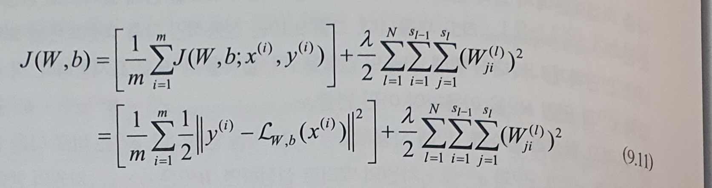

제곱오차의 전체 비용함수는 위와 같습니다. 여기서 첫 번째 항이 제곱오차 항이고, 두번째 항이 L2정규화 항입니다. 정규화 항은 기능적인 요소 때문에 가중치 감쇠항이라고 불리기도 하며, 가중치의 변동 폭을 줄이는 것이 목표이고 과적합을 방지하는 역할을 합니다. $\lamda$는 가중치 감쇠 계수이며, 손실함수에서 두 가지 항의 상대 가중치를 제어하는 역할을 합니다.

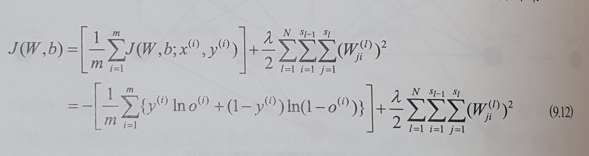

이진분류에서의 교차 엔트로피 손실함수는 위와 같이 나타낼 수 있습니다. 여기서 정규화 항은 식 9.11과 동일합니다.

⭐ 문제 1에서 정의한 손실함수에 기반하여 각 층 파라미터가 업데이트하는 그래디언트 계산공식을 유도하세요

⭐ 제곱오차 손실함수와 크로스 엔트로피 손실함수는 각각 어떤 상황에서 사용해야할까요?

일반적으로 제곱오차함수는 연속값 출력에 적합하고, 마지막 층에 시그모이드 혹은 소프트 맥스 활성화 함수가 없는ㅅ ㅣㄴ경ㅁ아을 구축합니다. 크로스 엔트로피 함수는 이진분류나 다중분류 문제에서 활용됩니다. 구체적인 이론 근거를 가진 합리적인 원인을 말하기 위해서는 위 문제에서 살펴본 내용을 정확하게 숙지하고 있어야 하며, 이를 유연하게 활용하고 분석하는 능력을 갖춰야 합니다.

왜 제곱오차 손실함수는 마지막 층에 시그모이드나 소프트맥스 활성화 함수가 있는 신경망에 부적합할까요? 문제 2에서 유도한 출력층에 관한 제곱오차 손실함수의 도함수를 다시 생각해보면 $\delta^{(L)} = -(y-a^{(L)})f’(z^{(L)})$, 마지막 항은 활성화 함수의 미분값입니다. 활성화 함수가 시그모이드 함수일때, 만약 $z^{(L)}$의 절댓값이 비교적 크다면 함수의 그래디언트는 포화 상태가 됩니다. 즉, $f’(z^{(L)})$의 절댓값이 매우 작아, 손실함수의 도함수도 작아져 그래디언트에 기반한 학습 속도가 매우 느려지게 됩니다. 

교차 엔트로피 손실함수를 사용할 때 출력 층에 대한 미분 값은 다음과 같습니다.

$\delta^{(L)} = a_k^{(L)} - y$, 이 공식은 선형이기 때문에 학습 속도가 느려지는 문제가 존재하지 않습니다.

④ 딥러닝 훈련 테크닉 257

⭐ 신경망을 훈련할 때 모든 파라미터를 0으로 초기화해도 될까요?

만약 파라미터를 모두 동일한 값으로 초기화한다면, 순전파나 역전파의 값도 모두 완전히 같게 될 것입니다. 학습 과정에서 이러한 대칭성을 깨지 못한다면, 최종 동일 네트워크 중의 각 파라미터는 여전히 동일할 것입니다. 따라서 우리는 임의로 신경망 파라미터값을 초기화하여 이러한 대칭성을 깨야 합니다.

⭐ 과적합을 방지할 수 있는 드롭아웃의 원리와 구현방법을 말해주세요

드롭아웃은 딥러닝 훈련 중에 일정한 비율로 일부 뉴런 노드를 ‘임시로 버리는’것을 뜻합니다. 각 배치 훈련 데이터에 적용되는데, 랜덤으로 버려진 부분이 매번 반복할 때마다 서로 다른 구조의 신경망에서 훈련을 하는 것과 같은 효과를 얻게됩니다. 이는 배깅 방법과 유사한데, 드롭아웃은 일종의 대규모 딥러닝 모델을 사용한 앙상블 알고리즘이라고 생각할 수 있습니다. 전통적인 의미의 배깅은 다수의 모델을 동시에 훈련하고 평가하기 때문에 네트워크와 파라미터 규모가 거대해지면 대량의 연산 시간과 공간을 소모한다는 단점이 있습니다. 드롭아웃은 미니배치 급에서 작동하기 때문에 경량화된 배깅 앙상블에 근사해, 기하급수적인 수량의 신경망의 훈련과 평가를 할 수 있습니다.

신경망에서의드롭아웃 응용은 훈련과 예측 두 단계를 포함합니다. 훈련 단계에서는 각 뉴련 노드에 확률 계수를 더해줘야 합니다. 그리고 훈련 단계는다시 순전파와 역전파 두 단계로 나누어집니다. 예측 단계는 순전파의 과정입니다. 순전파를 계산할때 각 뉴런의 파라미터는 사전에 ㅎ롹률 계수 p를 곱하여 훈련 중에서 p의 확률로 전체 신경망 순전파 계산에 활용 됩니다.

⭐ 배치 정규화의 주도니 동기와 원리는 무엇인가요?

신경망 훈련 과정의 본질은 데이터 분포를 학습하는 것입니다. 만약 훈련 데이터와 예측 데이터의 분포가 다르다면 네트워크의 일반화 능력이 낮아질 것입니다. 따라서 우리는 훈련 시작 전에 모든 입력 데이터에 대한 정규화 처리를 진행해야 합니다.

그러나 네트워크 훈련이 진행됨에 따라 각 은닉층의 파라미터 변화는 다음 층 입력에 변화를 발생시킵니다. 따라서 각 배치에 따른 파라미터 변화는 다음 층 입력에 변화를 발생시킵니다.따라서 각 배치에 따른 훈련 데이터 분포도 변하게되어 매버ㅏㄴ 반복할 때마다 서로 다른 데이터 분포에 적합해야 하기 때문에 훈련의 복잡도가 증가하고 과적합 위험이 생깁니다.

배치 정규화는 각 층 네트워크 입력 전에 각 배치 데이터에 대해 정규화 처리를 추가하여 모든 배치 데이터가 동일한 분포에 있도록 만들어 줍니다. 배치 정규화는 각 층 입력과 이전 층의 출력 사이에 새로운 계산층을 더하는 것으로 생각해 볼 수 있습니다. 데이터 분포에 대해 추가적인 제약을 가해 모델의일반화 능력을향상시킵니다. 그러나 동시에 모델의 적합 능력을 저하시킵니다.

배치정규화의 합성곱 신경망 응요에서는 합성곱 신경망의 파라미터 공유 매커니즘을 주의해야합니다. 각 컨볼루션 커널의 파라미터는 서로 다른 위치에 있는 뉴련들이 공유하고 있기 떄문에 함께 정규화되어야 합니다.

⑤ 합성곱 신경망 263

CNN(Convolution Neural Network)는 일종의 피드 포워드 뉴럴 네트워크입니다.특징은 각 층의 뉴런 노드가 이전 층의 국부적 범위 내의 뉴런에만 반응한다는 것입니다. 일반적으로 여러 개의 컨볼루션층엥 ㅕ러개의 완전 연결층을 더해 구성됩니다. 중간에 각종 비선형함수나 풀링층이 들어가기도 합니다. 다른 네트워크와 비교했을 때 컨볼루션 계산은 파라미터 공유 특징을갖고 있기 때문에 최적화하는 파라미터 개수가 많이 줄어들어 모델 훈련 효율과 확장성이 높습니다.

⭐ 컨볼루션 작업의 본질적인 특성에는 희소 상화작용과 파라미터 공유가 있습니다. 이 두 특성에 대해 설명해 보세요

- 희소 상호작용 - 입력과 출력의 연결 관계는 하나의 가중치 파라미터 행렬로 표현할 수 있습니다. 여기서 각 단일 파라미터 값은 앞뒤 층에 존재하는 뉴런 노드 사이의 상호작용을표현합니다. 그러나 합성곱 신경망에서는 컨볼루션 커널 크기는 입력의 차원보다 작습니다. 따라서 각 출력 뉴런과 이전 층의 특정 부분 내에 있는 뉴런사이에만 연결 가중치가 존재하는 특성을 우리는 희소 상호작용이라고 부릅니다. 조금 더 구체적으로 ㅅ설명하면, 네트워크 중 이웃하는 두 층에 각각ㄱm개의 입력과 n개의 출력이 있다고 가정하면, 완전연결네트워크의 가중치 파라미터 행렬은 m x n개의 지만 합성곱 네트워크에서는, 연결 수를 k로 제한한다면 해당 층의 총 파라미터 수는 k x n개가 될 것입니다. 희소 상호작ㅇㅇ의 물리적 의미는 현실 세계의 데이터들은 모두 국소적인 특징 구조를 가지고 있다는 것입니다. 부분적인 특징을 먼저 학습하고, 이런 부분적인 특징들을 조합해 가며 더 복잡하고 추상적인 특징을 알아갑니다.
- 파라미터 공유 - 동일한 모델의 서로 다른 모듈에서 동일한 파라미터를 사용하는 것을 뜻합니다. 이는 컨볼루션 연산의 고유 특성입니다.  컨볼루션 커널 중의 각 원소는 부분 입력의 특정 위치에 대해 계속해서 작용합니다. 파라미터 공유 아이디어에 기반해 우리는 한 그룹의 파라미터 집합만 학습하고, 각 위치의 모든 파라미터에 대해 최적화할 필요가 없습니다. 따라서 모델의 메모리 사용을 대폭 줄일 수 있습니다. 물리적 의미는 컨볼루션층에 이동 등변 성질을 갖게 만드는 것입니다.즉, 신경망의 출력은 이동변환에 대해 등변(최종 인식결과는 불변)해야 합니다.
    
    

⭐ 자주 사용하는 풀링 방법에는 어떤 것들이 있나요? 풀링은 어떤 작용을 하나요?

평균 풀링, 최대 풀링 등을 자주 사용합니다. 평균 풀링은 특정 수치의 평균을 구하는 방법으로서, 영역의 크기 때문에 제한을 받아 예측한 분산이 증가하는 것을 막아 줍니다. 평균 풀링의 특징은 배경에 대한 보류 효과가 뛰어나다는 것입니다. 반면, 최대 풀링은 영역에서 특징의 최댓값만 찾아내 네트워크 파라미터 오차로 인해 발생하는 예측 평균치가 치우치는 현상을 방지합니다. 최대 풀링의 특징은 텍스처 정보를 잘 잡아낸다는 것입니다. 풀링작업의 본질은 다운 샘플링입니다.  이 외에도 오버래핑 풀링, 공간 피라미드 풀링등이 있습니다. 풀링 작업은 파라미터 수를 줄이는 장점 외에도 평행이동, 신축,ㅡ 회전 등 작업에 불변성을 보존합니다. 이동 불변성은 함수의 입력이 변해도 출력은 그대로 유지되어 바뀌지 않는다는 것을 뜻합니다.

⭐ 합성곱 신경망은 텍스트 분류 문제에서 어떻게 사용되고 있나요?

합성곱 신경망의 핵십 아이디어는 부분 특징을 잡아내는 것입니다. 텍스트에서 부분 특징은 N-gram과 비슷한 여러 개 단어로 구성된 슬라이딩 윈도우를 뜻합니다. 합성곱 신경망의 장점은 N-gram 특징에 대해 자동으로 조합이나 선별을 해 여러 추상 단계의 문맥정보를 얻을 수 있다는 것입니다. 

- 출력층은 하나의 N x K 크기의 행렬입니다 - N은 문장에 대응하는 총 단어 개수를 나타내고, K는 각 단어에 대응하는 표현 벡터의 차원입니다. 각 단어의K차원 벡터는 사전에 다른 말뭉치 에서 훈련시킨 것을 사용해도 되고, 혹은 이미지의 파라미터로 설정하여 네트워크 훈련을 통해 얻은 것이어도 됩니다. 우 두가지 방법은 각각 사전에 훈련시킨 워드 임베딩은 다른 말ㅇ뭉치를 사용하여 더 많은 사전지식을 얻을 수 있는 반면, 현재 네트워크로부터 훈련한 단어 벡터는 현재 문제와 관련성이 높은 특징을 추출해 낼 수있습니다.
- 두번째 층은 컨볼루션층입니다 - N x K차원 행렬에서 서로 다른 크기의 슬라이딩 윈도우를 정의하여 컨볼루션 작업을 진행합니다. 매번 컨볼루션 작업을 할 때마다 고유 벡터를 추출하는 것과 같으며, 서로 다른 슬라이딩 윈도우를 정의하면여러 고유벡터를 추출할 수 있고, 이들이 컨볼루션층의 출력을 구성하게 됩니다.
- 세번째 층은 풀링층입니다 - 각 슬라이딩 윈도우를 통해 고유벡터 중에서 특징만 선택한 후 해당 특징을 합쳐 벡터 표현을 구성하게 됩니다. 이들은 결과적으로 모두 서로 다른 길이의 문장에서 일정한 길이의 벡터 표현을 얻게 됩니다.
- 텍스트의 벡터 표현을 얻었다면 후반 부분의 네트워크 구조는 바로 구체적인 문제와 연관이 있습니다. - 마지막 완전 연결츠을 놓고 소프트맥스 활성화 함수를 사용하여 각 클래스의 확률을 출력하도록 설정했습니다.

⑥ ResNet 271

딥러닝의 층수는 모델의 용량을 결정하는데, 네트워크층이 깊어짐에 ㅏ라 최적화함수가 국소 최적해에 빠질 확률이 높아집니다. 동시에, 네트워크 층수가 늘어남에 따라 그래디언트가 역전파 과정에서 점점 소실되는 그래디언트 소실 문제가 더 심해집니다. 이 문제를 해결하기위해 여러 방법들 중 깊은 잔차 네트워크는 일종의 효과적인 테으워크 구조 개선 방법이었습니다. 이 방법은 효과적으로 훈련이 가능한 네트워크 층수를 대폭 증가시켰습니다.

⭐ REsNet이 나오게 된 배경과 핵심 이론은 무엇인가요?

깊은 층을 사용하는 딥러닝 훈련 중 나타나는 그래디언트 소실 문제를 해결 혹은 완화하기 위해서입니다. 만약 L개 층을 가진 딥러닝 네트워크가 있다고 가정했을 때 1개의 층을 더한다고 한다면, 직관적으로 L + 1개의 층을 가진 딥러닝 네트워크의 효과가 L층을 가진 네트워크보다 덜하진 않을 것이라 생각할 수 있습니다. 왜냐하면 우리는 마지막 층은 전 층의 카피로 설정하고, 다른 층은 원래의 파라미터를 유지하리라 생각하기 때문입니다. 그러나 역전파를 진행할 때 이러한 가정은 달라집니다.층수가 깊을수록 더 큰 훈련오차를 가질 수 있는데 이는 그래디언트 소실 문제 떄문입니다. 오차 역전파는 파라미터 그리고 도함수의 곱의 형식으로 나타낼 수 있는데 첫번째 ㄷ은닉층으로 전파될때 굉장히 많은 연속곱을 만나게 됩니다. 이때 오차는 아주 쉽게 소실되거나 폭발해 파라미터에 대한 정확한 학습에 영향을 주게 됩니다. 따라서 딥러닝 네트워크의 적합과 일반화 능력이 저하되게 되며, 얕은 신경망 모델보다 정확도가 떨어지기도 합니다.

resNet은 네트워크 구조의 조정을 통해 위 문제를 해결했습니다. 네트워크 구조를 조정하여 스킵 연결 방법을 사용하고 있습니다. 출력 x는 두개의 신경망 변환을 거쳐 F(x)를 얻고, 동시에 두 층 이후로 가까워지고 최종적으로 두개의 층을 포함하는 네트워크 모듈이 $H(x) = F(x) + x$를 출력합니다. 이렇게 F(x)는 입력과 목표출력의 잔차에만 적합하면 되도록 설계되어 잔차 네트워크라는 이름의 유래도 이 같은 이유 때문입니다.

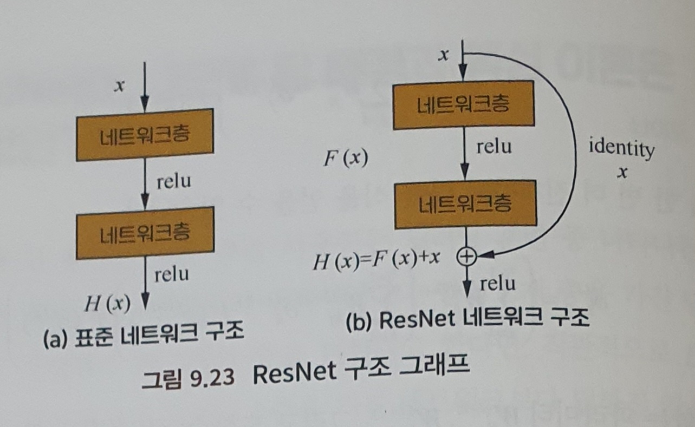

이는 효과적으로 깊은 층을 가진 신경망 학습문제를 해결하여 더 깊은 네트워크를 훈련하는 것을 가능하게 만들었습니다.

 

**CHAPTER 10 순환신경망 277**

Recurrent Neural Network는 순차 데이터를 모델링하는 일종의 주류 딥러닝 모델입니다. 우리는 전통적인 피드 포워드 신경망의 일반적인 입력은 길이가 정해진 벡터이기 때문에 동적이며 가변적인 순차적 정보를 처리하지 못한다는 것을 알고 있습니다. 설령, 어떤 방법을 통해 순차 데이터를 정적이고 고정 크기를 가진 데이터로 변환하다고 하더라도, 모델이 순서에 담긴 정보까지 잡아내기란 힘들 것입니다. RNN은 뉴런을 직렬로 연결해 순차 데이터를 처리합니다. 각 뉴런은 내부 변수를 사용하여 이전 입력의 순차적 정보를 저장할 수 있기 때문에 전체 시퀀스가 추상적인 표현으로 압축됩니다. 그리고 이에 기반하여 분류 작업을 하거나 혹은 새로운 시퀀스를 생성할 수 있습니다. RNN은 기계번역, 시퀀스 라벨링, 이미지 묘사, 추천 시스템, 로봇말하기 시스템 등 다양한 영역에서 큰 성과를 거두었습니다.

① 순환신경망과 합성곱 신경망 279

⭐ 텍스트 데이터를 다룰 때 순환신경망과 피드 포워드 신경망은 각각 어떤 특징이 있나요?

전통적인 텍스트 데이터 처리 방법에서는 TF-IDF 벡터를 특성으로 입력합니다. 이런 표현으ㅜㄴ 실제로 입력되는 텍스트 시퀀스 중 각 단어 순서에 대한 정보를 잃어버립니다. 신경망 모델링 과정에서 보통의 합성곱 신경망과 같은 피드 포워드 신경망은 일반적으로 고정 길이의 벡터를 입력으로 받습니다. 합성 곱 신경망이 텍스트 데이터를 모델링할 때, 가변 문자열이나 단어를 입력으로 받고 슬라이드 윈도우를 통해 풀링층을 추가하는 방법을 사용해 원래의 입력을 하나의 고정길이의 벡터 표현으로 전환함으로써 텍스트의 부분적 특성을 잡아낼 수는 있지만, 두 단어 사이의 거리 의존관계는 학습하기 힘듭니다. 반면, 순환신경망은 가변적이고 순차적인 텍스트 데이터의 입력 순서를 잘 처리할 수 있습니다. 이 모델은 사람이 한편의 문장을 읽는 순서를 모방해 앞에서부터 뒤로 문장의 단어들을 읽으며 이전 단계에서 읽었던 유용한 정보들을 상태변수 중에 코딩해 놓기 떄문에 일정한 기억 능력을 갖추게 되어 텍스트를 더 잘 이해할 수 있습니다. 순환신경망은 합성곱 신경망등의 피드 포워드 신경망과 비교ㅗ했을때, 순차적 데이터의 순서 정보를 표현할 수 있으며 더 정확한 결과를 얻습니다.

② 순환신경망의 그래디언트 소실 문제 281

⭐ 순환신경망에서 그래디언트 소실이나 그래디언트 폭발이 일어나는 원인은 무엇일까요?

순환신경망 모델은 BPTT(시간오차역전파)알고리즘을 사용하는데, 사실 일종의 오차역전파 알고리즘의 변종입니다.  초기의 순환신경망 설계ㅒ 의도가 바로 장거리 입력 사이의 의존관계를 잡아내는 것이었습니다. 구조저그로 보면, 순환 신경망은 이러한 기대에 부응할 수있습니다. 하지만 실제로  이러한 관계를 성공적으로 잡아내지는 못했는데, 그래디언트 소실문제 때문입니다. 예측한 오차는 신경망의 각 층을 따라 역전파되기 때문에 야코비행렬의 최대 고윳값이 1보다 클 때 출력과 멀면 멀수록 각 층의 그래디언트 크기가 지수적으로 늘어나 그래디언트 폭발을 불러옵니다. 반면 최대 고윳값이 1보다 작으면 그래디언트 크기는 지수적으로 줄어들어 그래디언트 소실을 야기합니다.  이는 순환신경망 모델이 입력 시퀀스 중의 장거리 의존관계를 학습하기 어렵게 만듭니다. 그래디언트 폭발 문제는 그래디언트 클리핑을 통해 오나화가 가능한데, 그래디언트의 norm이 어떤 지정값을 초과할 때 그래디언트에 대해 등비 축소를 진행하는 것을 뜻합니다. 그러나 모델 자체에 대한 개선이 이루어져야 하기 때문에 상대적으로 까다롭습니다. 순환신경망 중에서 LSTM, GRU(Gated Recurrent Unit)등의 모델이 게이트 메커니즘을 추가해 그래디언트 소실이 가져오는 손실을 줄입니다.

③ 순환신경망의 활성화 함수 284

우리는 피드 포워드 신경망에서 ReLU활성화 함수를 사용해 효과적으로 그래디언트 소실을 개선하고, 더 빠른 수렴속도와 더 좋은 수렴괄과를 얻는 다는 것을 알고 있습니다. 

⭐ 순환신경망에서 ReLU를 활성화 함수로 사용해도 될까요?

답은 당연히 ‘된다’입니다. 하지만 행렬 초깃값에 대한 일정한 제한이 있어야 합니다. 그렇지 않으면 수치 문제가 쉽게 발생합니다.그렇다면 왜 CNN에서는 이런 혀낭이 발생하지 않는 이유는 무엇일까요? 그 이유는 각 층의 가중치 행렬W는 모두 다르기 떄문입니다. 그리고 초기화할 때 모두 독립항등분포이기 때문에 상호 상쇄되며, 따라서 심각한 수치 문제가 발생하지 않게 됩니다.

정리하자면, RNN에서 ReLU함수를 은닉층의 활성화 함수로 사용한다면, W의 값이 단위행렬에 근사할 때만 비교적 좋은 효과를 얻을 수 있습니다. 따라서 W를 단위행렬로 초기화해야 합니다. 실험을 통해 확인된 사실은 W를 단위행렬로 초기화하고 ReLU 활성화 함수를 사용하면 LSTM 모델과 비슷한 결과를 얻을 수 있는 반면, 학습 속도가 더 빠르다는 사실입니다.

④ LSTM 네트워크 286

장단기 메모리 네트워크는 가장 성공적으로 확장해 나가고 있는 모델입니다. 유의미한 정보에 대해 장기적인 기억을 해서 순환신경망의 학습 난이도를 낮추기 때문에 다양하게 응용되고 있습니다.

⭐ LSTM은 어떻게 장단기 기억 기능을 구현할 수 있나요?

LSTM 역시 $x_t$와 $h_{t-1}$에 기반해 $h_t$를 계싼합니다. 다만, 내부 구조에서 입력 게이트, 망각 게이트, 출력게이트와 하나의 내부 기억 뉴런을 추가했습니다. 출력 게이트는 현ㅅ재 계산한 상태를 기억 뉴런에 얼마나 저장할 것인지에 대해 조절합니다. 망각 게이트는 이전 단계 기억 뉴런중의 정보를 어느정도로 ‘잊을지’에 대해 조절합니다. 출력 게이트는 현재의 출력이 어느 정도로 현재의 기억뉴런에 기반해 결정될 것인지에 대한 조절을 합니다. 전통적인 순환신경망과 다른 점은 이전 기억 뉴런의 상태 $c_{t-1}$에서 현재 상태 $c_t$로 전환 시 활성화 함수 계산으로 얻은 상태에 의해서만 결정되지 않고, 입력 게이트, 망각게이트에 의해 함께 제어 된다는 점입니다.

훈련을 마친 네트워크 중에서 입력 시퀀스에 중요한 정보가 없을 떄 LSTM의 망각게이트의 값은 1에 가깝게되고, 입력 게이트의 값은 0에 가깝게 됩니다. 이때 이전 기억은 저장되고, 따라서 장기 기억 기능을 구현하게 됩니다. 입력 시퀀ㅅ그에 중요한 정보가 나타난다면 LSTM은 바로 기억에 저장하는데, 이때 입력 게이트의 값은 1에 가깝게 됩니다. 중요한 정보가 나타나고 해당 정보가 이전의 기억이 더이상 중요하지 않는다는 것을 뜻한다면, ㅣㅂ력 게이트의 값은 1에 가깝게 되고 망각게이트이 값은 0에 가깝게 됩니다. 이렇게 예전 기억은 잊히게 되고, 새로운 중요 정보가 기억되게 됩니다. 이러한 설계를 통해 전체 네트워크는 시퀀스 사이의 장기 의존 관계를 더 잘 학습할 수 있게됩니다.

⭐ LSTM의 각 모듈은 어떤 활성화 함수를 사용하고 있나요? 다른 활성화 함수를 사용해도 될까요?

모든 게이트에서 시그모이드 ㅎ함수를 활성화 함수로 사용하고, 후보 기억을 생성할 때는 Tanh함수를 활성화 함수로 사용하고 있습니다. 여기서 이 두 활성화 함수 모두 포화성을 가지고 있다는 점입니다. 다른말로, 입력이 일정한 값에 다다른 상황에서 출력에 뚜렷한 변화가 생기지 않는다는 뜻입니다. 만약 ReLU 같은 비포화 활성화 함수를 사용한다면 게이지 컨트롤 효과를 구현하기 힘들 것입니다. 활성화 함수의 선택은 한번 정해진다고 변경할 수 없는 것은 아닙니다. 사실상 게이트 컨트롤에서 시그모이드 함수를 사용하는 것은 현대 신경망 모듈ㅇ의 공통적인 선택입니다.

정리하면, LSTM은 20년의 발전 역사를 거쳐 핵심 아이디어는 대부분 일맥상통하지만 부분적인 변화는 많이 일어났습니다. 발전 과정과 자주 사용하는 개량 알고리즘을 잘 이해해야 실무를 하거나 연구를 하면서 풀어야 하는 문제와 잘 결합하여 최적의 LSTM모듈을 만들어 낼 수 있는 것입니다. `핵심은 이해를 바탕으로 한 유연한 사고방식을 갖는 것이지, 무작정 네트워크 구조와 공식을 외우는 것이 아닙니다.`

⑤ Seq2Seq 모델 290

하나의 시퀀스 신호를 인코더와 디코더를 통해 하나의 새로운 시퀀스 신호로 생성해 내는 것을 뜻하는데, 기계 번역, 음성인식, 챗봇 등에서 많이 사용합니다. 해둥 부분에서는 시퀀스 길이를 사전에 알지 못합니다. 따라서 어떻게 이 문제를 해결할지에 대한 논의가 Seq2Seq 모델의 탄생 배경입니다.

⭐ Seq2Seq 모델은 무엇인가요?

핵심 아이디어는 딥러닝을 통해 입력 시퀀스를 출력 시퀀스로 투영하는 과정에서 인코더와 디코더를 사용하는 것입니다. 전통적인 방법에서 인코더와 디코더는 각각 하나의 순환 신경망으로 구성되어 있습니다. Seq2Seq 모델에서 두 개의 순환신경ㅁ아은 함께 훈련됩니다.학습한 정보는 일련의 가공과 정리를 거쳐 소위 ‘지식체계’를 형성하게 되는데, 이것이 바로 인코딩 과정입니다. 그리고 고도로 추상화된 지식을 일련의 문제 중에서 으용해 해답을 구하게 되는데, 이것이 바로 디코딩 과정입니다. 텍스트 요약 문제에서는 입력되는 시퀀스가 긴 구절이나 단락이고, 출력 시퀀스는 요약된 짧은 구절인 경우가 많습니다. 이미지 묘사 텍스트 생성 문제에서는 시각 네트워크를 거친 이미지의 특징이 인풋이고, 출력 시퀀스는 이미지에 대한 묘사 구절입니다. 반면, 음성인식에서 입력 시퀀스는 디지털 주파수 신호이며, 출력 시퀀스는 식별된 텍스트 입니다. 서로 다른 상황에서 인코더와 디코더는 서로 다른 구조를 가지게 되는데, 기본적인 구조는 Seq2Seq의 저층 구조와 같습니다.

⭐ SEq2Seq 모델에서 디코딩할때 자주 사용하는 방법들은 어떤 것들이 있나요?

해당 모델의 핵심이 되는 부분은 디코딩 부분입니다. 개선된 많은 파생 방안이 나오는 곳도 바로 디코더 부분입니다. 가장 기초가 되는 디코딩 방법은 그리디 알고리즘입니다. 즉, 하나의 측정 기준을 선택하고 매번 현재의 상테에서 가장 최선의 결과를 낳는 것을 선택하는 방법입니다. 이 방법은 계싼 비용이 낮기 때문에 기준이 되는 결과로 설정하여 다른 방법들과 비교하기에 적합합니다. 핮미ㅏㄴ 그리디 방법으로 얻은 해는 국부적 최적해이기 떄문에 실제 문제의 복잡성을 고려했을 때 해당 방법을 사용하는 것으로는 최고의 효과를 낼 수 없습니다. 빔 탐색은 자주 사용하는 개선된 알고리즘 입니다. 일종의 휴리스틱 알고리즘입니다. 그 밖에도 중첩된 RNN의 사용, 드롭아웃 매커니즘 추가, 인코더 사이에 잔차 연결 만들기 등의 개선 방법들도 자주 사용합니다. 그리고 디코딩 부분에서 중요한 하나의 개선 방법이 바로 어텐션 매커니즘인데, 매 단계마다 목표성을 가지고 현재 상테에서 가장 관련있는 인코딩 결과를 ‘주의’할 수 있게 되었고, 이는 인코딩 출력 ㅎ표현의 학습 난이도를 낮추어 장기 의존 관계를 더 쉽게 학습할 수 있게 만들어 주었습니다. 이외에 디코딩 시에 기억 네트워크 등을 사용하여 외부에서 지식을 얻어 오기도 합니다.

⑥ 어텐션 메커니즘 294

인간의 두뇌 메커니즘을 모방하는 방법을 모색하는 사고에서 유래 되었습니다. 연구를 통해 일간의 두뇌는 일을 할 때 일정의 주의력을 발휘한다고 알려졌습니다. 이는 대뇌가 신호를 처리할 때 일정의 가중치를 분할하는 것으로 볼 수 있는데, 어텐션 메커니즘은 바로 이러한 대뇌의 핵심 특성을 모방했습니다.

⭐ Seq2Seq모델의 어떤 문제를 해결하기 위해 어텐션 매커니즘을 도입했나요? 왜 양방향 순환신경망 모델을 사용할까요?

실무에서 일반적으로 먼저 하나의순환신경망을 인코더로 사용해 입력 시퀀스를 하나의 벡터 표현으로 인코딩합니다. 그리고 다시 하나의 순환 신경망 모델을 디코더로 사용하여 벡터 표현을 디코딩해 출력 시퀀스를 얻습니다. 실제 응용에서 입력 시퀀스가 늘어남에 따라 모델의 성능이 저하됨을 발견할 수 있습니다. 이는 인코딩 시 입력 시퀀스의 전체 ㅓㅇ보가 하나의 벡터 표현으로 압축되기 때문입니다.시퀀스가 늘어남에 따라 구절의 앞부분에 위치한 단어 정보가 유싫되는 현상이 더 심각하게 발생합니다.

Seq2Seq 모델에서 어텐션 매커니즘을 도입한 이유는 위에서 기술한 문제를 해결하기 위함입니다. 해당 매커니즘에서도 여전히 일반 순환신경망을 사용해 입력 시퀀스에 대해 인코딩하여 은닉 상태를 얻을 수 있습니다. 그러나 디코딩할 때 각 출력 단어는 이전 은닉상태와 입력 시퀀스에 대응하는 은닉 상태에 의존합니다. 여기서 콘텍스트 벡터는 입력 시퀀스 전체 은닉 상태의 가중치 합입니다. 여기서 주의력 가중치는 고정된 가중치가 아니며, 다른 신경망을 통해 계산된 것입니다. 하나의 출력 단어를 생성할 때 각 입력 단어와 현재 출력 단어의 매칭(align)관계를 고려하여 매칭이 더 잘되는 단어일 수록 더 큰 가중치를 부여하여 현재 출력 단어가 생성되는데 더 큰 영향을 주게 만듭니다. 양방향 순환신경망을 사용해 모델링하면 전후 문장 정보가 유실되는 것을 방지합니다. 어텐션 매커니즘은 일종의 아이디어로서 다른 많은 방식으로 구현이 가능합니다.

**CHAPTER 11 강화학습 299**

강화학습은 행위 심리학의 영향을 받은 머신러닝의 한 분야입니다. 어떤 환경에 놓인 에이전트가 누적 보상을 최대화하는 행동을 취하는 것에 초점에 맞춰져 있습니다. 전통적인 지도학습과 다르게, 강화학습은 에이전트의 출력에 대해 직접적으로 점수를 매기지 않습니다.반대로, 에이전트는 간접적인 피드백만 받을 수 있고 정확한 입력. 출력 쌍을 얻을 수 업습니다 따라서 계속되는 시도 속에서 자신의 전략을 최적화하여 더 높은 보상을 받아야 합니다. 넓은 의미에서대부분 동작 시스템과 관련된 의사결정 과정은 모두 일종의 강화학습으로 간주할 수 있습니다.

① 강화학습 기초 301

⭐ 강화학습에는 어떤 기본개념들이 있나요? 마리오 보물찾기 문제에서 이러한 개념을 어떻게 정의할 수 있을까요?

강화학습의 기본적인 상황은 위 그림으로 설저명할 수 있습니다. 환경, 에이전트, 상태, 액션, 보상 등의 기본개념으로 구성되어 있습니다. 이 모든 상황은 일반적으로 하나의 마르코프 결정 과정으로 나타낼 수 있습니다. 마르코프 결정 과정은 마르코프 과정과 결정론적 동적 프로그래밍이 결합된 산물이며, 의사결정자가 주기적 혹은 연속적으로 마르코프 성질을 가진 랜덤 동적 시스템을 관찰하여 순차적으로 의사결정을 내리는 과저을 뜻합니다.

- 액션 - 취할 수 ㅣ있는 모든 액션의 집합.
- 상태 - 모든 상태의집합
- 보상 - 에이전트는 보상을 받을 수 있는데, 일반적으로 하나의 실수이며, r로 표기합니다.
- 시간 - 각 시각 t에 대해 에이전트는 하나의 동작 $a_t$를 취하고, 환경이 주는 보상 $r_t$를 받습니다.
- 상태전이 - 현재 상태에서 다음 상태로의 전이는 현재 상태와 현재 취한 액션과만 관련이 있다는 뜻으로 소위 말하는 마르코프 성질입니다.
- 누적보상 - 현재 시각 0에서 시작하여 누적 보상을 계산하는 방법

핵심 태스크는 상태공간 S에서 액션 공간 A로의 투영을 학습하여 누적 보상을 최대화하는 것입니다. 자주 사용하는 알고리즘으로는 Q-러닝, 정책 그래디언트, 액터-크리틱 알고리즘 등이 있습니다.

⭐ 그럼 11.1에서 주어진 마리오와 보물의 위치에서 가치 반복을 고려해 어떻게 하면 최적의 길을 찾을 수 있을지설명해 주세요.

어떻게 가치 반복을 이용해 마르코프 결정 과정을 풀 수 있는지 알아봅시다. 먼저, 가치란 무엇일까요? 현재 상태 s의 가치는 V(s)로 정의할 수 있고, 이는 상태 s=(y,x)에서 시작해 최대화할 수 있는보상을 뜻합니다.최적의 가치 상태를 찾는 과정에서 모든 V(s)는 업데이트 후에 아무런변화도 생기지 않으면 가치 반복은 최적의 정책을 찾은 것이 됩니다. 최종적으로, 마리오가 위치한 곳에서 매 단계마다 최적의 액션을 선택해 최대한 빠르게 보물을 찾을 수 있습니다. 사실상 벨만 방정식을 사용해 각 위치의 가치에 대해 업데이트한 것입니다. 

마르코프 결정 과정의 해를 구하는 다른 한 가지 방법은 바로 정책 반복입니다. 그렇다면 정책이란 무엇일까요? 정책이란, 현재의 상태에 기반해 어떤 액션을 취할지 결정하는 것을 뜻합니다. 정책의 좋고 나쁨은 어떻게 판단할까요? 바로 정책 평가를 통해 진행 됩니다. 하나의 전략이 주어졌을떄 우리는 각 상태의 기대가치를 계산할 수있습니다. 정책 반복은 우리가 더 좋은 정책을 찾을 수 있도록 도와주는데, 다시말해 기대가치가 더 높은 전략을 찾도록 ㅐ줍니다.

- 초기화 - 랜덤으로 하나의 정책을 선택하여 초깃값으로 설정합니다.
- 정채 평가 진행 - 현재 정책에 기반해 기대가치를 계산합니다.
- 정책개선진행 - 현재 상태의 최적 액션을 계산하고, 정책을 업데이트합니다.
- 정책의 변화가 생기지 않을 떄까지 계속해서 반복합니다.

② 비디오 게임에서의 강화학습 308

⭐ 심층강화학습이란 무엇일까요? 전통적인 강화학습과 어떤 점이 다른가요?

2013년, 딥마인드에서 발표한 심층강화학습은 여전히 Q-러닝 프레임워크를 사요하고 있습니다. 전통적인 Q-러닝 알고리즘과 심층 Q-러닝 알고리즘을 비교해보면 주요 프레임이 동일하다는 것을 쉽게 알 수 있습니다. 

1. 현재 $Q$d함수에 기반해 한 차례 액션을 취함
2. 해당 차례의 보상과 다음 상태를 얻음
3. 모종의 방식으로 4차원 조합($s_j, a_j, ㄱ\r_j, s_{j+1}$)을 얻음
4. $y_j%를 계산
5. $(y_j - Q(s_j, a_j;\theta))^2$에 대해 일차 경사하강 진행, 파라미터 업데이트 완료.

> 도파민에서 강화학습까지
> 

도파민과 강화학습은 얼핏 듣기에 서로 관련이 ㅇ벗어보이지만, 놀랍게도 본질적으로 많은 공통성을 가지고 있습니다. 도파민 분비량을 결저아는 요소느 무엇이 있을까요? 답은 바로 보상과 기대 사이의 차이입니다. 기술이 발전하면서 과학자들은 도파민의 분비가 보상에 의한 것이 아니라 보상에 대한 기대에서 오는 것임을 밝혀냈습니다.기대보다 보상이 적어 도파민 분랴량이 적어지면 사람들은 생활에 대한 흥미를 잃는다고 합니다. 기대와 보상 사이의 차이에 균형을 유지하는 것은 시간차학습의 목적이기도 합니다. 시간차학습은 보상과 예상의 차이에 기반해 가치함수를 조정하는데, 이는 대뇌에서 도파민을 분비하는 매커니즘과 유사합니다. 시간차학습은 V함수를 최적화하거나 Q함수를 최적화하는데 사용될 수 있습니다. 이번절에서 소개된 Q-러닝이 바로 시간차 알고리즘의 특례입니다.

③ 폴리시 그래디언트 313

Q-러닝은 상태공간상에서 Q함수의 최댓값을 구하기 떄문에 이산 상태공간처리에만 사용될 수 있습니다. 연속적인 상태공간에 대해 Q함수를 최대화하는 것은 매우 어려울 것입니다. 따라서 복잡한 연속 출력이 필요한 영역에서는 적합하지 않고, 대다수 강화학습 알고리즘은수렴성 보장이 없습니다. 하지만 폴리시 그래디언트는 이러한 문제가 없습니다. 폴리시 그래디언트는 연속 상태공간이든 이산 상태공간이든지에 상관없이 모두 처리할 수 있습니다. 동시에 최소하나의 국소 ㅚ적해에 수렴함을 보장합니다. 

⭐  ㅍ폴리시 그래디언트는 무엇인가요? 전통적인 Q-러닝과 어떤 차이점이 있으며, Q-러닝 대비 어떤 장점이 있나요?

기본 아이디어는 Q함수를 계싼하지 않고 현재 상태를 이용해 액션을 생성한다는 점입니다. 이렇게 효과적으로 연속 상태공산상에서 Q함수를 최대화하는 어려움을 피할 수잇습니다.  동시에 그래디언트 방법을 사용해 $R(\theta)$를 최적화하여 최소 국소적 수렴을 할 수 있도록 보장합니다.

④ 탐색과 이용 317

환경과 계속해서 상호작용을하면서 에이전트는 서로 다른 상태에서 지속적인 탐색을 진행해 여러 액션에 대한 피드백을 얻습니다. 탐색은 에이전트가 계속되는 실험을 통해 피드백을 얻을 수 있도록 돕습니다. 이용은 이미 가지고 있는 피드백 정보를 이용해 최적의 액션을 선택하는 것을 뜻합니다. 따라서 어떻게 이 둘 사이의 균형을 맞추는 가에 대한 부분은에이전트가 학습해야하는 중요한 문제입니다. 

⭐ 에이전트가 환경과 상호작용을 하는 과정에서 탐색과 이용이란 무엇을 말하는 것일까요? 어떻게 탐색과 이용사이에 균형을 맞출 수 있을까요?

탐색과 이용의 균형은 오랫동안 계속되어 온 딜레마 같은 문제입니다. 첫 번째로, 탐색의 대가는 계속해서 고객을 대상으로 실험을 해야하는 것이기 떄문에 고객 경험에 좋지 못한 영향을 준다는 것입니다. 하지만 더 정확한확률의 계싼을 도와줍니다. 두번쨰로, 이용은 ㅕㄴ재 계싼된 ‘가장 좋은’요리만을 고객들에게 제공하지만 계싼된 확률이 정확하지 않을 수 있습니다. 이 둘 사이에 균형을 맞추는 건 $e$-그리디 알고리즘을 사용할 수 있는데, 즉 e확률로 탐색을 진행하고, N개중에서 랜덤으로 작용합니다. 피드백에 기반해 확률을 업데이트하고, 확률이 높은 목록을 선택하는 것입니다. 단점도 존재하는데, 탐색하는 확률은 동일하게 같은데 피드백이 많을수록 확률 계산이 정확해지는 것은 당연하기에 피드백이 많은 부분에 가중치를 더 줘야 할 거입니다.

e-그리디 알고리즘은 다소 서투르게 선택 과정을 탐색 단계와 이용단계로 나눕니다. 탐색시에는모든 사물을 대상으로 동일한 확률로 탐색을 진행하고, 요리가 탐색된 횟수나 좋은 피드백을 받는 비율 등 어떠한 역사적 정보도 사용하지 않습니다.

만액, 알고리즘이 맛있는 음식을 추천해주는 알고리즘을 생각할떄, 한 요리가 k번 추천되었고 k번의 피드백을 얻엇다면 확률을 계산 할 수있습니다. k가 무한대로 갈수록 확률은 정확해지지만 k가 무한대로 갈 일은 현실에서 없기에 그 간격이 존재합니다. 그래서 실제 확률과 예측확률 사이의 차이를 계싼하는 유명한 UCB(Upper Confidene Bound)알고리즘을 사용합니다. 직관적으로 생각하면, 선택된 요리에 대해 피드백을 얻을 떄마다 $삼격형$는 작아질 것입니다. 이는 체르노프-호에프딩 부등식을 통해 계산합니다. 우리는 낙관적으로각 요리가 받는 호평이 $\tilde{p} + \triangle$이라고 간주하고, 현재 호평에 대한 정보를 사용하는 동시에 UCB를 사용하여 탐색을 진행합니다. 만약 추가적으로 관심이 있으면 베이지안 사상에 기반한 톰슨 새믈링이나 상하 문맥정보를 ㅘㄹ용하는 LinUCB에 대해서도 공부하기 바랍니다.    

**CHAPTER 12 앙상블 학습 323**

일반적으로 머신러닝 문제에 대해서 두 가지 전략이 존재합니다. 첫 번쨰는 연구원이 각종 모델을 실험하며 성능이 제일 좋은 모델을 선택해 지속적으로 최적화하는 전략입니다. 다른 한 가지는 각자의 장점을 합치는 것인데, 종합적으로 고려하여 최종 결정을 내립니다. 이 전략의 핵심은 다수의 분류기의 결과를 하나의 최종 결정에 녹이는 것입니다. 이러한 전략을 앙상블 학습이라고 부릅니다. 여기서 각 단독 분류기는 기초 분류기라고 부릅니다. 옛말로 ‘신기료 장수 셋이면 제갈량보다 낫다’라고 했습니다. 앙상블 학습의 인기는 학계에서도 계속되고 있을 뿐만 아니라 업계와 많은 머신러닝 경진대회에서도 성공적인 퍼포먼스를 보여주고 있습니다. 특히, 케글에서 가장 인기있는 XGBoost가 바로 앙상블 학습의 아이디어를 응용한 알고리즘입니다.

① 앙상블 학습의 종류 325

⭐ 앙상블 학습에는 어떤 종류가 있나요? 이들 사이에는 어떤 공통점 혹은 차이점이 있나요?

- 부스팅 - 기초 분류기를 훈련시킬 떄 직렬적인 방식을 사용하여 각기초 분류기 사이에 의존 관계가 존재합니다.기본 아이디어는 기초 분류기를 층층이 더해 각 층이 훈련될 떄 이전 층 기초분류기가 잘못 분류한 샘플에 더 큰 가중치를 주는 것입니다. 테스트할 떄는 각 층 분류기 결과의 가중치에 기반해 최종 결과를 얻습니다. 부스팅 과정은 사람이 학습하는 과정과 유사합니다. 우리가 새로운 지식을 습득하느 ㄴ과정은 늘 반복적입니다. 처음 학습할떄는 일부분의 지식을 기억하는 동시에 어떤 부분에서는 실수를 합니다. 하지만 두 번쨰 학습에서는 이전에 실수한 부분에 대해 같은 실수를 범하지 않기 위해서 공부를 더 많이 하게 됩니다. 이러한 순환은 계속되는데, 일반적으로 같은 실수를 반복하지 않을 정도까지 학습을 반복하게 됩니다.
- 배깅 - 부스팅의 직렬적인 훈련 방식과 다르게, 훈련 과정에서 각 분류기 사이에 의존관계가 거의 존재하지 않고 병렬적으로 훈련을 진행합니다. 기초 분류기 사이가 상호 독립적으로 만들기 위해 훈련 세트를 몇 개의 하위 집합으로 분리합니다. 배깅 방법은 부스팅보다 집단 의사결정 과정과 더욱 유사합니다. 각 개체는 단독적인 학습을 진행하고, 학습 내용은 동일할 수도 상이할 수 도 있으며, 일정부분 중복될 수도 있습니다. 하지만 객체 사이에 차별성이 존재하기 떄문에 최종적으로 의사결정을 내릴 떄 각 객체는 단독으로 판단을 내리고, 투표방식으로 최종 집단 의사결정을 내립니다.

기초 분류기의 분산과 편향을 제거하는 시각에서 부스팅과 배깅방법의 차이를 이해할 수도 있습니다. 기초 분류기는 ‘약한 학습기’라고도 불리는데, 기초 학습기의 오차율이 앙상블 분류기보다 크기 떄문입니다. 기초 분류기의 오차는 편향과 분산 두 종류 오차의 합입니다. 편향은 분류기의 표현 능력에 제한이 있기 떄문에 발생하는 시스템 오차 입니다. 분산으 적은 훈련 샘플로 인해 노이즈까지 훈련되어 분류기가 너무 민감해 과적합을 일으켜 발생하는 오차입니다.

부스팅 방법은 점차적으로 기초 분류기가 잘못 분류한 샘플에 초점을 맞춰 앙상블 분류기의 편향을 줄입니다. 배깅 방법은 반대로 ‘분할 정복’ 전략을 사용해 훈련 샘플에 대한 여러 차례 샘플링을 통해 다수의 서로다른 모델을 훈련시키고 종합하여 앙상블 분류기의 분산을 줄이는 것입니다.  만약 모든 기초 분류기가 오차를 발생시킬 확률이 독립적이라면, 어떤 테스트 샘플에서 단순한 다수결 투표 방식으로 앙상블한 결과를 사용했을 때 과반수를 넘긴 기초 분류기가 오류를 발생시킬 확률은 기초 분류기 수가 증가함에 따라 낮아지게 됩니다. 

② 앙상블 학습 단계와 예제 329

⭐ 앙상블 학습에는 어떤 기본적인 단계가 있나요? 앙상블 학습 예제를 통해 설명해 주세요

앙상블 학습은 일반적으로 다음과 같은 3단계를 거칩니다.

- 오차가 상호 독립적인 기초 분류기를 찾는다
- 기초분류기를 훈련한다
- 기초 분류기 결과를 병합한다.

결과를 병합하는 방법에는 투표와 스태킹 두 종류가 있습니다. 전자는 투표 방식으로, 더 많은 표를 얻은 결과를 최종결과로 채택합니다. 후자는 직렬적인 방법으로, 이전 기초 분류기의 결과를 다음 분류기로 출력하고 모든 ㅣ초 분류기의 출력 결과를 더해 최종출력으로 설정합니다. AdaBoostㅇ에서 정확하게 분류된 샘플에 대해서는 가중치를 낮게 주고, 잘못 분류된 샘플에 대해서는 가중치를 높이거나 유지 시킵니다. 최종적으로 모델을 융합하는 과정 중에 오차율에 기반해 기초 분류기에 대한 가중 융합을 진행합니다. 오차율이 낮은 분류기는 더 큰 ‘발언권’이 있는 셈입니다. 또 다른모델로 그래디언트 부스팅 결정트리입니다. 이 알고리즘의 핵심은 각 트리가 이전 트리들의 잔차를 학습하는 것입니다. 자나는 바로 실제값과 예측값의 차이입니다.  

③ 기초 분류기 332

왜 많은 앙상블 학습모델은 의사결정 트리를 기초 분류기로 선택하는 것일까요? 알고 사용하는 것과 모르고 사용하는 것과는 전혀 다른 이야기가 되기 때문에 이 문제에 대해 확실히 짚고 넘어가야 할것입니다.

⭐ 자주 사용하는 기초 분류기는 무엇인가요?

의사결정 트리를 자주 사용하는 이유로 아래 세가지가 있습니다.

- 의사결정 트리는 샘플의 가중치를 비교적 쉽게 정합하여 훈련 과정에서 사용할 수 있게 해줍니다. 그리고 오버 샘플링 방법을 통해 가중치를 조절할 필요가 없습니다.
- 트리의 표현 능력과 범용 능력은 나무의 층수를 조절함으로써 절충이 가능합니다.
- 데이터 샘플 변화는 의사결정 트리에 비교적 큰 영향을 주기 떄문에 서로 다른 하위 샘플 집합으로 생성된 의사결정 기초 분류기의 임의성이 비교적 큽니다. 이러한 ‘불안정한 학습기’가 기초 분류기로 더 적합합니다. 이 외에도 의사결정 트리 노드 분기 시 랜덤으로 하위 특성을 선택해 최적의 분할속성을 찾는데, 이또한 매우 좋은 임의성을 반영하고 있습니다.

의사결정 트리 외에도 신경망 모델 역시 기초 분류기로 적합합니다.신경망 모델도 비교적 ‘불안정’하고, 임의성을 부여할 수 있기 떄문입니다. 

⭐ 랜덤포레스트의 기초 분류기를 의사결정트리에서 선형부ㅡㄴ류기 혹은 K-최근접 이웃 알고리즘으로 대체할 수 있을까요?

랜덤 포레스트는 배깅류의 앙상블 학습입니다. 배깅의 장점은 앙상블 후의 분류기의 분산이 기초 분류기의 분산보다 작다는 것입니다. 기초 분류기는 비교적 민감한 분류기가 최적일 것입니다. 그래야만 배깅의 장점이 유지될 것이기 떄문이죠. 선형분류기, K-최근접 이웃 알고리즘은 비교적 안정적인 분류기 이며, 원래 모델 자체의 분산이 크지 않습니다. 따라서 이들을 사용해도 좋은 퍼포먼스를 내기 힘들고, 배깅의 샘플링떄문에 훈련 중에 수렴하지 못하는 현상을 보이거나 편향을 증가시킬 것입니다. 

④ 편향과 분산 334

우리는 과적합, 과소적합을 사용하여 정성적으로 모델의 문제해결능력을 묘사합니다. 정량적인 시각에서 보면 모델의 편향과 분산으로 모델의 성능을 나타낼 수 있습니다. 앙상블학습은 ‘신기’하게도 약한 분류기의 성능을 향상시킵니다.  

⭐ 편향과 분산이란 무엇일까요?

지도학습 중에서 모델 일반화 오차에 기인하는 요소는 크게 편향과 분산 두 가지가 있습니다.

편향은 모델 출력의 평균값과 실제 모델 출력사이의 편차를 말하고, 일반적으로 학습 알고리즘에대해 잘못된 가설을 설정했을 떄 발생하는데 이로인해 생기는오차는 일반적으로 훈련오차에서 나타나게 됩니다.

분산은 모델 출력의 분산을 뜻합니다. 일반적으로 모델의 복잡도가 훈련 샘플 수 에 비해 높을 떄 발생하는데 이로 인한 오차는 훈련오차 대비 테스트오차의 증가에서 나타납니다. 

⭐ ‘편향과 분산 줄이기’관점에서 부스팅과 배깅의 원리를 설명해주세요.

배깅이 약한 분류기의 성능을 향상시킬 수 있는 이유는 부난을 낮추기 떄문이고, 부스팅이 약한 분류기 성능을 향상시 킬 수 있는 이유는 편향을 낮추기 떄문이라고 대답할 수 있습니다. 하지만 왜 그런걸까요?

먼저 배깅은 ‘Bootstrap Aggregationg’의 약자로 리샘플링해서 각 샘플에서 훈련된 모델의 평균값을 취합니다. 모델 자체에 대한 관점에서 이해하자면 독립적이고 연관이 없는 모델의 예측 결과의 평균을 취해 분산이 줄어들게 만듭니다. 모델 사이에 완전한 독립적 관계란 존재할 수 없습니다. 하지만 최대한 보존하기 위해 많은 개선 방안이 시도 되었습니다. 

부스팅에 대해 알아보면, 하나의 약한 분류기를 훈련시킨 후, 약한 분류기의 오차 혹은 잔차를 계싼해 다음 분류기의 인풋으로 넣습니다. 이과정 자체가 손실함수를 계속해서 줄여 모델을 계속해서 ‘과녁 중심’으로 가까이 갈 수 있도록 만듭니다. 그러나 부스팅 과정은 분산을 눈에 띄게 줄이지는 못합니다. 그 이유는 약한 분류기 사이의 강한 상관성을 갖도록 해 독립성이 부족해집니다.

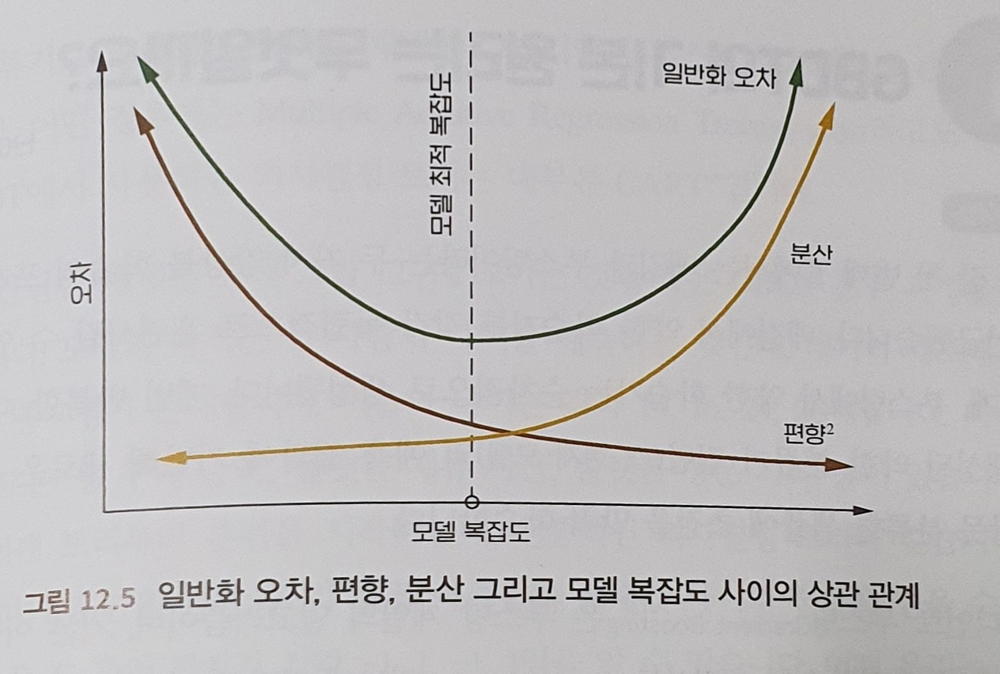

그래프를 통해 분산과 편향은 상부상조하며, 모순되면서도 통일되는 관계이기 떄문에 양자는 완전히 독립적으로 존재할 수 없음을 쉽게 알 수 있습니다. 따라서 종합적으로 편향과 분산을 고려해 적합한복잡도를 가진 모델로 훈련을 진행해야 합니다.  

 

⑤ GBDT 알고리즘의 기본 원리 338

GBDT는 ‘오차를 통한 배움’이라는 이념을 정확히 보여 주고 있는데, 의사결정 트리 예측의 잔차에 기반해 반복적인 학습을 진행합니다. 이는 반드시 알아야하는 알고리즘이기도 합니다.

⭐ GBDT의 기본원리는 무엇일까요?

그래디언트 부스팅은 부스팅 계열의 알고리즘이며, 기본 아이디어는 현재 모델 손실함수의 음경사도 정보에 기반해 새로 더해지는 약한 분류기를 훈련합니다. 그리고 누적 추가하는 형식으로 현재 모델에 결합합니다. 약한 분류기로 의사결정을 채택한 그래디언트 부스팅 알고리즘을 GBDT라고 부릅니다.대부분은 CART 의사결정 트리를 사용합니다.

GBDT는 잔차를 사용해 훈련하기 떄문에 예측 과정 중에 모든 트리의 예측치를 더해 최종 예측 결과를 얻어야 합니다.  

⭐ 그래디언트 부스팅과 경사하강법 사이에는 어떤 연관성과 차이점이 존재할까요?

GBDT는 그래디언트 부스팅 훈련 방법을 사용하고, 로지스틱 회귀 혹은 신경망은 경사하강법을 훈련 방법으로 사용합니다. 두 알고리즘 모두 매번 반복할 떄마다 모델에 관한 손실함수의 음의 겨사 방향의 정보를 이용해 현재 모델에 대한 업데이트를 진행합니다. 다만,  경사하강 단계에서 모델은 파라미터화 형식으로 표현할 수 있는데 모델의 업데이트는 파라미터 업데이트와 동일시됩니다. 그래디언트 부스팅에서 모델은 파라미터화 표현이 필요 없고, 직접적으로 함수 공간에서 정의가 가능합니다. 따라서 사용 가능한 모델의 종류를 확장할 수 있습니다. 쉽게 말해, 경사하강법은 경사를 ‘하강’할 때 파라미터를 업데이트하고, 그래디언트 부스팅은 새로운 모델을 사용합니다.

⭐ GBDT의 장점과 한계에는 어떤 것들이 있을까요?

- 장점
    - 속도가 빠르고, 병렬화 계산가능
    - 데이터 일반화, 표현 능력이 뛰어남
    - 비교적 괜찮은 해석력과 robustness를 갖게 됨. 자동으로 특성 공간의 과원 관계를 발견가능하고, 전처리 작업이 필요 없음.
- 한계성
    - 고차원희소 데이터에서 표현 능력이 SVM이나 신경망보다 저조
    - 텍스트류의 특성 ㅜㄴ제를 처리할떄 성능이 안 좋음.(수치형에 적합)
    - 직렬화 되어 있어 내부에서 국소적병렬 수단 사용해야 속도를 높임.

⑥ XGBoost와 GBDT의 차이점, 그리고 연관성 342

XGBoost 패키지를 사용할 떄 내부에 구현된 코드와 원리에 대해서도 잘 알고 있어야 실무 환경에서 알고리즘을 응용할 떄 모델을 자유자재로 튜닝해 목적에 맞게 사용할 수 있을 겁니다.

⭐ XGBoost와 GBDT의 차이점, 그리고 연관성에는 어떤 것들이 있나요?

기존 GBDT는 경험 손실함수의 음의 경사에 기반해 새로운 의사결정 트리 구조를 만들고, 구성된 후에야 가지치기를 했습니다. 그러나 XGBoost는 트리 구성 단계에서 정규화항을 더했습니다. 의사결정 트리의 구조를 이미 알고 있다고 가정한다면,  $w_j$에 대한 손실함수의 도함수를 0으로 설정함으로써 손실함수를 최소화한 상황에서의 예측값을 구할 수 있을 겁니다. 그러나 모든 트리 구조에서 ㅚ적의 트리 구조를 찾는 것은 NP-hard의 문제입니다. 따라서 현실에서는 보통 그리디 방법을 사용하여 차선의 ㅡ리 구조를 만듭니다. 핵심 아이디어는 근 노드부터 시작해 매번 하나의 잎 노드에 대해 분할을 진행하고, 특정한 규칙에 기반을 둬 최적의 분할을 선택하는 것입니다.  분할 전후 손실하수의 차이를 최소화하는 것을 규칙으로 설정하고 의사결정 트리를 만들어 가니다. 

XGBoost는 프로그래밍 구현 단계에서도 많은 개선을 진행했습니다. 전반적으로 양자 사이의 차이점과 연관성은 다음과 같이 정리할 수 있습니다.

- GBDT는 머신러닝 알고리즘이고, XGBoost는 엔지니어링적 구현이다
- CART를 기초 분류기로 사용했을 떄 XGBoost는 정규화항을 더해복잡도를 조절하고, 과적합을 방지하고 일반화 능력을 향상시키는데 도움
- GBDT는 모델 훈련 시에 비용함수의 일차 도함수 정보만을 사용하지만, XGBoost는 비용함수에 대해 2차 테일러 전개를 진행해 1차, 2차 도함수를 동시에 사용한다
- GBDT는 CART를 기초 분류기로 설정하지만, XGBoost는 선형분류기와 같은 다양한 종류의 기초 분류기를 지원
- GBDT는 매번 반복할 떄 마다 모든 데이터를 사용하지만, XGBoost는 랜덤 포레스트와 비슷한 전략을 사용하여 데이터에 대한 샘플링을 지원한다.
- GBDT는 결측치에 대한 처리 전략이 없지만, XGBoost는 스스로 결측치 처리 전략을 학습한다.

> 머신러닝 경진대회 케글
> 

각 대회에서 두각을 나타내는 성능을 선보여 XGBoost는 가장 유행하는 머신러닝 알고리즘이 될 수 있었습니다. 구글이 캐글을 인수하면서 규모와 인지도 측면에서 비교할 수 없는 수준에 도달 했습니다. 현재 캐글은 이미 구글 AI 생태계의 중요한 일환으로 자리 잡았고 해당 창업자는 두 가지를 강조했습니다. ‘자신이 직접 겪었고 다른사람도 겪고 있을 거라 생각하는 문제를 해야 한다’, ‘해당 문제를 해결하기 위한 열정이 있어야 한다는 점’입니다. 

**CHAPTER 13 생성적 적대 신경망 347**

Generative Adversarial Networks는 생성모델을 훈련시키는 새로운 프레임입니다. 갠이처음 고안되었을 떄는 난해한 수학적 추론 없이 역동적인 한 폭의 그림으로 묘사되었습니다. 이는 마치 만물이상생상극 중에서 진화한다는 동양 철학의 ㅐ극도와 유사합니다. 태극도로 비유하면 양의는 생성기와 판별기에 해당합니다. 생성기는 ‘생’을 책임지고, 판별기는 ‘멸’을 책입지는것입니다.    

① 처음 만나는 GANs의 비밀 349

갠을 만든 이안 굿펠로는 경찰과 위조지폐범 사이의 게임에 비유했습니다. 위조지폐범은 최대한 진짜 같은 화폐를 만들어 경찰을 속이기 위해 노력하고, 경찰은 가짜 ㅘ폐로부터 진짜 화폐를 잘 식별하기 위해 계속해서 노력하는데, 이러한 대립속에서 쌍방 간의 수준이 향상된다는 것입니다. 

⭐ GANs의 기본 아이디어와 훈련 프로세스에 대해 설명해주세요

갠의 주요 프레임은 생성기와 판별기 두 부분으로 구성되어 있습니다. 여기서 생성기는 ‘가짜’ 샘플을 합성하는데 사용되고, 판별기는 입력으로 들어온 샘플이 진짜인지 합성된 것인지를 판별하는데 사용됩니다. 구체적으로, 생성기는 사전분포에서 랜덤 신호를 취해신경망을 통해변환한 후 모의 샘플을 얻습니다. 판별기는 생성기로부터 모의 샘플을 받는 동시에 실제 데이터 세트로부터 실제 샘플도 받습니다. 하지만 판별기는 샘플이 어디서 오는 것인지 알지 못하고 스스로 판단해야 합니다. 이는 서로 간의 대립 자체가 목적은 아닙니다. 목적은 쌍방이 서로 대립하면서 각자의 능력을 키우는 것입니다. 이상적인 상황은 생성기와 판별기 모두 일종의 균형 상태에 도달해 쌍방이 더 이상 개선의 여지가 없는 상황입니다. 훈련 시에 생성기와 판별기는 서로 교대하며 최적화하는 방식으로 작동합니다

- 판별기를 훈련할 때 먼저 생성기를 고정합니다 - 생성기를 이용해 랜덤으로 모의 샘플을 생성하여 음성 샘플로 설정합니다. 그리고 실제 데이터 세트에서 샘플링을 진행해 양성 샘플을 얻습니다. 이어서 음성, 양성 샘플을 판별기에 인풋으로 넣습니다. 그리고 판별기의 출력과 샘플의 레이블로 오차를 계싼합니다. 최종적으로 오차역전파 알고리즘을 사용해 판별기의 파라미터를 업데이트 합니다.
- 생성기를 훈련할 떄 먼저 판별기를 고정합니다. 그리고 현재 생성기를 사용해 랜덤으로 모의 샘플을 생성하여 판별기에 인풋으로 넣습니다. 판별기는 이를 기반으로 오차를 계산하고 오차역전파 알고리즘을 사용해 파라미터를 업데이트 합니다.

⭐ GANs의 가치 함수

갠의 프레임워크는 두명이 진행하는 MiniMAx 게임과 같은데, 가치함수는 무엇일까요? 이상적인 상황에서 게임은 최종적으로 내시 균형에 이릅니다. 이떄의 생성기와 판별기를 각각 $(G^*, D^*)$로 표기해 대응하는 가치 함수의 값은 무엇일까요?  균형에 도달하지 않았을떄 생성기를 고정하고 최적의 판별기를 찾을떄 판별기와 가치함수는 무엇일까요? 이러한 질뭇들은 굿펠로의 논문에 모두 나와 있습니다.

판별기 D는 실제 데이터를 진성샘플로, 생성기가 생성한 데이터를 모의 샘플로 식별하려고 하기 떄문에 이진분류 문제에 해당합니다. 손실함수는 음의 로그우도 혹은 범주형 크로스 엔트로피입니다. 이를 기반으로 가치함수를 얻을 수 있는데, 판별기 D는 가치함수를 최대화하고, 생성기 G는 이를 최소화합니다. 훈련 중에 생성기 G를 최적화하는 것은 생성 샘플 분포와 실제 샘플 분포 사이의 JS 거리를 최소화 하는 것과 같다는 사실입니다. 훈련시에 D가 주어진 상태에서 최적해 G를 구하면 어떤 것을 얻을 수 있을까요? G를 최적화 하는 과정은 G를 G’로부터 최대한 멀리하게 하는 과정이고 균형점 분포에 근접하게 됩니다. 또한 균형점에 도달했을때 판별기를 사용해 새로운 생성기를 훈련한다면 이론상으로는 아무것도 훈련시킬 수 없습니다. 

⭐ GANs에서는 어떻게 대량 확률 추론 계산을 피할 수 있을까요?

갠을 발명한 초기 목적은 더 효과적으로 확률생성모델의 예측문제를 해결하기 위함이었습니다. 전통적인 확률 생성모델 방법은 대량의 완성하기 어려운확률추론계산이 필요한데, 갠은 어떻게 이 문제를 피할 수 있을까요?

전통적인 확률 생성 모델은 하나의 확률 분포 표현식을 정의해야 하는데, 일반적으로 다변량 결합확률분포의 밀도함수이며, 이에 기반한 우도 예측을 최대화합니다. 이 과정에서 확률 추론 계싼이 빠질수 없는데, 주변분포나 조건확률, 분모의 분배함수 등의 계싼이 있습니다. 확률 모델은 랜덤변수가 많을 때 매우 복잡해지기 떄문에 확률 계산도 매우 복잡해집니다. 즉, 근사 계산을 한다고 하더라도  효과는 만족스럽지 못할 떄가 많습니다. GANs는 호가률 생성모델을 만들 떄, 확률미돌함수에 대해 직접적인 모델링을 하지 않고 샘플을 만들어 간접적으로 분포를 구현합니다. 따라서 우리는 확률밀도함수의 표현식을 볼 수 없습니다. 그러면 어떻게 할까요? 만약 랜덤변수 Z와 X사이의 모종의 투영관계를 만족한다면, 이들의 확률 분포도 모종의 투영관계가 존재할 것입니다. 따라서 Z의 분포를 알고 있다면 우리는 랜덤 변수 사이의 변환함수에 대해 직접적인 모델링을 할 수 있고, 이는 유일하게 X의 분포를 결정합니다.

이런 방법으로 복잡한 확률 계싼을 피할 수 있을 뿐만 아니라 f에게 더 큰 공간을 제공함으로써 우리는 신경망을 상용해 훈련할 수 있게 됩니다. 신경망 네트워크 구조를 최적화하기 위한 새로운 테크닉들로 생성기의 네트워크 중에 추가할 수 있어 대대적으로 표현능력을 증가 시켰습니다. 

⭐ 실제 훈련중에 마난ㄹ 수 있는 문제들은 어떤 것ㅅ들이 있을까요?

이론에서 설명한 것처럼 GANs의 훈련이 완벽하게 진행될 수 있을까요? 목적함수를 최소화해 G의 해를 구하는 것은 어떤 문제점이 있을까요? 이문제에 대한 해결방인은 무엇인가요?

실제 훈련에서 초기 단계 생성기 G는 성능이 좋지 않아 생성한 모의 샘플이 쉽ㄱ 판별기 D에 의해 식별됩니다. 따라서 D에서 G로 전달되는 그래디언트가 매우 작아 훈련 목적에 도달하지 못하게 되는데, 이를 최적화 포화라고 부릅니다. ㅇD가 쉽게 모의 샘플을 알아본다는 것은 모의 샘플을 잘못 알아볼 확률이 0에 가깝다는 것을 뜻하게 되는데 즉, G가 얻게 된 그래디언트가 거의 0이 된다늠 말인데, 이는 D가 강해진 후에는 G에 대해 도움을 주는 정도가 매우 미미해진다는 것을 뜻합니다. 해결 방안은 변환을 통한 방안인데, 형식적으로 마이너스 부호 하나만 달라 후자를 최대화하는 것이 전자를 최소화하는 것과 동이ㅏㅎ게 됩니다. 양자가 최적화 될떄 동일한 해를 갖습니다. 이는 G가 얻는 그래디언트가 거의 0에 가까워지더라도 변경된 목적함수는 소멸되지 않고 생성기에 유효한 그래디언트를 제공합니다.

② WGAN: 저차원의 유령을 잡아라 357

고차원 공간에서 부피는 척도라고 하며, 3차원 공간에 있는2차원 공간처럼 N차원 공간에서의 N이 얼마나 큰지에 상관없이 N+1차원 공간에서의 척도는 0이 됩니다. 따라서 하나의 저차우너 공간의 물체가 고차원 공간에서는무시될 수 있습니다. 고차원 세계에서 생활하는 사람에게 저차원 공간이란 대수롭지 않은 마치 존재하는 듯 존재하지 않는 유령같은 것입니다.  생성적 적대 신경망읋 ㅜㄴ련하는 새로운 방법인 WGAN이 고안되었습니다. GANs의 원리가 매우 기발하며 이해하는데 어렵지 않고, 또한 사람들의 직관에도 잘 맞는 부분이 있습니다. 왜냐하면 만물은 서로 경쟁하고 대립하며 점점 발전하니까요 하지만 실제 사용 중에 많은 사람이 해석하기 힘든 문제들이 나타났고, 생성기 훈련이 매우 불안정하다는 것을 실증적으로 경험했습니다.

⭐ GANs의 함정: GANs에 존재하는 어떤문제들이 모델 훈련 효과를 저하시켰을까요?

GANs의 판별기는 실제 샘플과 만들어진 모의 샘플의 구별을 시도합니다. 만약 우리가 실제 데이터가 어떻게 형성되는지 모른다고하더라도 데이터 분포만 일치한다면 모의 생성과정을 통해 이를 대체할 수 있을 것입니다. 하지만 좋은 생성기를 만드는 것은 결코 쉬운일잉 ㅏ닙니다. 생성기는 불안정해 붕괴모드 현상이 자주 일어납니다. 붕괴 모드란, 이미지를 예로들면 반복해서 비슷하거나 동일한 이미지를 생성해 내면 다양싱이 부족하는 마치 이해하지 못하는 것을 죽어라 외워 실제로 활용도 못하고 창의적인 능력도 없는 것과 같습니다. 이런 현상은 생성기가 JS 거리에 기반해 훈련되니 아마도 JS거리와 관련이 있을 것입니다. 고차원 공간에서 모든 점이 하나의 샘플을 나타내지 못합니다. 공간의 대부분은 잉여 부분이고, 실제 데이터는 저차원 하위 공간의 매니폴드(고차원 곡면)에 말려 있을 것입니다.차원이 낮기 떄문에 차지하는 공간 부피는 0이 되며, 극심한 주의를 기울이지 않는 한 발견하기 어려울 것입니다. 생성기 분포와 실제 데이터 분포의 JS거리 즉, 2개의 KL 거리의 평균을 고려하면 초기 생성기는 파라미터가 랜덤으로 초기화되기 떄문에 하나의 샘플 생성기라기보다는 고차원 공간 점의 생성기라고 불러야 합니다. 점은 고차원 공간에 광범위하게 분포되어 있을 것입니다. 비유하자마녀, 그물을 크게 펼칠 수록 각 점 부근의 병력은 적어질 것입니다.이 구물이 저차원 하위 공간을 통과할 떄 볼 수 있는 ‘병’은 거의 0일 것이고, 이 하위 공간은 ‘사각지대’가 됩니다. KL 거리로 돌아와서 과원 공간의 대부분이 ㅣㄹ제 데이터를 보지 못하여 곳곳이 0이 되고, KL거리에 대한 공헌도 0이 됩니다. 생성기가 어떻게 ‘그물’을 펼치고 훈련을 하든지 JS거리는 변하지 않아 생성기에 대한 그래디언트는 0이 됩니다. 만약 그래디언트가 계속 0이라면 어떻게 훈련을 진행할 수 있을까요?

⭐ WGAN은 위 문제를 어떤 방법으로 개선했나요? 와서스타인 거리란 무엇일까요?

직관적으로 볼 때 생성기로 하여금 고차원 공간에서 아무렇게나 그물을 던지게 하면 안되고, 직접 저차원 공간에서 실제 데이터를 ‘잡아’야합니다. 고차원 공간에 숨어 ㅣㅆ는 수많은 저차원 하위 공간 중에서 어떻게 목적하위 공간을 찾을 수 있을까요?우리에게 필요한 것은 단서이지 단순하게 그물을 던지는 것이 아닙니다. 고차원 공간에서 은밀한 저차원 공간을 대항할 때 단순하고 거친 방법을 사용하기보다는 특별한 무기를 사용해야하는데, 그것이 EMD라고도 부르는 와서스타인 거리입니다. 이공식은 큰 마당의 각 구덩이에서 가장 가까운 모래 더미에서 운반하는 것이 운반 거리를 최대한 단축시킬 수있는 방법일 것입니다. 그러나 문제는, 만약 가장 가까운 위치에 있는 모래더미를 다 사용하거나 혹은 가까운거리의 구덩이를 메운 후에 모래더미가 많이 남았을 경우, 구덩이에서 여러 모래더미까지의 거리가 동일할 경우 등에 대해 어떻게 할 것인지를 모두 고려한 시스템화된 방안이 필요하다는 것입니다. ㅚ적의 방안은 위 목적함수의 최적해를 찾는 것입니다. 모래 분포와 구덩이 분포가 주어졌을떄, 모래를 옮기는 전체 손실에만 초점을맞추고 모래알 하나하나에 대한 배체이 대해서는 신경쓰지 않을 것입니다. 손실이 변하지 않는 상황에서 모래배치는 아마도 많은 선택지가 있을 것입니다. 모래더미 일부분만 옮기거나, 전부 옮기거나ㅡ 혹은 구덩이의 일부분만 채우거나 모두 채울수도 있습니다. 왜 와서스타인 거리는 JS거리가 해결하지 못한 문제를 해결할 수 있는 것일까요? 통속적인 해석으로는 ‘그물’비유로, 생성기는 더이상 ‘그물’을 던지는 것이 아니라 ‘타겟팅’하여 ‘쫓아가개’됩니다. 실제 분포가 어떤 저차원 하위 공간에 숨어 있든지 생성기는 감지할 수 있게 됩니다. 왜냐하면 생성기는 자신의 분포를 조금 변화시킴으로써 자신으로부터 실제 분포까지의 와서스타인 거리를 변화시킬 수 있기 떄문입니다. 그러나 JS거리는 둔감하므로 생성기를 어떻게 변화시키든지 여전히 하나의 상수입니다. 따라서 와서스타인 거리를 사용해 효과적으로 저차원 하위 공간중의 실제 데이터 분포에 근접할 수 있게 되는 것입니다.     

⭐ 어떻게 구체적으로 와서스타인 거리를 사용해 WGAN 알고리즘을 구현할 수 있을까요?

우리는 와서스타인 거리라는 무기를 손에 쥐었지만, 이 거리를 어떻게 계싼해야하는지 알지 못합니다.한 가지 다행인 점은 이와 동일한 값을 가지는 쌍둥이 동생으로 와서스타인 거리의 쌍대성입니다. 쌍대성은 와서스타인 거리의 해 구하기 난이도를 대대적으로 낮추게 되는데, 계산과정이 목적함수를 최대화하는 함수 f를 찾는 것으로 변합니다. 이 식은 GANs에서 log만 제거한 것입니다. 따라서 조금만 손보면 GANs의 원본 프레임을 사용할 수 있습니다.자세히 살펴보면 $f$와 $D$가 다름을 알 수있습니다. 전자는 1-Lipschitz 함수를 만족해야 하고, 후자는 하나의 시그모이드함수를 출력층으로 하는 신경망입니다. 이 둘 모두 최적 함수를 찾을떄 반드시 경계의 제한을 고려해야하는데 안하면 함숫값은 무한히 크거나 작게 나옵니다. 시그모이드 함수의 값은 천연적인 경계가 존재하는데, 1-Lipschitz는 함숫값의 경계를 제한하지 않고 함수 미분의 경계를 제한하여 각 포인트에서 함수의 변화율이 무한히 클수 없도록 합니다. 신경망에서는 어떻게 1-Lipschitz 혹은 K-Lipschitz를 구현할 수 있을까요? WGAN는 매우 교묘하게 이를 풀어 냈습니다. 하나의 피드 포워드 신경망에서 입력은 여러 차례 선형변환과 비선형 활성화 함수를 거쳐 출력을 얻고, 입력에 대한 출력의 그래디언트는 대부분의 모두 선형 조작으로 곱한 가중치 행렬에 의한 것인데, 따라서 각 가중치 행렬의 크기를 제약할 수 있다면 입력에 대한 네트워크 출력의 그래디언트 크기를 제약할 수 있습니다.

여기서 판별기는 평가기로 이름을 바꾸는데, 목적함수는 ‘샘플의 근원을 구분’하는 것에서 ‘샘플에 평점을 매기는 것’으로 바뀌게 됩니다. 실제 샘플과 비슷할 수록 더 높은 점수를 받고, 반대라면 낮은 점수를 받습니다. 이는 SVM의 마진의 개념과 유사합니다. 평가기의 목표는 마진을 최대한 멀게 만드는 것이고 생성기의 목표는 마진을 최대한 줄이는 것입니다. 구체적으로, 평가기를 훈련하는 것은 생성기 분포와 실제 분포사이의 와서스타인 거리를 게산하는 것입니다.

③ DCGAN: GANs이 합성곱을 만났을 때 365

GANs가 처음부터 이미지 생성에 사용되긴 했지만, 바로 CNN을 사용하지는 않았습니다. 이미지 데이터를 이야기하면 CNN을 떠올리느데, 왜 사용하지 않았을까요? 이미지 분할에서 입력은 한 장의 이미지이고, 출력은 원 이미지와 동일한 크기의 분할 이미지입니다. 입력단은 여전히 한장의 이미지이지만, 출력단 정보량은 분류문제에 비해 많은 편입니다. 전통적인 CNN은 점차 크기가 줄어 화소 위치와 관련된 정보를 대량으로 유실한다는 점인데, 연구자들은 이미지 분할 문제를 해결하기 위해 Fractional-Strided Convolutuins와 같은 새로운 CNN 구조를 만들어냈습니다. 이 구조는 각 층의 높이가 넓이를 줄어들지 않고 오히려 커져 최종적인 출력과 원래 입력 이미지의 크기가 동일할 수 있도록 만들어 줍니다. 그러나 이미지 생성은 이미지 분할이 아닙니다. 이미지 분할의 출력단은 원래 이미지와 동일한 크기를 갖지만, 화소 레벨에서의 디테일한 정보에 여전히 유실이 발생하여 고화질 이미지를 생성하기 힘듭니다. 그렇다면 어떻게 개선해야 이미지 생성에 사용할 수 있을까요?

⭐ 생성기와 판별기에서 어떻게 합성곱 구조를 설계할 수 있을까요?

GANs 프레임 내에 다층 CNN을 심어 볼 예정입니다. GANs에서 CNN 구조의 위력을 발휘하기 위해서는 두가지 부분에 대한 고민이 필요합니다

- 생성기 - 생성기는 이미지를 생성하게 된는데, 이미지 분류와반대되는 과정이라고도 간주할 수 있습니다. 입력은 한장의 이미지이고, 출력은 하나의 클래스 입니다. 생성기의 출력은 한장의 이미지인데, 그렇다면 입력은 무엇일까요? 일반적으로 가우스 분포에서 생성된 100차원 랜덤 벡터와 같은 하나의 랜덤 벡터입니다. 여기에는 신경망이라는 블랙박스에서 우리는 의미를 알길이 없습니다. 그러나 이 랜덤벡터는 작은이미지를 보다는 훨씬 작은 차원의 벡터라는 것입니다. 그렇다면 저차원 벡터에서 고차원 이미지를 얻고 싶다면 어떻게 해야 할까요? 정보의 압축이나 유실이 일어나지는 않고 오히려 정보를 보충해야하고 난이도도 높아질 것입니다.  랜덤벡터의 각 차원으로 서로 다른디테일을 그리고, 한장의 이미지를 생성합니다. 화소 레벨의 위치 정보를 담고 있지 않지만, 이미지에서 각 화소는 모두 각자의 위치가 있고, 선과 면을 형성하며 물체의 형태를 그려냅니다. 이러한 위치 정보가 랜덤벡터에서 생성되는 것이 아니라면, 생성기의 특수한 네트워크 구조에서 나와야 할 것입니다. 그렇다면 CNN을 사용해 위치 정보를 구현할 수있을까요? 전통적인 다층 CNN 구조에서 입력단에 가까울수록 포함하고 있는 위치 정보가 명확하고, 층이 깊어질수록 수용장이 포괄하는 구역이 넓어져 너무 세부적인 위ㅣ 정보는 유실되고 고급의미정보만 납게되어 정보를 더 잘 반영할 수 있습니다. 이는 위치 정보를 포착하거나 식별하기만하고 생성까지는 하지 않습니다. 위치 정보는 입력된 이미지로부터 나오며, 이들이 이미지의 고급 의미를 효과적으로 반영하지 못하면 점진적인 계싼 중에 유실되게 됩니다. 따라서 만들어 내는 과정중에 위치정보를 생성해야 합니다. 이런 과정은 아래의 두 가지 원칙에 부합해야합니다.
    - 정보가 층 계산 중에서 점차 많아져야 한다.
    - 위치 정보를 유실하지 않아야 하고, 계속해서 세부적인 위치 정보를 생성해야한다,
    1. 위치정보 유실을 야기할 수 있는 풀링층 같은 정보를 제거한다. - 평균이나 최댓값은 변하지 않습니다. 위치 불변성은 분류에 있어서 매우 좋은 성질이지만 생성에 서는 좋지 않습니다. 이러한다운샘플링 과정은 세부정보를 희생함으로써 곡브 의미를 보존하기 떄문입니다.
    2. 부분 스트라이드 컨볼루셔능을 사용 - 모델이 추상적인 것이 아닌 구체적인 것을 만들어야 하므로 계산은 업샘플링 과정이며, 점진적으로 더 세버죽언 정보를 제공합니다. 
        
        전통적인 컨볼루션층은 이전 층의 높이와 넓이를 축소하거나 보존하는 것밖에 할 수없어 높이와 넓이를 확장하는ㄷ ㅔ소용이 없습니다. 우리는 특수한 컨볼루션 ㅡㅇ을 사용해 높이와 넓이에 대한 업샘플링 계싼을 구현해야 합니다. 부분 스트라이드 컨볼루션층에서 수학적으로 옴격하진 못합니다. 그렇다면 어떻게 ㅏ능할까요? 바로 0을 채우는 것인데 가장자리에만 채우는 것이 아니라 원소 포인트 사이에도 0을 채웁니다. 이러한 ‘역’컨볼루션 프로세스는 이미지 해상도의 ‘역’이지 수학적 의미상에서의 ‘역’이 아닙니다.
        
    3. 가장 마지막 부분의 완전 연결층을 제거합니다. - 일반적으로 CNN은 마지막 부분에 완전 연결층을 연결하는데, 이는 각 ㅏ원을 종합하여 비선형변환을 진행해 이미지 분류라는 목적에 대응하기 위함입니다, 그러나 생성이라는 목적에서는 사용할 ㅣㄹ요가 없습니다.
    4. 배치 정규화와 ReLU 활성화 함수 - 단일 뉴런은 배치층에서 정규화 처리를 하며, 평균이 0이고 분산이 1인 새로운 배치를 얻어 그래디언트가 원활하게 흐를 수 있게 해주며, 잘못된 초기화의 영향을 덜 받게 해줘 모델 훈련 효과를 개선합니다. 생성모델이 깊으면 깊을수록 배치놈층이 필요하게 됩니다. 만약 없다면훈련이 불충분해 모델 붕괴현상이 쉽게 발생하고, 계속해서 똑같은 이미지 샘플만 생성하게 됩니다. 이 외에도 그래디언트 포화를 피하고 학습을 더 안정적으로하기 위해서 내부에 ReLU활성화 함수를 사용하고 출력층에만 Tanh활성화 함수를 사용합니다. 
- 판별기
    
    생성된 이미지와 실제 이미지를 구분하는데, 전형적인 이미지분류 문제이지만, 일반적인 이미지 분류 문제와는 다릅니다. 진품과 가품의 구별은 디테일의 차이를 발견하는 것이지 거시적인 ㅡㄱ면에서의 차이를 구별하는 것이 아닙니다. 판별기의 다층 컨볼루션 네트워크에서도 풀링층을 사용하지 않고ㅡ 스트라이드가 1보다 큰 컨볼루션층으로 대체합니다. 비록 이역시 언더샘플링 과정이지만, 풀링층이 없습니다. 마지막 부분에는 완전연결층을 더하지 않고, 평탄화 처리를 거친 후 바로 시그모이드 출력층에 전달하여 ㅚ대한으로 위치에 관한 디테일을 보존합니다. 이외에 판별기 내부 활성화함수는 LReLU를 사용해 최대한으로 이전 ㅡㅇ의 정보를 보존합니다. 판별기에서도 배치놈층을 사용합니다.  
    

④ ALI 372

사람들은 그림을 볼떄 그림의 기교뿐만아니라 표현된 주체도 함께 봅니다. 동일한 주제에 대한 표현 방법은 매우 많아 사람들은 서로 다른 그림을 그려냅니다. 반대로, 구경꾼 입장에서 서로 다른 그림을 볼 떄도 동일한 주제혹은 비슷한 주제를 떠올릴 수도 있습니다. 하나의 주제를 주고 그림을 그리는 것이 생성의 과정이고, 주제를 추측하는 것이 ㅜ론의 과정입니다.우리는 두종류의 정보를 마주하는데, 하나는 관찰 가능한 것이고, 다른 한종류는 관측 불가능하지만 추론을 통해존재에 대해 인지할수 있는 것입니다. 이 두 종류의 정보는 두 종류의 표현공간에 존재하는데 관측 데이터가 있는 데이터 공가닝고, 은닉변수가 있는 은닉 공간입니다. 후자는 전자의 일종의 춯상입니다. 생성과 추론이 바로 이 두 공간에서 이루어지는 정보의 교환인데, 두개의 신경망을 사용해 만들어 낼 수있습니다. 하나는 생성 네트워크이고, 다른 하나는 추론 네트워크입니다. 생성 네트워크는 은닉공간에서 데이터 공간으로의 투영을 만들고, 추론 네트워크는 데이터 공간에서은닉공간으로의 투영을 만듭니다. 데이터 공간의 정보는 볼 수 있고, 은닉 공간의 정보는 볼 수 없기 떄문에 생성 네트워크는 하나의 디코더 이고, 추론네트워크는 인코더 입니다.

한편의 논문에서 ALI(Adversariall Learned Inference)모델이 제안되었습니다. 생성과 추론 네트워크를 GANs 프레임 아래에 두었는데, 더 나아가 생성모델과 추론 모델을 함께 훈련해 훌륭한 효과를 보여주었습니다.    

⭐ 생성 네트워크와 추론 네트워크의 융합

이 둘의 융합은 모의 샘플의 분포를 실제 분포에 가깝게 할 뿐만 아니라, 모의 샘플의 은닉공간 표현과 실제 샘플의 은닉공간 표현이 분포상에서 최대한 가깝게 만들 수 있는지 설명하자면,임의의 관찰 데이터 x 배후에는 은닉공간 표현 z가 존재합니다. x에서 z로 가는 변환 루트와 z에서 x로 가는 변환 루트를 각각 인코딩, 디코딩 과정에 해당됩니다. 확률의 관점으로 본다면 인코더는 추론 과정에 해당합니다. 반대로, 디코더는 생성과정에 해당합니다.관찰 데이터와 데이터에 대한 은닉공간 표현을 함께 고려해 결합 확률 분포를 작성하고 두 관점에서 본 두 결합확률분포를 서로 적합합니다. 양자가 비슷할 시에 대응하는 주변분포는  모두 같습니다. 그리고 대응하는 조건확률도 모두 같습니다. 중요한 것은, 얻게 된 두 네트워크는 한 쌍의 역관계 네트워크라는 점입니다. 이외에도 판별 네트워크가 존재하는데 목적은 두 네트워크에서 온 것을 구별하는 것입니다. GANs 프레임에서 판별 네트워크와 생성 네트워크는 하나의 목적함수를 공유합니다. 이는 MiniMax게임을 진행하는 것과 같습니다.  이를 통해 동시에 생성 네트워크와 추론 네트워크, 판별 네트워크까지 훈련시킬 수 있는 GANs 알고리즘을 만들 수 있습니다.

⑤ IRGAN: 이산 샘플의 생성 377

최초 GANs를 설계할 떄 실수 데이터를 생성하기 위해 설계되었고, 생성기는 하나의 실수 벡터를 출력한다고 합니다. 그러나 생성기가 이산 데이터를 출력한다면 그래디언트가 만들어 내는 미세한 업데이트는 진행되지 않을 것인데, 이는 이산 샘플의 변화는 연속적이지 않기 떄문입니다. 양성과 음성을 구별하는 지도학습모델을 훈련시키기 위해 음성 샘플이 필요한데, 랜덤 네거티브 샘플링을 진행하면 해당 샘플링으로 얻은 데이터가 마침 양성 샘플일 확률은 매우 낮습니다. 따라서랜덤 네거티브 샘플링의 결과는 너무 간단해 모델 훈련에 어떤 난이도도 제공하지 못합니다. 따라서 우리는 최대한 혼동하기 쉬운 샘플을 만들어 새로운 수준에 도달하게 해야합니다. 그래서 우리는 전체 데이터 세트에서 네거티브 샘플링을 진행하면 안되고, 근접한 지대에서 네거티브 샘플링을 해야 합니다. 하지만 이러한 편향적인 샘플링에서 양성 샘플을 샘플링할 확률이 매우 높아지므로 우리는 랜덤 샘플링 결과가 모두 음성샘플일 것이라고 단순하게 생각하면 안됩니다. 이러한 문제에 대한 해결 방안을 IRGAN이 제시했습니다.  

⭐ GANs을 사용해 음성 샘플을 생성하세요

우리는 전체 데이터 세트에서 랜덤으로 음성 샘플을 추출하는 방법을 저수준의 생성기로 간주하는데, 왜냐하면 이러한 생성기는 시종일관 고정되어 있고 학습 능력이 없기 떄문입니다. 사실 GANs의 설계 이념에는 ‘음성 샘플’에 대한 설명이 부정확합니다. 왜냐하면 생성기의 진정한 목적은 생성된 모의 샘플을 최대한 실제 샘플에 가깝게 만드는 것이고, 판별기는 실제 샘플과 생성기가 만들어 낸 가짜를 판별하는 것입니다. ‘음양’의 함의가 다소 변해 앞에서는 검색어와 관련 있거나 관련 없는 것을 양성 샘플 혹은 음성 샘플로 간주했는데, 이제는 실제 데이터 혹은 모의 데이터도 야성 샘플 혹은 음성 샘플이라고 간주할수있습니다.

훈련 과정은 원래 GANs의 과정과 동일하게 생성기와 판별기에 대해 교차 최적화를 진행하는 MiniMax 최적화 프레임을 따릅니다. 생성기 최적화 단계에서는 먼저 K개의 샘플을 생성하고, 폴리시 그래디언트를 사용해 파라미터에 대해 여러 번의 업데이트를 진행합니다. 판별기 최적화 단계에서는 역시 먼저 K개의 샘플을 생성하고, 음성 샘플로 설정해 실제 데이터의 샘플과 함꼐 판별 기 훈련을 합니다.이론상 하나의 내시 균형점에 수렴하게ㅐ 되는데, 생성기는 완벽하게 실제 데이터의 쿼리 문서상관성 분포에 적합했다고 할 수 있고, 생성적 검색모델(GRM)이라 부릅니다. 이에 대응하는 것으로는 지도 판별적검색모델(DRM)이 있습니다.

⑥ SeqGAN: 텍스트 시퀀스 생성 382

유하난 점들로 구성된 이산공간에서 각 샘플은 하나의 매우 작지만 나눌 수 없는 점이고, 이 점의 내부 구조는 고려하지 않습니다. 따라서 이전 절의 IRGAN 모델에서 ‘생성’이라는 두 글자의 의미는 한 그룹의 점드렝서 일부 점들을 선택하는 것인데, 전체 집합에서 하위 집합을 생성하는 과정이라 할 수 있습니다. 정보 검색의 생성모델은 검색 단어가 주어진 후 문서집합에서 가장 관련이 있는 문서를 찾아내는데, 하나의 문서가 바로 최소 단위의 점이며, 문서에서 어떤 단어를 사요했는지는 이 모델의 관심 대상이 아닙니다.’선택’하는 작업과 ‘만드는’작업은 매우 다릅니다. 문장을 예로 들면 선택한다는 것은 구절을 하나의 점으로 본다는 것이고, 만든다는 것은 구절을 하나하나의 글자로 본다는 것입니다. 문장을 ‘활용’하라고 한다면, 적당한 문장을 고르라는 뜻일 것이고, ‘모방’하라고 한다면, ㅐㄱ에 없는 문장을 만들어 내라는 뜻일 것입니다. 이떄 문장을 하나의 점으로 보고 단순히 암기만 해서는 안되고, 창조적인 사고력을 가지고 문자의 구조부터 파악해 단어를 선택하며 구절을 만들어야 합니다. 한 문장을 만드는 과정은 텍스트 시퀀스를 생성하는 과정입니다. 단어는 최소 기반단위가 되는데, 다른말로 문장은 이산적이고, 단어도 이산적입니다. 생성기가 해야할일은 문장을 ‘선택’하는 것이 아닌, 단어를 ‘선택’하고 문장을 ‘만드는 것’입니다.

SeqGAN이라는 모델은 GANs 프레임을 사용하여 텍스트 시퀀스를 만드는 문제를 해겨하고, 더 나아가 GANs의 적용 범위를 확장했습니다. 이 논문은 강화학습 이론 중에 정책과 행동가ㅣ함수를 참고했는데, 판별기는 결정이 완료된 후 생성된 텍스트 시퀀스를 채점하고 정책에 영향을 주는 보상으로 활용됩니다.

⭐ 텍스트로 구성된 시퀀스를 생성해 문장을 표현하려면 생성기를 어떻게 만들어야 할까요?

일반적으로 시퀀스는 RNN 프레임을 사용해 모델링하는데, LSTM 혹은 GRU를 사용하고 심지어 어텐션 매커니즘을 사용하기도 합니다.

⭐ 시퀀스 생성기를 훈련할 때 사용하는 최적화 목표는 일반적으로 무엇인가요? GANs프레임과 어떤 차이점이 있나요?

생성기의 목적은 텍스트 시퀀스를 생성해 실제 문장을 고도로 모방하는 것이고, 판별기의 목적은 생성기가 만든 문장과 실제 데이터 세트에서 선택한 문장을 구별하는 것입니다. 쉽게 말해, 마치 기계가 사람의 문장을 모방하는 것과 동일합니다. 한편으로는 최대한 비슷하게 모방해야하고, 다른 한편으로는 어떤 것이 기계가 말한 것이고 어떤 것이 사람이 말한 것인지 구별해야 합니다. 만약 GANs이 없고 생성기가 그냥 보통의 시퀀스 생성기라면, 일반적으로 어떤 최적화 목표를 사용해 이를 훈련시킬까요? 생성기는 데이터 세트를 생성하는 ㅗㅇ 확률을 최대화해야합니다. 데이터 세트에서 문장까지 문장은 독립항등분포라고 가정해도 되지만, 문장에서 단어, 단어에서 단어는 한 문장 내엣 강한 의존성을 가지고 있어 독립적이라 가정할 수 없습니다. 따라서 반드시 연쇄법칙에 따라 확률 분해를 해야합니다. 생성기의 최적화 목표는 더이상 분해할 수 있는 결합확률이 아닙니다. 판별기와의 게임에서 속이는 것이 목표로 판별기의 평가는 하나의 완전한 문장에 대해 이루어집니다. 생성기는 판별기의 채점을 알고 싶다면 반드시 전체 문자을 보내야 하며, 절만만 생성되었을 떄 보내 채점을 받을 수 없습니다. 따라서 최대우도예츠거럼 목표식을 분해해 각 단어에 대한 최적화로 전환할 수 없습니다. 그리고 생성기를 훈련할 떄 판별기도 훈련해야하며, 이둘에대한훈련은 교차로 진행됩니다.생성기가 출력하는 것은 이산 단어로 조합된 이산 문장으로 재-파라미터화 트릭을 사용해 생성기를 만들고 직접 새믈링 과정에 대한 모델리을 해 샘플 확률 분포를 명시적으로 만들지 않습니다. IRGAN에서는 ㅔㄱ스트 시퀀스 같은 이산 데이터를 생성할 떄 생성기는 재-파라미터화 트릭을 사용하지 못한다고 했습니다. SeqGAN에서 생성기가 생성하는 텍스트 시퀀스는 더 이산적입니다. 시퀀스의 각 원소는 모두 이산적입니다. 강화학습 이론을 연상해 보면, 시퀀스 생성과정을 일련의 직렬적인 행동(액션)으로 볼 수있는데, 각 단계에서의 액션은 단어 하나를 선택하는 것이고 상태는 선택한 단어를 조합한 접두어 상태입니다. 마지막 단계 액션 후 전체 시퀀스를 얻습니다. 이어서, 판별기는 하나의 완전한 문장을 받고 판별하고 채점을 합니다. 이 점수가 바로 생성기가 얻게 되는 보상입니다. 이 보상에 대한 기댓값을 최대화하하는 것이 최적화의 목표입니다. 해당 ㅚ적화 목표의 함의는 시작 상태에서 정책에 기반해 첫 번째 단어를 선택하고, 이후 계속해서 이 정책에 기반해 단어를 선택해 전체적으로 얻을 수 있는 보상의 기댓값을 얻는 것입니다. 이때 시퀀스 마지막 부분의 보사은 시퀀스 처음 부분의 장기보상이 됩니다.

⭐ 생성기의 최적ㅎ롸 목표가 있다면 어떻게 생성기 파라미터에 대한 그래디언트를 구할 수 있을까요?

우리는 목적함수를 가지고 ㅣㅆ습니다. 그렇다면 이 목적함수의 그래디언트를 구해 봅시다. 최적화 목표는 합을 구하는 것인데, 두 개의 항을 포함하고 있습니다 정책과 행동가치함수는 모두 파라미터 $\theta$를 포함하고 있어 미분 공식에 기반해 반드시 구해야합니다. IRGAN에도 정책과 즉시보상이라는 두항이 존재하는데, 장기보상이 없고 행동가치함수도 게산할 필요가 없습니다. 그리고 즉시보상은 정책에 의존하지 않아 파라미터 $\theta$와 무관하며, $\theta$에 대한 정책의 그래디언트만 구하면 됩니다. 그러나 SeqGAN에서는 둘의 그래디언트를 구해야합니다. 장기보상은 확률 함수로 계산하는 것은 어렵지 않지만 행동가치함수에 대한 문제는 확실히 어려운 문제입니다. 그러나 행동가치함수 재귀 공식을 통해 구할 수 있습니다.

**CHAPTER 14 인공지능의 응용 현황 391**

‘백문이 불여일견이요, 백견이 불여일각이며, 백각이 불여일행’이라 했습니다. 현실 세계를 바탕으로 한 다양한 응용현황을 살펴보며 어떻게 적용되고 있는지, 앞으로 해결해야하는 문제들은 무엇인지 살펴볼 것입니다.

① 알고리즘 마케팅 393

구글로 대표되는 검색 엔진이 트렌드를 이끌기 시작하면서 기존의 포털 사이트와 다르게 검색 엔진의 비즈니스 모델은 검색 서비스와 결합된 과금 형식을 사용했습니다. 즉, 사용자의 즉흥적인 관심에 따라 타깃 마케팅을진행한 것입니다. 이러한 광고는 일반적으로 경매 방식으로 판매를 진행하는데, 광고주는 사용자의 흥미에 기반해 실시간으로 광고 노출 효과를 최적화하기 때문에 포털 사이트와 비교했을 때 광고노출효과에 정확도가 높다는 특징이 있습니다.인터넷 광고 모델이 많은 광고주의 관심을 독차지하게 된 현상에는 사용자들이 인터넷 소비 시간이 늘어나고, 문턱이 낮아 광고주 범위가 넓다는 이유가 이스빈다. 인터넷광고 산업이 계속해서 ㅏㄹ전하면서 인터넷 광고 배후의 알고리즘 모델에 대한 연구도 많은 고나심을 받고 있습니다.계산 광고학이라는 개념으로 정보 과학, 통계학, CS 그리고 미시경제학 등이 융합된 새로운 학문이라고도 합니다. 

- 계약형광고 - 일반적으로 포털 사이트와 비디오 콘텐츠 플랫폼에서 자주 보임. 보통 CPM(Cost per Mille, 1000회 노출 당 비용)으로 계산.
- 경매광고 - 관련 검색어로 각 검색 광고는 특정한 관련 검색어에 대해 입찰.검색 광고는 클릭 수에 따라 비용을 지불하는데 클릴륙 예측 알고리즘은 입찰 광고 최적화에서 매우 중요한 역할을 합니다.
- 프로그래매틱 광고  - 광고주에게 더 유연하고 광고 시청 지반과 노출 시간등을 선택할 수 있도록 해줍니다. 보통 CPA(Cost Per Action)방식으로 과금하며 따라서 클릭률, 전환율 등의 요소를 종합적 고려.

광고 시스템의 각 알고리즘 모듈은 Spark, HDFS, Kafka 등 빅데이터 시스템과 밀접한 관련이 있을 뿐만 아니라 머신러닝 지식과도 관련이 있습니다. 이어서 광고 시스템 모듈에 관련된 알고리즘과 머신러닝 지식에 대해 설명하겠습니다.

- 사용자 페르소나 - 검색광고와 프로그래매틱 광고에서는 사용자 페르소나에 기반해 해당 사용자의 각 광고에 대한 클릭률과 전환률 등에 대해 더 정확한 예측을 할 수 있게 되고, 전체적인 광고 노출 효과를 최적화 할 수 있게 해줍니다. 해당 분석에서는 지도학습과 비지도학습 테크닉이 모두 광범위하게 응용됩니다.지도 학습으로는 어떤 특정 성별에만 광고를 노출하고 싶을때, 사용자의 행동 데이터나 기타 특성들로 사용자 성별에 대해 모델링하고 예측해야 합니다.비지도 학습은 데이터 내에 존재하는 규율을 발견하는 것인데, 레이블된 데이터를 사용하지 않아도 됩니다.사용자의 행동 기록과 기타 특성을 바탕으로 우리는 사용자를 특정한 유형에 군집시킨 결과를 클릭률 예측, 광고 배열 및 선택 등에 활용해 전체적인 광고 효과 상승을 기대할 수 있게 됩니다.
- 클릭률 예측 - 광고 효과를 최적화하기 위해서 광고 노출후 효과(즉, 클릭률, 전환율 등)에 대한 정확한 판단이 있어야 합리적인 선택과 결정을 내릴 수 있습니다. 검색 광고에서 일반적으로 광고의 클릭률을 통해 효과에 대한 평가와 결산을 하는데, 따라서 클릭률 예측의 정확성은 효과 최적화에서 매우 중요한 역할을 합니다. 많은 상황에서 실제 전환 데이터는 매우 적은데, 직접적으로 전환 데이터를 사용해 모델훈련을 할 수 없습니다. 따라서 보통은 차선택으로 이차 전환이나 장바구니 담기 행위 등 간접데이터로 모델링을 진행합니다. 클릭률 예측 문제는 하나의 이진분류 문제로 추상화할 수 있습니다.  광고 노출후 클릭을 하게 되는 확률을 예측하는 것입니다. 클릭률 예측은 아래와 같은 단계로 나눌 수 있습니다.
    - 샘플링 - 일반적으로 음성 샘플에 대한 샘플링해야하는데, 그 이유는 이진분류문제에서ㅏ 클릭 수는 대부분 전체노출 수 대비 매우 작은 부분만을 차지하기 떄문입니다. 이러한 현상은 매우 심각한 데이터 불균형 문제를 야기합니다.더 중요한 것은 음성 샘플이 담긴 정보가 양성 샘플에 비해 적다는 것인데, 만약 음성 샘플에 대해 샘플링을 진행할 수 있다면 훈련 시간을 줄이거나 혹은 같은 훈련 시간내에 더 많은 양성 데이터를 처리할 수 있게 되어 같은 훈련 시간이 주어졌을 떄 더 좋은 효과를 낼 수 있습니다.한가지 덧붙이면, 샘플링 후에 데이터 분포가 변하기 때문에 해당 문제에서는 원래 분포를 환원하는 작업도 필요하다는 것입니다.
    - 특성 추출 및 조합 - 사용자, 맥락, 광고주 등과 관련 있는 각 차원 특성을 추출하고 이들을 조합해야 합니다. 전통적인 머신러닝 모델에서 특성 공학의 퀄리티가 모델 성능에 결정적인 영향을 끼치는 부분이며, 동ㅅ기에 알고리즘 엔지니어들이 가장 시간을 많이 할애하는 부분이기도 합니다.전통적인 모선리넝 모델은 두 종류의 특성 사이의 상호작용을 직접적으로 잡아낼 수 없어 명시적으로 특성교차를 진행해야 합니다. 하지만 우리는 가능한 모든 조합에 대해 실험하게 되는데, 이렇게 하면 차원 폭발 문제가 발생할 수 있습니다. 따라서 실전에서는 GBDT와 인수분해 머신을 사용해 기존 특성에 대한 전처리를 진행합니다.이 내용은 2014년 페이스북에서 발표한 내용인데, 후에 많은 실전 프로젝트에서 응용되며 그 효과가 입증되었습니다.딥러닝 시대가 도래한 후, 딥러닝은자동으로 특성조합을 추출하는 방식을 제공하고 있으며, ㅣ는 직접 조어단간으로 클릭률에 대해 모델링하고 예측을 가능하게 합니다.실제 프로덕트 라인에서는 이전의 구조를 한 번에 바꾸기란 쉽지 않기 때문에 모두 종단간 딥러닝 모델로 교체해 클릭률 예측을 진행하는 것은 비현실적입니다. 이때는 딥러닝 모델 출력의 중간 결과를 전통적인 머신러닝 모델의 입력으로 사용해도 괜찮은 향상 효과를 보이는 것으로 알려져 있습니다.
    - 모델 훈련 - 모델 훈련과 튜닝 과정은 매우 많은 경험과 지식이 담겨 있는 과정입니다. 예를 들어, 온라인 실시간 클릭률 예측을 할 때 모델의 희소성과 예측 효과 사이에서 절충해야 하는 경우가 많은데, 이때 모델의 희소성을 요구하게 됩니다. 그러나 L2 노름을 사용해 정규화하면 완전히 희소한 결과를 얻을 수 없습니다. 더 좋은 방안은 L1 노름을 사용하는 것입니다. 이는 지원자가 L1, L2정규화의 특징과 이론에 대한 이해가 있어야 사용할 수 있는 방법입니다.다른 예를 들면 딥러닝 모델을 사용한 프로그램에서 계산한 기울기가 정확한지 검증을 할때, 필요한 기울기 검정에 대한 테크닉으로입니다. 원인에 대한 깊이 있는 분석을 할 줄 알아야 하며, 개선 방법을 사용해 훈련을 진행할 수 있어야 합니다.
    - 모델 평가 - 모델 평가는 주로 오프라인평가와 온라인 평가 두 단계로 나눌 수 있습니다. 오프라인 평가의 목적은 합리적인 실험과 지표를 설계해 오프라인 평가의 결과와 이후 진행할 온라인 평가 결과가 최대한 비슷하도록 만드는 것입니다. 일반적으로 단일 지표는 모델의 모든 부분을평가할 수 없기 때문에 서로 다른 여러 지표들을 사용해 모델 효과에 대한 종합적인 평가를 합니다. 어떤 지표를 우선시할 것인지에 대해서는 상황에 맞게 설정해야 합니다. 만약 오프라인 평가 단계에서 좋은 결과를 얻었다면, 다음단계는 온라인 A/B테스트 입니다. 이 단계는 모델이 정식으로 사용되기 전 가장 중요한 단계인데, 그 이유는 아무리 정밀하게 설계한 오프라인 실험이라 하더라도 온라인 환경과의 차이가 존재하기 때문입니다. 합리적인 테스트 방안을 만드는 것 또한 마케팅 알고리즘 엔지니어가 반드시 숙지해야할 스킬입니다.
- 광고 검색 - 광고 검색 단계의 목적은 쿼리, 시청자 등 정해진 조건에서 노출 조건을 만족할 만한 광고를 검색해 내는 것입니다.간단히 설명하면, 현재 쿼리의 의미와 비슷한 한 그룹의 쿼리를 찾은 다음, 이들이 찾은 광고 중 최소 한 가지 광고를 예비 집합에 더하는 것입니다. 쿼리 확장은 본질상으로 두 쿼리사이의 텍스트유사도를 계산하거나, 혹은 하나의 쿼리가 주어진 조건에서 다른 쿼리를 생성할 확률을 계산합니다. 전자는 토픽 모델 등으로 구현하고, 후자는 딥러닝 등의 방법을 사용해 모델링 할 수 있습니다.
- 광고 배열/선택 -
    
    계약광고에서 우리의 목표는 계약 규정에 명시된 노출 요구를 채우는 것이지 클릭률 예측 등과 상관없기 때문에 광고의 배열과 선택문제를 제약 조건이 있는 최적화 문제로 모델링 할 수 있습니다. 만약 트래픽을 특성에 따라 여러 세그먼트로 나눈다면 각 세그먼트는 한 종류의 노출 기회를 대표하게 되며, 각 계약은 해당 계약 조건에 의해 제한되고 특정 세그먼트 트래픽에서만 노출할 수 있게 됩니다. 따라서 광고의 선택은 이분 그래프의 매칭문제로 나타낼 수 있고, 최적화 목적은 총 노출 수익을 최대화하는 것이 됩니다.
    
    경매 광고 유형에서 고아고 집행기는 클릭률 예측 결과에 기반해 광고에 대한 배열과 선택을 진행합니다. 새로 노출된 광고의 경우, 충분한 노출이 없다면 해당 클릭률에 대해 정확한 예측을 진행하기 힘들 것입니다. 이미 충분한 노출량을 보유한 광고에 대해서도 클릭률 예측 결과에 따라 배열, 선택, 그리고 입찰을 진행해야 합니다. 탐색과 이용은 한 쌍의 모순된 주체로서, 이들 사이의 균형을 찾아야 최적의 광고 노출 효과를 얻을 수 있을 것입니다. 이는 앞서 배운 것과 같이 강화학습에서 초점을 맞추고 해결하려고 하는 문제이기도 합니다. 강화학습 시점에서 생각하면, 시작할 때 만약 충분히 라벨링된 데이터가 ㅇ벗다면 환경과 상호작용하며 피드백을 얻는 방식으로 모델을 개선해서 최종적으로 최적의 노출 정책을 얻을 수 있을 것입니다.
    
    프로그래매틱 광고에서 DSP는 특정한 광고에 대해 입찰을 진행하기 때문에 최적의 입찰가를 찾는 ㅓㅅ 역시 하나의 독립적인 연구 주제이기도 합니다.
    

정리하면, 컴퓨팅 광고와 연관있는 알고리즘에는 이책에서 소개한 모든 내용을 대부분 포함하고 있습니다. 만약 훌륭한 마케팅 알고리즘 엔지니어가 되고 싶다면, 업무 프로세스를 잘 익히는 것 외에도 각종 알고리즘, 이론, 방법들에 대해 튼튼한 기초를 쌓아야 하고, 계속해서 실전 경험을 쌓아야 합니다. 

② 게임에서의 인공지능 409

게임의 단계별 난이도 설계는 서로 다른 레벨의 지능적 난이도를 뜻하며, 해당 관문을 통과하기 위해 지능, 관찰, 사고, 실험, 학습, 그리고 기존의 누적된 지식에 대한 사용까지 일어나기 때문에 게임과 지능은 떼려야 뗄 수 없는 관계에 있습니다.

- 알파고에서 알파고 제로까지 - 알고리즘에 관해 이야기하면, 알파고의 성공은 딥러닝, 지도학습 기술, 강화학습 기술, 몬테카를로 트리 탐색 알고리즘이 완벽하게 어우러진 결과였습니다. 강화학습은 전체적인 학습 프레임을 제공했고, 정책 네트워크와 가치 네트워크를 설계해 몬테카를로 트리 탐색 과정을 이끌었고, 딥러닝은 두 네트워크의 함수를 학습할 수 있는 근사 도구를 제공했으며, 정책 네트워크의 초기화 가중치는 인류 기사에 대한 지도학습 ㅏㅇ법을 통해 얻을 수 있었습니다.알파고 훈련은 두가지 단계로 나누어집니다. 첫 번째 단계에서는 지도학습 정책 네트워크 파라미터에 기반해 강화학습 중의 폴리시 그래디언트 방법을 사용해 정책 네트워크를 한 단계 더 최적화합니다. 두번째 단계에서는 자신과 수많은 대결에 기반해 몬테카를로 정책 평가 방법을 사용해 새로운 가치 네트워크를 얻습니다. 알파고의 계승자 알파고 제로가 혜성처럼 나타났습니다. 알파고 제로는 인간 기사와의 사전훈련 없이 전적으로 홀로 학습할 수 있습니다. 하나의 신경망을 기반으로 천만 판을 스스로 대국하는 알고리즘입니다. 처음 시작할 때 인간의 가르침이 없기 때문에 알파고 제로는 바둑이 무엇인지조차도 모릅니다. 하지만 모든 버전의 알파고를 이길 수 있는 수준까지올라 갑니다. 이는 사람들이 오랫동안 보지 못한진실을 밝혔다는 데 큰 의미가 있는데, 그것은 바로 데이터가 반드시 필요한 것이 아니며 게임 규칙만으로도 충분하다는 사실입니다. 이는 근 몇년간 사람들의 관점과는 완전히 반대되는 것인데, 사람들은 딥러닝 기술이 데이터 기반의 인공지능 기술을 발전시켰고, 알고리즘의 유효성은 빅데이터와 분리해 생각할 수 없다고 여겼기 때문입니다. 사실, 깊게 들여다모녀 모의 게임 시스템이 있기 때문에 천만판의 게임 자체가 천만 개의 샘플 데ㅐ이터가 될 수도 있었습니다. 따라서 단지 데이터에 대한 정의가 다를 뿐이지 사실상 데이터에 기반한 것이라 말할 수도 있습니다. 전체적으로 살펴보면, 바둑ㄹ의 게임은 결정론적인 규칙에 의해 만들어진 게임입니다. 이런 종류의 겡미은 규칙이 명확하고 쌍방이 대칭적인 정보를 갖고 있습니다. 게임 AI가 직면한 문제는 일반적으로 탐색 문제이며, 일대일의 MiniMAx 게임인 경우가 많습니다. 하지만 바둑은 다른데,수학적으로 장기와 체스의 공간 복잡도는 대략 10의 48승이고 바둑은 10의 172승입니다. 게다가 돌을 따내는 상황까지 고려하면 더 복잡해집니다. 한가지 언급하고 싶은것은 관측가능한 우주의 양자수가 10의 80승이라는 사실입니다.
- 텍사스 홀덤에서 사람을 ‘위협한’ AI - 2017년 1월, 미국에서 리브라투스라는 이름의 AI 프로그램이 세계 최고의 프로 포커 플레이어들을 이기고 우승을 했습니다. 딥스택은 세계적 수준에 도달한 또 다른 텍사스 홀덤 AI 프로그램입니다. 리브라투스와 동일하게 딥스택도 자기 스스로 훈련하며 재귀적인 추론을 하는 방법의 학습전략을사용했습니다.알파고와 유사하게 트리 탐색과 근사 가치함수를 결합한 강화학습 방법을 사용해 각 라운드의 액션을 결정하는데, 불완전한 정보가 있을 때 휴리스틱 탐색을 하는 알파고로 볼수도 있습니다. 포커류는 기류 게임과 다르게 은닉 정보가 있어 ‘불완전한 정보’의 게임입니다. 따라서 텍사스 홀덤 한판의 의사결정 포인트는 바둑보다 적지만, 불확실성이 더해지며 계산량이 상상할 수 없을정도로 많아지게 됩니다. 비대칭 게임에서 상대방에 대한 예측은 상호 간에 수시로 발생하며 서로에게 영향을 줍니다. 따라서 단일한 최적 방법이 없습니다. 따라서 좋은 알고리즘이란 다른 사람의 전략을 기반으로 새로운 전략을 만드는 동시에 내 전략을 최대한 상대방이 이용하지 못하게 만드는 알고리즘입니다. 이러한연구는 미래에 금융 담판, 경매, 인터넷 보안 등 영역에서 AI가 ‘불완전한 정보’를 기반으로 의사결정을 내려ㅑ야 하기 때문인데, 이는 리브라투스가 잘하는 영역입니다.
- AI와 e-sports - 딥마인드에서 2013년에 네이처에 발간한 내용에서 CNN, 강화학습을 결합한 프레임, 경험 재생을 응용한 샘플링 사고 등을 사용해 심층 Q-러닝 알고리즘을 만들어 냈는데, 이 종단간 DQN(Deep Q-Network)하나만 훈련시켜 49개의 서로 다른 게임 환경에서 인간 고수를 넘어설 수 있었습니다. 알파고가 세계 바둑 챔피언을 이겼지만, 여전히 좁은 의미에서의 AI, 즉 특정 영역에서만 인간 수준을 뛰어넘고 다른 영역에서는 아무런 능력이 없는 AI라는 것을 알고 있습니다. 더 일반적인 문제를 해결하는 능력을 갖춘 시스템을 구현하기 위해서 우리는 AI에게 사람 수준의 상식을 갖도록 해야합니다. 따라서 에이전트는 새로운 임무를 수행할 때 경험을 사용해야 하며, 전통적인 훈련 단계를 거치고 초기화하고 다시 시도해 파라미터를 학습하는 방법을 사용할 수 없습니다. ㅣ는 아마도 통용 AI로 가는 첫걸음이라 할 수 있습니다.향후에 AI는 더 복잡한 임무들을 수행할 것입니다.
- 스타크래프트:통용AI로 향하는 길 - AI를 전략 게임에 적용하기 어려운 점은 픽셀 격자로 구성된 화면뿐만 아니라 고급 인지 수준을 구현해야 한다는 점인데, 종합적인 능력이 필요합니다.특히, 실시간 전력게임 같은 경우는 AI로 구현하기 가장 어려운 게임이라고 할 수 있습니다.알리바바 연구원들은 멀티 에이전트 양방향 협업 네트워크 학습을 통해 고효율의 통신 프로토콜을 유지해 AI가 학습을 통해 스타크래프트의 각종 전쟁임무를 수행할 수 있음을 증명해 냈습니다. 일반적으로 스타크래프트를 할때 세 가지 서로 다른 차원의 정책 결정을 한다고 합니다. 가장 높은 차원은 전략 수준의 정책 결정이고, 가장 낮은 차원은 마이크로 조작 수준의 정책 결정입니다. 플레이어는 각 조작 유닛의 유형, 위치 그리고 속성등 대량의 정보를 관측을 통해 얻습니다. 중간 차원은 전술 수준의 정책인데, 부대를 이동하는 것이 포합됩니다. ㅣ처럼 실시간 전략게임은 AI에게는 큰 도전이며, 지능 수준 테스트를 할 수 있는 최고 난이도 문제라는 것을 알 수 있습니다.
- 왜 게임에 AI가 필요한가? - 게임에는 대결만 있는 것이아닙니다. NPC라는 개념이 생겨나 ㅅ게임 AI에 대한강한 수요가 생겼습니다.게임은 복잡한 AI 문제를 정의해 주고 만들어 주었습니다. 전통학계의 AI문제는 단일하고순수해 각 문제는 이미지 분류, 객체 탐지, 상품 추천 등 특정한 임무에 포커스되어 있습니다. 통용 AI로 향하려면 언젠가는 이런 단일한 임무설정에서 벗어나 다양한 입력, 다양한 상황 등이 있는 복잡한 문제를 해결해야 할 것입니다. 이러한 관점에서 볼 때 게임은 전통 학술 문제와는 비교할 수 없습니다.게임은 다양한 인간-컴퓨터 상호작용 형식을 제공합니다.인간의 각종 조작 행위와 컴퓨터가 사람에게 나타내 주는 다양한 정보를 뜻하며, 빠른 리듬의 모달리티를 보이는 특징이 있습니다. AI 알고리즘은 덩 이상 데이터 사이의 연관성을 적합하는 것이 아니라, 일종의 인지, 행동, 그리고 감성상의 인류 체험을 학습하는 것입니다.많은 AI 연구자가 게임을 새로운 통용 AI 개발을 위한 실험장으로 여기기 시작했는데, 그 이유로 ‘진화 속도에 한계가 없다’, ‘무한한 재생이 가능하다’, ‘독립된 세계’ 등이 있습니다.정리하자면, 게임이라는 AI 실험장에서는 모든 것이 가능합니다.

③ 자율 주행에서의 AI 428

- 왜 자율 주행차가 필요할까요?
    - 안전 - 충돌사고의 94%가 넘는 원인이 운전자의 부주의나 실수입니다.
    - 편리함 - 자율 주행은 운전자를 운전대로부터 자유롭게 해서 차에 머무는 시간에 다양한 일을 할 수 있게 해줍니다.
    - 고효율의 공유경제 - 공유 자동차의 대부분 비용이 운전기사의 시간이기 떄문에 자율주행이 구현될 수 있다면 사람들은 더 이상 차를 구매하지 않고 완벽하게 공유 자동차에 의존해 생활할 수가 있게 됩니다.
    - 교통체증 감소 - 일리노이대 학교의 워커 교수의 연구에 따르면 인간 운전사가 있는 차 행렬에 한 대의 자율 주행차만 있어도 차 속도의 표준편차를 50%까지 줄일 수 있다고 합니다. 즉, 주행전체를 안정적이고 효율적으로 바꾸어 준다는 뜻입니다.
- 자율 주행에 대한 정의
    
    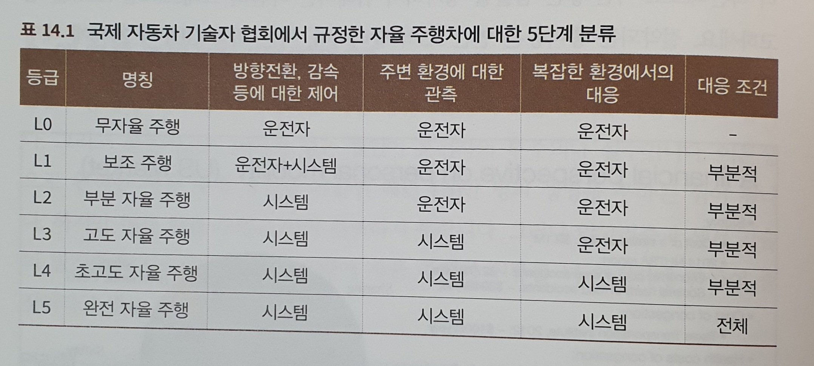
    
    자율 주행이라는 단어는 최초에 비행기, 기차 영역에서 주행을 돕는 보조 시스템에서 ㄴ왔습니다. 넓은 의미에서의 자율 주행에 대한 정의는 운전자의 조작 없이도 교통 도구의 자동제어를 통해 스스로 주행하도록 만드는 시스템을 뜻합니다.
    
- 자율 주행과 인공지능 - 자율주행을 지탱하는 기술은 다음의 3단계로 나눌 수 있습니다.
    - 상층 제어 - 노선 계회그 교통 상황 분석, 배치
    - 중층 제어 - 사물 인식, 장애물 감지, 교통 규칙 준수
    - 하층 제어 - 크루즈 컨트롤,잠김 방지 브레이크 장치
    
    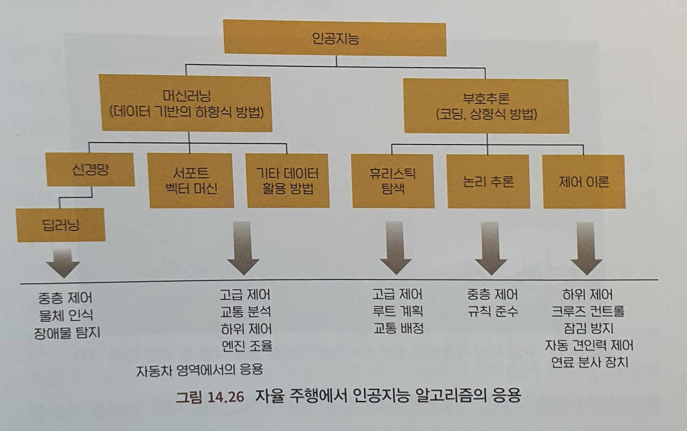
    
    모든 층에서 인공지능 기술을 사용합니다.
    
- 무인 운전의 상업화 - 많은 응용 영역에는 인공지능에 대한 ‘허용 오차’범위가 넓은 것을 알 수 잇습니다. 그러나 자율 주행차의 경우에는 아주 엄격한 안전 기준을 요구합니다. 실수가 가져오는 손실은 만회하기 힘든 손실 일 수 있기 떄문ㅇ비니다.이유로 현재 있는 자율자동차들은 주로 단절된 구역이나 엄격하게 관리되는 고정 루트에서만 사업을 진행하고 있습니다.
- 자율 주행 알고리즘 엔지니어에게 필요한 스킬 - 이 미래지향적인 기술 혁명에 당장이라도 뛰어들고 싶을지도 모릅니다. 하지만 그전에 컴퓨터 비전, 센서와 제어, 시스템 인티그레이션 등과 같은 자율 주행과 관련된 많은 과목과 강의가 있기 때문에 충분히 체계적으로 위의 스킬을 익힐 수 있을 것입니다.

④ 기계 번역 439

- 기계번역이란?- 컴퓨터를 통해 하나의 언어 텍스트를 다른 언어로 번역하는 일은 언어장벽을 없앨 ㅅ ㅜ있는 중요한 방법의 하나입니다.
- 기계번역기술의 발전 - 근래 들어 신경망에 기반한 방법이 도입되었고, 성능은 비약적으로 좋아졌습니다. 신경망 모델도 통계 기계 번역의 이중언어 병렬 말뭉치를 동일하게 훈련 데이터로 사용하지만, 모델은 여러 개의 부분으로 분해합니다. 신경만 모델은 일반적으로 하나의 시퀀스 투 시퀀스 모델입니다.일반적으로 순환신경망을 인코더로 설정하고, 입력 시퀀스를 벡터 표현으로 인코딩합니다. 그리고 다시 순환신경망을 디코더로 설정하여 인코더를 통해 얻은 벡터 표현을 디코딩해 출력 시퀀스를 얻습니다.
- 기계번역의 응용 - 인간의 번역 수준에는 미치지 못하지만 빠른 속도로 성능을 향상시키고 있으며, 응용 범위 또한 갈수록 넓어지는 추세입니다.각종 기계 번역 서비스가 당장 모든 서면 번역을 대체할 수는 없지만, 점점 더 격차가 좁혀지고 있기 때문에 많은 상황에서 훌륭한 보조 도구가 될 수 있을 것으로 생각합니다. 기계번역성능의 향상과 함께 각 회사의 목표는 이제 동시통역의 영역으로 향하고 있습니다. 기계번역모델은 눈부시게 발전했지만 아직은 인간을 대체하기엔 역부족이며, 특히 동시통역분야에 대한 도전은 아직 갈길이 멀어보입니다. 현재 단계는 간단한 언어에 대한 이해 및 보조 번역 정도에 머무르고 있으며, 아직 사람을 대체하기엔 큰 갭이 존재하는 듯합니다. 하지만 인공지능 응용 역역중에 관심을 가장 많이 받는 분야로 미래는 밝다고 생각합니다.

⑤ 인간과 컴퓨터 상호작용 443

사람이 사용자 인터페이스의 일련의 입력과 컴퓨터가 제공하는 출력 피드백을 통해 테스크 혹은 하나의 목표에 도달하는 과정이라고 할 수 있습니다. HCI는 하나의 융합 학문으로 다양한 학문이 모두 밀접하게 연관되어 있습니다. HCI는 또한 ㅇ인공지능의 집대성이라고도 불립니다. HCI 과정에서 음성인식, 이미지 인식을 통해 기계가 사람의 입력신호를 이해할 수 있고, 각종 예측모델, 증강학습모델은 기계가 유효하고 이성적인 판단을 할 수 있도록 돕고, 학습 능력을 갖출 숭 ㅣㅆ도록 해줍니다.따라서 HCI는 인공지능의 각 방면을 포함하고 있고, HCI의 빠른 발전은 인공지능 수준 전체의 발전이라고도 말할 수있습니다. HCI의 궁극적 형태는 고도의 지능을 가지고 있어 인간과 자연스럽게 교류할 수 있고, 주도적이며 고효율적으로 인간에게 부엽다은 임무를 완성하는 기계의 모습인듯합니다. 그러나 사람 사이의 상호작용과 인간-컴퓨터 상호작용 방식이 반드시 같아야 합리적이고 효율적인 방식이라고 말할 수 있을까요? 정말로 하나의 궁극적이고 통일된 모습의 HCI방식이 존재할까요? 이는 우리에게 주어진 미래에 관한 질문이기도 합니다.

- 자연으로의 회귀 - 스마트 상호작용의 최종점은 휴머니즘으로의 회귀일 것입니다. 인간과 스마트 장치 사이의 상호작용 방식이 각각 다르고 끊임없이 변화하더라도 스마트 상호작용 설계는 이성적 경로와 감성적 경로를 따라 최적화해야 하기 때문입니다. 하지만 사람 사이의 상호작용 방식이 반드시 최고 효율적이라고 말할 수 없습니다.사람의 시각에서 바라보면 특정 기능과 스마트 장치 자체의 특징에 맞춰 특정한 상호작용 방식을 설정해야 가장 적합한 HCI 방식이라 할 수 있을 겁니다.
- HCI는 블랙박스화 될것인가? - 많은 학자와 연구원들은 AI 알고리즘이 편견을 생성할 수도 있다고 주장합니다. 즉, 환경에 좋고 나쁜 정보가 섞여 들어오는 ‘데이터 편견’이 존재하기 떄문일 것입니다. 반대로, ‘모델 편견’은 데이터가 부족해 알고리즘 모델이 불공평한 판단을 내리는 것을 뜻합니다.동시에 사람들은 인공지능 장치가 너무 과도한 자기결정권을 가진 상황에서 잘못된 결정을 내렸을 때 어떤 문제들을 일으키는지 잘 알고 잇습니다.
    
    블랙박스화는 인공지능 장치에 대한 사람들의 신뢰도를 떨어뜨리기 시작했습니다. 따라서 많은 ㅇ녀구 작업이 의사결정 투명성을 더하기 위해 힘들 쏟고 있습니다. 예를 들어, 영상을 추천할 때 추천하는 이유까지 설명할 수 있다면 더 많은 사용자가 알고리즘을 신뢰할 수 있을 것입니다.하지만 모든 분야에서 블랙박스 모델을 투명하게 바꾸는 것은 현재로서는 불가능하기 때문에 ‘블랙박스화’와 ‘투명화’사이에서 절충을 찾으리라 생각합니다.
    
- 보편적으로 적용될수 있는 상호작용 방식이 존재할까요? - 답은 아마도 ‘불가능하다’일 것입니다. 인공지능 상호작용 방식의 다양화는 인공지능 장치 각각에 다양성을 부여했습니다.
- 인공지능 상호작용의 미래 - 여러분이 현장에서 만드는 크고 작은 공헌이 모여 사람들의 생활 방식 전체를 바꾸고 새로운 세상을 만들 것입니다. 영화에서나 보던 세상이 아직 멀어 보이시나요? 우리는 이미 걸어가고 있는 중입니다.

에필로그 및 저자 소개 449

