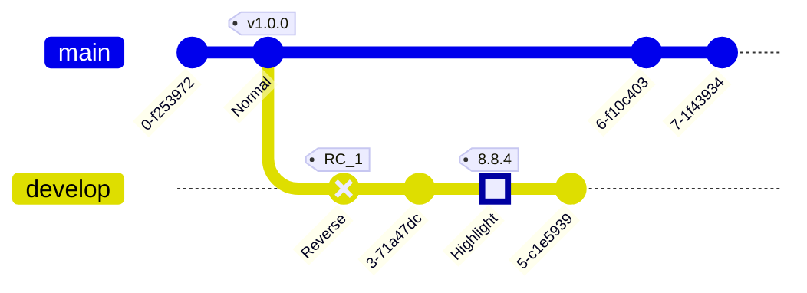

markdown으로 문서 작업을 대부분 하면서 mermaid라는 그래프 툴이 있어 활용하기 편할 것 같아 정리하게 되었다.

> ## flowchart [LR, RL, TD(TB), DT]


```bash
graph TD;
    A-->B;
    A-->C;
		subgraph ide1 [one]
		A-->B
		end
		
		id1["break syntax : This is the (text) in the box"]
```
### flowchart

| node | syntax | arrow | syntax |
| :-:| :-: | :-: | :-: |
| rectangle | [text] | arrow head  | --> |
| round edges | (text) | open link | --- |
| stadium-round | ([text]) | text on link  | --\|text\|-- |
| subroutine | [[text]] | arrow head | -->\|text\||
| databse | [(text)] | dotted | -.-> |
| circle | ((text)) | thick | ==> |
| asymmetric | >text] | chain | --> b & c|
| rhombus | {text} |new type |o--o, x--x |
| hexagon | {{text}} | | |
| parallelogram | [\text\\]| | |
|||||
| Length | 1 | 2 | 3 |
| Normal | --- | ---- | ----- | 
| Normal with arrow | --> | ---> | ----> | 
| Thick | === | ==== | ===== | 
| Thick with arrow | ==> | ===> | ====> | 
| Dotted | -.- | -..- | -...- | 
| Dotted with arrow | -.-> | -..-> | -...-> | 

> ## SequenceDiagram


```bash
sequenceDiagram
    participant Alice
    participant Bob
    Alice->>John: Hello John, how are you?
    loop Healthcheck
        John->>John: Fight against hypochondria
    end
    Note right of John: Rational thoughts <br/>prevail!
    John-->>Alice: Great!
    John->>Bob: How about you?
    Bob-->>John: Jolly good!
```
### SequenceDiagram
|Type	|Description|
| :-:| :-: |
|->	|Solid line without arrow|
|-->	|Dotted line without arrow|
|->>	|Solid line with arrowhead|
|-->>	|Dotted line with arrowhead|
|-x	|Solid line with a cross at the end|
|--x	|Dotted line with a cross at the end.|
|-)	|Solid line with an open arrow at the end (async)|
|--)	|Dotted line with a open arrow at the end (async)|

> ## Gantt diagram

```bash
gantt
    dateFormat  YYYY-MM-DD
    title       Adding GANTT diagram functionality to mermaid
    excludes    weekends
    %% (`excludes` accepts specific dates in YYYY-MM-DD format, days of the week ("sunday") or "weekends", but not the word "weekdays".)

    section A section
    Completed task            :done,    des1, 2014-01-06,2014-01-08
    Active task               :active,  des2, 2014-01-09, 3d
    Future task               :         des3, after des2, 5d
    Future task2              :         des4, after des3, 5d

    section Critical tasks
    Completed task in the critical line :crit, done, 2014-01-06,24h
    Implement parser and jison          :crit, done, after des1, 2d
    Create tests for parser             :crit, active, 3d
    Future task in critical line        :crit, 5d
    Create tests for renderer           :2d
    Add to mermaid                      :1d
    Functionality added                 :milestone, 2014-01-25, 0d

    section Documentation
    Describe gantt syntax               :active, a1, after des1, 3d
    Add gantt diagram to demo page      :after a1  , 20h
    Add another diagram to demo page    :doc1, after a1  , 48h

    section Last section
    Describe gantt syntax               :after doc1, 3d
    Add gantt diagram to demo page      :20h
    Add another diagram to demo page    :48h
```

> ## class diagram


> ## Git Graph

```bash
    gitGraph
       commit
       commit id: "Normal" tag: "v1.0.0"
       branch develop
       commit id: "Reverse" type: REVERSE tag: "RC_1"
       commit
       commit id: "Highlight" type: HIGHLIGHT tag: "8.8.4"
       commit
       checkout main
       commit
       commit
```

> ## Entity Relationship Diagram - ❗ experimental

```bash
erDiagram
    CUSTOMER ||--o{ ORDER : places
    ORDER ||--|{ LINE-ITEM : contains
    CUSTOMER }|..|{ DELIVERY-ADDRESS : uses
```

> ## Pie chart

```bash
pie title Pets adopted by volunteers
    "Dogs" : 386
    "Cats" : 85
    "Rats" : 15

```

> ## User Journey Diagram

```bash
journey
    title My working day
    section Go to work
      Make tea: 5: Me
      Go upstairs: 3: Me
      Do work: 1: Me, Cat
    section Go home
      Go downstairs: 5: Me
      Sit down: 5: Me
```

## REFERENCES.

[1] : [Flowcharts - Basic Syntax \| Mermaid](https://mermaid.js.org/intro/)