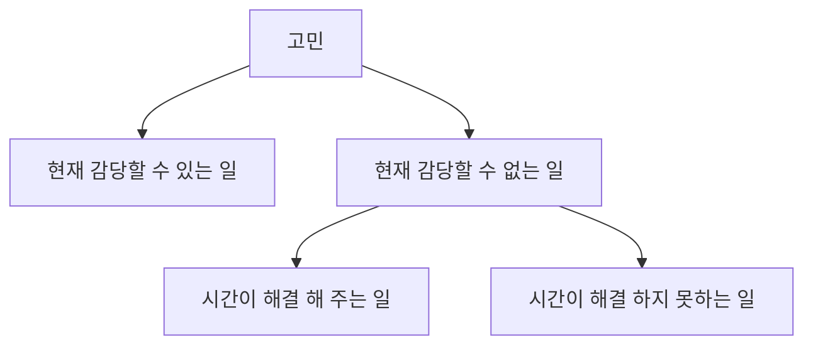

해당 도서는 서점에서 직접 구입하여 보관하고 있던 도서였다. 사실 도서를 구입한 이유는 정확히 기억나지는 않지만 베스트 셀러 구문에 있었고 "여행의 이유"라는 제목에 이끌려 고르게 된 것이 아닐까 싶다.

_이미지 출처: 교보문고_

> ## Ⅰ. Introduction

개인적으로 군대를 전역한 이후 내일로[^1]를 타고 혼자 국내여행을 한 적이 있었는데, 여행을 다니면서 만난 사람들마다 "혼자 생각할 시간을 갖는 것도 중요하지."라는 말을 많이 들었었다. 하지만 개인적으로 여행을 다니면서 혼자 고뇌하는 생각은 하지 않고, 그저 눈 앞에 있는 '어디를 가지?', '뭘 해야 재밌을까?' 정도만 생각하느라 바빴던것 같다. 

그렇게 여행을 끝마치고 나서 여행에 대해 회고를 해보니 "생각보다 혼자하는 여행은 지루하다" 정도의 생각만 들었던 것 같다. 마침 이러한 생각을 가지고 있는 찰나에 도서를 구입 하게 되었을 거리라 예상한다.

[^1]: 일정 기간 동안 무제한으로 기차를 탈 수 있는 상품.

> ## Ⅱ. 여행의 이유

> ### 추방과 멀미

저자는 중국에서 책을 집필할 생각으로 여행을 떠났으나 의도치 않게 추방당하여 집으로 다시 돌아와 집에서 집필을 한 경험을 소개하면서 '여행기'의 본질적인 근원에 대해 이야기를 시작한다.

주인공이 원하는 것을 찾아 떠나는 이야기들을 `'추구의 플롯'`[^2]이라 하는데, 대부분 두가지의 목표로 외부적으로 드러나는 목표와 내부적으로 보이지 않는 목표(무의식속의 추구)로 나뉠 수 있다고 한다. 이렇게 '추구의 플롯'을 따라 잘 쓰인 이야기에서는 `외부적으로 드러나는 목표보다 내부적으로 추구하던 목표를 달성하도록 한다`고 한다.

그러나 현실적으로 우리는 '추구의 플롯'을 따르는 이야기 처럼 여행을 하는 도중에 '의도치 않은 사건'으로 인하여 깨달음을 얻는 마법과 같은 일을 계획하는 것은 불가능하다. 

'여행'이라는 단어는 이동수단이 현대만큼 편해지기 이전까지는 '고생'이였다. 

저자는 어렸을 적 이상적인 사회주의를 꿈꾸고 중국으로 단체여행을 떠났지만 오랫동안 품어왔던 멋진 환상과 일치하지 않는 현실에 실망하고, 의도치 않은 깨달음을 얻는 '추구의 플롯'을 따르는 자신의 이야기를 소개했다. 

[^2]: 로널드 B.토비아스 $\ulcorner$인간의 마음을 사로잡는 스무가지 플롯$\lrcorner$

> ### 상처를 몽땅 흡수한 물건들로부터 달아나기

어떤 인간은 스스로에게 고통을 부과한 뒤, 그 고통이 자신을 파괴하지 못한다는 것을 확인하고자 한다. 그때의 안도감이 너무나도 달콤하기 떄문에, 고통의 시험을 통과해야만 한다.

저자는 어렸을 적 부터 이사를 자주 다녔는데, 이러한 성정 과정을 통해 고통의 시험을 통과한 후 주어지는 달콤함은 예약된 호텔을 들어섰을 때로 느껴졌고 이것이 자신이 호텔을 좋아하는 이유중 하나라고 말한다. 

그리고 저자가 호텔을 좋아하는 또 다른 이유로 소제목처럼 '풀리지 않는 난제'로 부터 달아나는 이유기도 한다고 한다.

어쩌면 개인적으로 어느 목표를 세우고 힘들게 노력하여 목표를 달성하는 과정에서 느끼는 성취감과 희열이 저자가 말하는 달콤함이 아닐까 생각한다. 그리고 저자는 해당 챕터에서 중국 병법 중 하나로 흔히들 말하는 '삽십육계 줄행랑'이라는 이야기를 꺼내며 '풀리지 않는 난제'로 부터 빠져나온는 이야기를 했다. 

해당 글을 읽으며 나는 이 세상의 모든 사건들은 현재 내가 감당 할 수 '있는 일'과 내가 감당할 수 '없는 일' 이 두 가지로 크게 분류 된다는 말이 떠올랐다. 그 중 '없는 일'은 '시간'이 해결해 줄 수 있는 일과 없는 일로 더 나뉘어 지는데, 우리가 고민을 해야할 부분은 '현재 내가 감당할 수 있는 일'에 대해서만 고민을 해야 한다 이야기이다. 어떻게 보면 해당 챕터의 소제목의 의미는 "현재 감당 할 수 없는 일"로부터 멀어지는 내용이 아닐까 생각한다.

> ### 오직 현재

저자는 오래전 캄보디아에 다녀온 이야기를 시작으로 마지막 부분에 아래와 같은 글을 적었다.

>생각과 경험의 관계는 산책을 하는 개와 주인의 관계와 비슷하다고 한다.
>생각을 따라 경험하기도 하고, 경험을 따라 생각하기도 하는 것처럼 현재의 경험이 미래의 생각으로 정리되고, 그 생각의 결과로 다시 행동하게 된다.  
>여행은 지나가 버린 과거와, 오지 않은 미래로 부터 끌어내 현재로 데려다놓는다.
>여행이 끝나면, 우리는 그 경험들 중에서 의미 있는 것들을 생각으로 바꿔 저장한다.  
>`영감을 좇아 여행을 떠난 적은 없지만, 길 위의 날들이 쌓여 지금의 나를 만들었다는 것을 부인할 수 없다.`

해당 글을 읽으면서 내가 지나온 모든 길들을 다시 한번 생각하게 되고, 모든 순간들이 감사하게 느껴지는 글이 었다.

> ### 여행하는 인간, 호모 비아토르

해당 장에서는 철학자 가브리엘 마르셀은 인류를 '호모 비아토르(여행하는 인간)'이라 정의한 건에 대해 이야기 한다.

>원시 인류는 사냥감이 지쳐서 쓰러질 때까지 뛰어서 쫓아가도록 진화했다는 것을 2007년 하버드대 고고학과와 유타대 생물학과 합동 연구팀이 밝혀냈다고 한다. 현대 사회에서 인터넷으로 간접 경험이 가능하지만 직접 두눈으로 보고, 만지고, 그 자리에 존재하고 싶어하는 현상인 여행은 이렇게 유전자에 새겨진 이동의 본능으로 인류가 현대에 남긴 진화의 흔적 문화일지도 모른다고 한다. 

의자에 앉아서 지내는 현대 시대의 생활 환경은 인간 역사 전체를 놓고 하루로 치환하면 0.1초도 안되는 짧은 시간이라고들 한다. 그래서 우리가 운동을 통해 활동량을 늘리는 행동도 위와 같은 맥락이지 않을까 한다.

> ### 알아두면 쓸데없는 신비한 여행

저자는 \<알아두면 쓸데 없는 신비한 잡할사전\>이라는 여행 프로그램에 나간 경험을 소개하면서 `"모든 여행은 끝나고 한참의 시간이 지난 후에야 그게 무엇이었는지를 알게 된다"`고 이야기 했다.
해당 프로그램을 촬영할때는 완전한 1인칭 시점으로 여행을 경험했지만, 본 방송을 시청할 때는 완벽한 3인칭 시점이 되어 1인칭 시점으로 부터는 상상만 했었던 다른 출연자들의 전체적인 여행을 경험하게 되었다고 한다.

해당 프로그램은 각 출연자들의 시점으로 촬영되고 편집되는 과정에서 모든 여행을 경험한 사람은 한명도 없다고 한다. 이는 \<알쓸신잡\>이라는 프로그램이 프란츠 카프카의 소설 $\ulcorner$성$\lrcorner$에 나오는 건축기사 K의 여정과 닮았다고 생각하는 이유이다. 

출연자들은 프란츠 카프카의 관점으로 현대의 복잡한 시스템 속에서 누구도 자신이 어디에 있고, 어디를 향해 가는지, 목적지의 존재 여부도 모른다는 태도를 가지는 사람도 있었다. 또한, 미래를 예측하여 불확실성을 배제하여 카프카적 상황을 극복하려는 출연자도 존재한다고도 했다.

저자는 자신을 두 가지 측면 모두 지니고 있지만 카프카의 관점에 조금 더 치중된 편으로 이러한 상황에서는 그저 현재를 즐겨야 한다는 이야기를 했고, 그에 더해 여행을 좋아하는 이유 중 한가지로 우리를 현재를 위협하는 어두운 그림자로부터 벗어날 수 있기 때문이라고 했다. 여행을 하면 일종의 위기상황에 직면해 오직 현재만이 중요하고 의미를 가지게 된다고 한다. 이에 스토아학파의 철학자들이 거듭하여 말한 것처럼 미래에 대한 근심과 과거에 대한 후회를 줄이고 현재에 집중할 때, 인간은 흔들림 없는 평온의 상태에 근접한고 한다.

프랑스의 철학자 피에르 바야르는 $\ulcorner$여행하지 않은 곳에 대해 말하는 법$\lrcorner$이라는 책에서  각각의 여행지에 최소한의 시간만 머무는'비여행' 또는 여행을 대신하게 하는 '탈여행'이라고 이야기 했다.

우리는 흔히 어떤 곳을 여행하고 왔다고 말하지만 우리가 그 도시의 전부를 속속들이 다녀온 것은 아니며 바야르 식으로 말하면, 누구보다  이 여행을 총체적으로 체험하게 되는 이는 자기 집에 누워 있는 시청자들이라고 한다. 내가 직접 경험한 여행에 비여행, 탈여행이 모두 더해져 비로소 하나의 여행 경험이 완성되는 것이라고 한다.

내 발로 다녀온 여행은 생생하고 강렬하지만 미처 정리되지 않은 인상으로만 남곤 한다. 일상에서 우리가 느끼는 모호한 감정이 소설 속 심리 묘사를 통해 명확해지듯, 우리의 여행 경험도 타자의 시각과 언어를 통해 좀더 명료해진다고 한다.

`세계는 엄연히 저기 있다. 그러나 우리가 그것을 어떻게 인식하고 받아들이는가는 전혀 다른 문제다. 세계와 우리 사이에는 그것을 매개할 언어가 필요하다. 내가 내 발로 한 여행만이 진짜 여행이 아닌 이유다.`

> ### 그림자를 판 사나이

소설 $\ulcorner$그림자를 판 사나이$\lrcorner$에 주인공이 그림자라는 신경쓰지 않던 무언가를 파는 대신 엄청난 부를 얻었지만 돈이 아무리 많아도 그림자가 없다는 사실을 사람들이 알자 주인공을 경원시하는 내용을 소개하면서 시작한다. 여기서 김영하 작가님은 주인공이 이런 상태를 극복하는 방법으로 그림자에 연연하지 않고 여행자/방랑자로 살아가며 만족을 느끼는 주인공에 대해서 놀랐다고 한다. 

사회 안에서 사람들과 함께 살아가야 한다면 사람을 사람으로 만드는 것. 즉, 그림자가 절대적으로 필요하다. 그러나 어디에도 속하지 않는 존재가 되면 굳이 그림자가 없어도 된다는 것이다. 

내가 해당 장을 해석하기로 아래 '노바디의 여행' 챕터에서 이야기가 나오지만 자신의 정체성은 스스로 인정하는 것으로는 부족하다고는 하지만 자신의 정체성을 구성하는 것 역시 자기 자신이 아니면 누구도 만들어 주지 못하는 것 중 하나가 아닐까?

최근 시그마 메일sigma-male[^3]과 관련한 밈meme이 유행이여서 몇번 보게 되었다. 해당 소설에 나오는 주인공이 이러한 시그마 메일의 예시가 아닐까?

[^3]: 약육강식의 세계에서 벗어나, 자기만의 세계를 구축하는 사람.

> ### 아폴로 8호에서 보내온 사진

{: w="500" h="400" }
_이미지 출처: nasa.gov_

시인 아치볼드 매클리시는 뉴욕타임스에 '저 끝없는 고요 속에 떠 있는 작고, 푸르고, 아름다운 지구를 있는 그대로 본다는 것은 바로 우리 모두를 지구의 승객으로 본다는 것'을 의미한다고 썼다. 승객은 영원히 머물지 않고, 왔다가 떠나는 존재일 뿐이라고 설명한다. 이어서 이 끝 모를 차가움 속에서 우리 자신들의 형제, 서로가 형제임을 진실로 아는 형제라고 부연했다.

저자는 인류는 오래전부터 인생이 여행과 닮았다고 생각한다고 했다. 어디에선가 오고, 여러 가지 일을 겪고, 결국은 떠나기 떄문이라고 한다..

또한, 우리는 인생의 축소판인 여행을 통해, 환대와 신뢰의 순환을 거듭하여 경험함으로써, 우리 인류가 적대와 경쟁을 통해서만 번성해온 것이 아니라는 것을 알게 되었다고 했다. 그 푸른 구슬에서 시인이 바로 인류애를 떠올린 것은 지구라는 행성의 승객인 우리 모두가 오랜 세월 서로에게 보여준 신뢰와 환대 덕분이었을 것라 한다.

> ### 노바디의 여행

여행자는 낯선 존재이며, 그러므로 더 자주, 명백하게 분류되고 기호화된다. 즉, 특별한 존재somebody가 되는 게 아니라 그저 개별성을 잃어버리는 것이다. 여행자는, 스스로를 어떻게 생각하든 상관없이, 결국은 아무것도 아닌자nobody일 뿐이다.

여행자는 자신을 드러내고 싶은 방식을 적극적으로 조정하고 맞춘다. 떄로 우리는 노바디가 되어 현지인 사이에 숨으려 하고, 섬바디로 확연히 구별되고자 한다. 

호메로스의 서사시 $\ulcorner$오디세이$\lrcorner$에서 오디세우스는 집으로 돌아가는 여행에서 외눈박이 괴물 키클롭스와 얽힌다. 오디세우스는 언제나 영웅인 섬바디 였는데, 아쉬울 것 없는 무인도에서 노바디가 되는 정체성의 위기를 겪는다.  우리의 정체성은 스스로 확인하는 것만으로는 부족하며, 타인의 인정을 통해 비로소 안정적으로 유지된다. 

실뱅 테송의 말처럼 여행이 약탈이라면 여행은 일상에서 결핍된 어떤 것을 찾으러 떠나는 것이다. 우리가 늘 주변에서 쉽게 얻을 수 있는 것이라면 뭐하러 그 먼길을 떠나겠는가 나이가 들면서, 점점 더 사회적으로 나에게 부여된 정체성이 때로 감옥처럼 느껴지는 순간이 많아지면서, 여행은 내가 누구인지를 확인하기 위해서가 아니라 내가 누구인지를 잠시 잊어버리러 떠나는 것이 되어가고 있다.

오디세우스의 일화를 여행자의 변화라는 관점에서 보면 여행자 오디세우스를 위험에 빠드린 것은 그의 허영심이었다. 그가 위험에서 벗어난 것은 스스로를 노바디로 낮춘 덕분이었다. 남의 땅에서 우리의 힘은 약해진다. 약해지기 때문에 더더욱 자기 존재를 타인으로부터 확인받고 싶어한다. 그럴때 우리는 그들의 환대와 인정, 선물이 필요하다. 현명한 여행자의 태도는 키클롭스 이후의 오디세우스처럼 스스로를 낮추고 노바디로 움직이는 것이다. 여행자는 허영과 자만에 대한 경계, 타자에 대한 존중의 마음을 지니는 태도를 가져야 한다.

> ### 여행으로 돌아가다

자신의 의자와 상관없이 떠나야하는 이주자와 자기 결정에 따라 여행하는 자가 보는 풍경은 다르지 않을 것이다. 그러나 그들이 느끼는 것은 확연히 다를 수 밖에 없다. 이주자는 일상을 살아가는 반면 여행자는 정제된 환상을 경험하고 있다고도 말할 수 있다. 이주와 여행의 관계는 마치 현실과 소설의 관계와 같다. 현실은 어지럽고 복잡하고 무질서하다. 자잘한 일들이 끝없이 일어나고, 그중 어떤 것은 우리 삶에 심대한 영향을 미칠 수 도있다. 하지만 개개의 사건들에 일일이 주의를 기울일 수는 없다. 현실은 줄거리가 없다. 떄로 우리의 통제력을 벗어난다.이야기는 다르다 현실과 비슷한 일이 일어나지만 질서가 있다. 이야기를 통해 인간은 현실에서 무질서하게 일어나는 여러 일들을 어떻게 받아들여ㅑ야 하는지를 배운다. 우리는 자신의 내면을 지켜내야 하고 그럴 때 이야기가 우리에게 심리적 틀을 제공하는 것이다.저자는 유럽으로 배낭여행을 떠났을 때, 어린 날의 이주와는 너무나 다른 경험으로 진짜 여행이 가져다주는 행복감과 자유롬을을 알게 되었다고 한다.

`어둠이 빛의 부재라면, 여행은 일상의 부재다.` 

공원에서 지나가는 사람들을 보는 것도 잠깐은 재미있다. 하지만 금방 지루해진다. 그러나 소설을 읽을 때는 다르다. 책장을 넘길수록, 이야기가 진행될수록 더욱 몰입하게 된다. 독자들은 일종의 실험실적 환경에서 인물에게 어떤 일이 일어나고, 그것을 인물이 어떻게 받아들이는지, 그것이 인물을 어떻게 변화시키는지를 지켜볼 수 있다. 여행도 마찬가지로 우리를 집중시킨다. 현지인들이 겪는 자잘하고 어지러운 일상을 잠깐 맛볼 수는 있지만 오래 지속되기를 원하지는 않는다. 여행자는 도시의 정수만을 원한다. 

여행은 분명한 시작과 끝이 있다는 점에서도 소설과 닮았다. 설렘과 흥분 속에서 낯선 세계로 들어가고, 그 세계를 천천히 알아가다가, 원래 출발했던 지점으로 안전하게 돌아온다. 독자와 여행자 모두 내면의 변화를 겪는다. 그게 무엇인지는 당장은 알지 못한다.그것은 일상으로 복귀할 때가 되어서야 천천히 모습을 드러낸다.

인간(독자)은 왜 여행(소설)을 꿈꾸는가. 우리는 이 안전하고 지루한 일상을 벗어나 여행을 통해 세상을 다시 느끼기 시작하고, 경험들은 열결되고 통합되며, 우리의 정신은 한껏 고양된다. 그렇게 고양된 정신으로 일상을 여행할 힘을 얻게 된다.

"땅 멀미"라는 말이 있다. 어느 정도 배의 흔들림에 익숙해지고 나면 멀미가 잦아드나. 육지에 오르면 마치 육지가 흔들거리는 것처럼 느껴지는 것을 "땅 멀미"라고 한다. 

저자는 현재 안정되고 단단한 기반 위에 서 있다고 한다. 이제 부모는 저자를 전학시키지 못한다. 그러나 여전히 저자는 어디론가 떠나야 할 것 같은 기분에 사로잡힌다고 한다. 자기 의지를 가지고 낯선 곳에 도착해 몸의 온갖 감각을 열어 그것을 느끼는 경험한 이들에게는 일상이 아닌 여행이 인생의 원점이 된다고 한다.

나는 "땅멀미"라는 말을 다시한번 곱씹게 되었다. 육지에서 살던 사람이 바다에서 몇개월 지내다 땅을 밟았을 때, 멀미를 한다니. 이상하지 않은가? 얼마전에 '정리하는 뇌'를 읽으면서 기억은 덮어씌워진다는 이야기를 통해 흔히들 말하는 '사람은 변하지 않는다'라는 말을 믿지 않게 되었는데, 이러한 "땅멀미"도 내가 가진 생각을 뒷받침 해 줄 수 있는 이야기 중 하나이지 않을까 싶다.

> ### 작가의 말

저자는 개나 고양이를 '반려동물'이나 '애완동물' 두 단어를 경박하거나 무겁게 느껴져 잘 쓰지 않는다고 한다. 인간의 수명보다 훨씬 짧은 개와 고양이를 반려라고 생각하지 않고 여행자에 가깝다고 표현했다. 인간과 동물 서로가 인생이라는 여행을 떠나다 잠깐 만나 같이 동행하는 것처럼말이다.

> ## Ⅲ. 마치며

해당 도서는 약 200페이지의 분량으로 구매하고나서 최근에서야 버스를 타고가면서 읽기 편할 것 같아 읽기 시작했는데, 버스안에서 정말 책에 함몰되어 재미있게 볼 수 있던 도서였다. 그리고 이 도서를 통해 읽어보고 작가가 소개한 책들을 보면서 읽어보고 싶은 책들이 무더기로 생기게 되었다. 

김영하 작가님이 쓴 산문이지만 내가 느끼기에는 한 가지의 철학서를 읽은 느낌으로 작가님의 철학이 잘 녹아있다고 느껴졌다. 여행을 다니면서 한번쯤은 생각하는 '여행의 이유'에 대해서 정말 잘 풀어쓴 도서로 읽으면서 대부분 모든 글에서 내가 여행을 다녀 왔던 기억과 경험에 대해 떠올리면서 생각보다 많은 생각을 가지게 되는 계기가 되었다. 그리고 해당 도서의 주제는 '여행'이라는 키워드로 되어 있지만 넓게 생각해보면 마지막 '여행으로 돌아가다'에서 말하듯 살면서 경험하는 모든 일들이 여행과 같지 않을까 생각한다.

마치 우리는 `인생이라는 긴 여정 속에서 '어려운 문제'라는 작은 마을을 탐험하는 여행가`처럼 말이다.

> ## Ⅳ. REFERENCES

[1] : https://blogn2.tistory.com/entry/시그마메일-뜻-시그마-남성이란

  

---